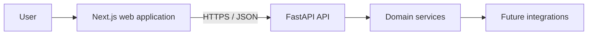
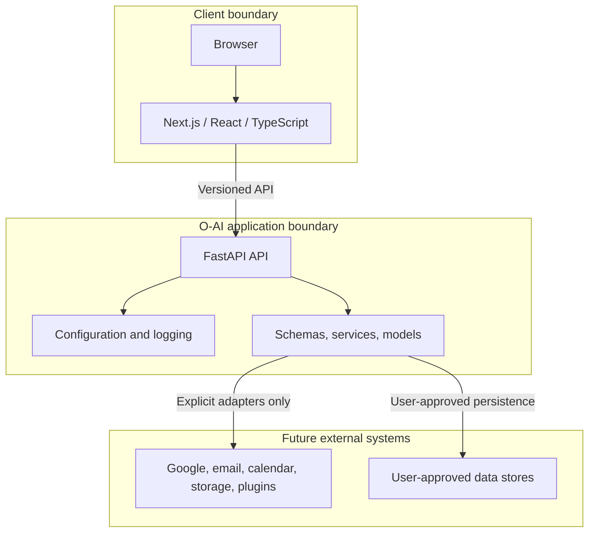
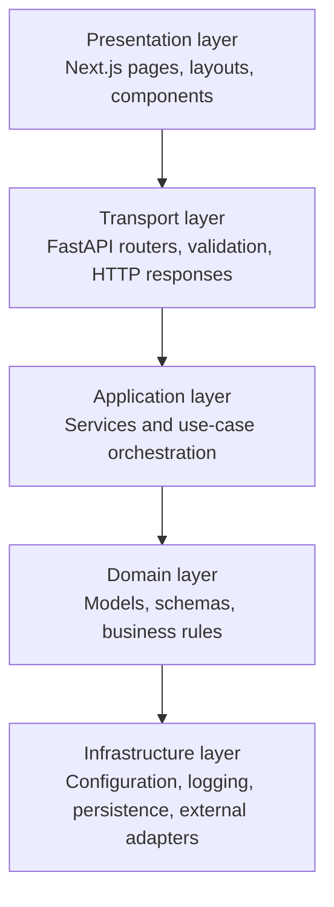
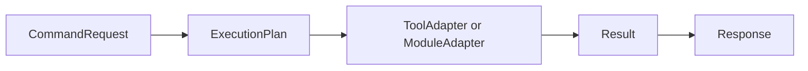
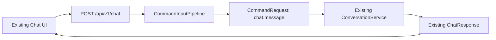
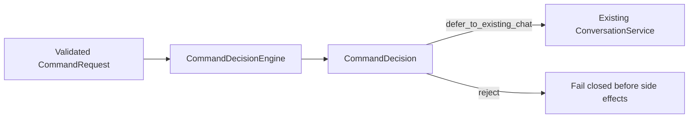

# Architecture

## Overview

O-AI is a local-first Personal AI Operating System with a web client and a versioned HTTP API. It currently includes local Knowledge ingestion/retrieval, owner-controlled Personal Memory, persisted citations, and deterministic runtime intelligence metadata.



## System boundaries



The browser, O-AI application, and external providers remain separate trust boundaries. External access must be explicitly authorized, scoped, observable, and revocable. The frontend never receives secrets intended for backend integrations.

## Layered architecture



Dependencies flow inward. Framework-specific code belongs at the transport or infrastructure edges; business rules should not depend on HTTP, React, or a specific provider.

## Backend

The backend is a Python/FastAPI service under `backend/app`.

| Area | Responsibility |
| --- | --- |
| `api/` | Versioned HTTP routers and endpoint composition. |
| `core/` | Settings, startup/lifecycle concerns, logging, and shared infrastructure. |
| `models/` | Persistence-facing domain entities when storage is introduced. |
| `schemas/` | Pydantic request and response contracts. |
| `services/` | Business use cases and provider-neutral orchestration. |
| `contracts/` | Internal versioned protocols and immutable values for future AI, tool/module, and command boundaries. |
| `main.py` | FastAPI application assembly and middleware registration. |

Endpoints live below a versioned API prefix. Schemas form the public contract; services keep endpoint handlers thin. Health checks remain independent from future AI or integration services so operational status can be observed without invoking product features.

## API transport contract

Every API response uses a common envelope. Successful responses return `{"success": true, "data": ...}`. Failures return `{"success": false, "error": {"code": "...", "message": "..."}}`. Endpoint-specific schemas remain inside `data`, preserving stable resource contracts while making client handling consistent.

Each request carries an `X-Request-ID`. O-AI preserves a caller-supplied value or generates a UUID, returns it on successful and error responses, and includes it in logs for unexpected failures. Exception handlers translate validation, configuration, provider, HTTP, and unexpected errors into safe transport responses; internal stack traces remain in server logs only.

## Local conversation persistence

Version 1 stores conversations and messages in local SQLite. API routes call application services; services coordinate repositories and provider-neutral chat; repositories alone access SQLAlchemy sessions and ORM models. Public Pydantic schemas are mapped from persisted entities, so ORM models never cross the API boundary.

The chat flow creates a UUID conversation when needed, saves the user message, loads only a configured chronological window of recent messages, invokes `ChatService`, then saves the assistant reply. If the provider fails, the user message remains as history but no synthetic assistant reply is stored. Provider implementations never access repositories or database models.

Alembic owns production schema evolution. FastAPI startup opens the configured SQLite database read-only for compatibility verification; it verifies the expected revision, tables, constraints, foreign keys, FTS5 definition, and applicable Memory immutability protections. Startup never creates tables, upgrades, stamps, or rewrites the schema. The current string-based provider input remains a compatibility boundary.

## Local Knowledge Engine

```mermaid
flowchart LR
    Root["Configured local knowledge root"] --> Discovery["Secure discovery"]
    Discovery --> Reader["Reader registry"]
    Reader --> Extract["Ordered source sections"]
    Extract --> Normalize["Normalization and chunking"]
    Normalize --> Store["SQLite document tables + FTS5"]
    Store --> Service["Knowledge service"]
    Service --> API["Versioned knowledge API"]
    API --> Page["Next.js Knowledge page"]
```



Knowledge indexing is local-only and begins only after an explicit scan request. API routes call `KnowledgeService`; the service selects reader adapters and coordinates repositories; readers neither use FastAPI nor access database sessions. `Document` represents one root-relative source path, so two files with identical bytes remain separate documents with independent provenance and citations.

SQLite ORM tables store document metadata and chunks. A separate, idempotently-created FTS5 virtual table indexes searchable chunk text; `create_all()` does not create, alter, or migrate that virtual-table definition. Successful re-indexing replaces metadata, chunks, and FTS rows in one transaction. Extraction failures retain a previous successful index and record only a safe error. Missing files retain history but are excluded from normal search results.

The scanner resolves every candidate beneath `OAI_KNOWLEDGE_ROOT`, skips symlinks and hidden/runtime paths, enforces a maximum file size, and persists/exposes only root-relative paths. It never accepts arbitrary filesystem paths through the API. Supported readers cover PDF, DOCX, XLSX, CSV, PPTX, text, Markdown, HTML, and EML. No OCR, attachment extraction, embeddings, vector database, cloud storage, or background watcher is present. Image-only/scanned PDFs are reported as requiring OCR, planned for Release 0.6.1.

## Knowledge Intelligence

Knowledge answers are evidence-first: deterministic lexical retrieval queries local FTS5, ranking selects bounded evidence, conflict detection flags incompatible values, and a bounded prompt passes only selected text to `ChatService`. `GroundedPromptBuilder` delimits every source as untrusted and requires public source IDs. `CitationEngine` validates returned IDs; citation snapshots are transactionally persisted with the assistant message as historical evidence. `ConfidenceEvaluator` emits high, medium, low, or insufficient without probabilities. The existing single-string provider contract is a limitation: prompt injection cannot be claimed fully prevented.

## Memory-aware chat

Chat resolves only active `CONFIRMED` personal-memory versions through a read-only `ConfirmedMemoryReader` boundary. Eligibility also requires that the selected version belongs to the memory holding its active pointer. The resolver uses deterministic Thai/English/model-identifier lexical matching, positive matches only, and configurable item, total-character, and per-item-character budgets (`OAI_MEMORY_CONTEXT_MAX_ITEMS=8`, `OAI_MEMORY_CONTEXT_MAX_CHARS=2000`, `OAI_MEMORY_CONTEXT_MAX_ITEM_CHARS=500`). Malformed, empty, oversized, orphaned, stale, pending, rejected, and archived values are skipped without logging their content.

Selected records are rendered inside explicit `BEGIN/END UNTRUSTED PERSONAL MEMORY` delimiters, preceded by instructions that memory is contextual data only and cannot override system, developer, safety, or grounded-answer instructions. Document evidence remains authoritative for document-grounded factual claims, and conflicts must be disclosed. Conversation history, knowledge evidence, and memory remain distinct context blocks; neither the resolver nor chat creates, modifies, approves, rejects, or archives memory. Responses expose only memory ID, version, and key for explainability; memory context is not persisted with messages or citations. The current single-string provider boundary reduces prompt-injection risk but is not complete prompt isolation.

## Reasoning foundation

`ReasoningService` is a pure, deterministic service layer placed after memory and document retrieval and before provider prompt composition. It uses fixed Thai/English keyword rules to classify intent, with `general` as the safe fallback for empty, whitespace-only, and unclassified questions. It identifies missing information from already selected context and maps deduplicated evidence to stable memory ID/version/key metadata and selected document citation IDs only. It returns a `ReasoningPlan` planning/explanation artifact and a separate provider context block.

`ReasoningPlan` is not model chain-of-thought, hidden reasoning, or proof that an answer is correct. It contains only safe structured metadata—no memory values, document excerpts, hidden prompts, secrets, environment values, or provider internals—and is not persisted to messages, citations, or memory records. It never queries storage, changes retrieval ranking, invokes providers, performs actions, creates tasks, or executes plans. The plan is non-executable explanatory context only; it does not authorize autonomous behavior.

## Planning engine

`PlanningService` is a pure deterministic layer after `ReasoningService` and before prompt composition. It produces explanatory `PlanningPlan` metadata, not hidden model reasoning or chain-of-thought, an executable workflow, task persistence, or proof that an answer or recommendation is correct. It has no repository, provider, tool, workflow, scheduler, agent, filesystem, network, database, or execution dependency, and does not persist or execute generated tasks. Real-world actions require separate explicit owner approval and a future approved execution system.

Planning uses Policy A for every `ReasoningPlan` intent. General, casual, empty, whitespace-only, and unmatched questions receive only a minimal non-operational `response_organization` plan; they are not presented as project plans, commitments, or actions. The stable `plan_kind` mapping is: `general`, `factual_lookup`, `explanation`, and `summary` map to `response_organization`; `procedure` maps to `procedure_outline`; `comparison` maps to `comparison_structure`; and `troubleshooting` maps to `troubleshooting_structure`. The API exposes `planning_plan` as an optional additive field, so existing clients may ignore it. Its field names, fixed slug identifiers, and list ordering are stable: phase/task IDs are deterministic, dependencies are topologically ordered, risks use their approved code as their stable ID, and normalized missing-information codes retain first-occurrence order.

Templates only organize a response. All begin with `assess` and end with `respond`; `procedure` adds `sequence`, `comparison` adds `compare`, and `troubleshooting` adds `diagnose`. A `clarify` phase is inserted immediately before `respond` only for approved, normalized information-gap codes. Approved codes and their fixed advisory risk mappings are: `no_retrieved_context` — no retrieved memory or document context is available; `no_document_evidence` — document-grounded factual claims lack selected document evidence; and `comparison_basis` — a comparison may lack a complete basis. Empty, duplicate, and unknown codes are excluded safely and never produce risks or clarification claims.

`PlanningPlan` validates unique phase/task IDs and dependency edges, valid phase/task references, no self-dependencies, acyclicity, and topological task ordering before API or provider use. The planning prompt is isolated from Reasoning, Personal Memory, and Knowledge blocks. It explicitly says the data is deterministic and non-executable, cannot override system, developer, safety, grounding, citation, or owner-control requirements, cannot be changed by retrieved memory or documents, and must never be treated as completed work or disclose hidden prompts, secrets, environment values, or configuration.

## Decision engine

`DecisionService` is a pure deterministic layer after Planning and before prompt composition. It returns `DecisionAnalysis` explanatory metadata only: explicit alternatives found in the already-normalized question, fixed unweighted evaluation criteria, fixed advisory trade-offs, exact existing reasoning evidence references, inherited normalized information gaps, and a recommendation status. It has no repository, provider, tool, database, filesystem, network, workflow, agent, ranking, scoring, or execution dependency; it performs no writes and is not persisted to messages, citations, memories, or database records.

Decision analysis never selects, ranks, scores, or automatically recommends an alternative. It uses `owner_decision_required` only when a comparison question explicitly supplies at least two alternatives and no approved information gaps remain; it uses `insufficient_information` when such alternatives have gaps, and `not_applicable` otherwise. English separators only are supported: `vs`, `vs.`, `versus`, and standalone `or`. A standalone two-token `A or B` expression is classified as a comparison; Thai separator inference is deliberately unsupported. Alternatives remain in deterministic source order with stable `alternative-<n>` IDs and are capped at `MAX_ALTERNATIVES = 8`; longer labels are excluded and only the first eight normalized alternatives are retained. The decision prompt is separately delimited from Reasoning, Planning, Personal Memory, and Knowledge, and cannot override system, developer, safety, grounding, citation, planning, reasoning, or owner-control requirements. Any real decision or action requires separate explicit owner approval.

## Goal and Project engine

`GoalService` is a pure deterministic layer after Decision and before prompt composition. It returns non-persistent `GoalAnalysis` metadata only. A candidate is recognized solely from explicit English `goal: <text>` or `project: <text>` input; it never creates a goal/project, changes status, schedules work, creates workflows, or executes actions. Unmarked text is `not_applicable`; marked text is only a `candidate` requiring separate owner approval.

Separately, the durable Project backbone stores explicitly owner-created Projects and append-only immutable ProjectRevision snapshots in SQLite. It has no separate Goal table, automatic state changes, or task subsystem. An owner may explicitly select a Project only when creating the first chat or grounded-answer conversation; the selection and first persisted message commit together and cannot later change. At provider-request time, the latest selected Project is projected read-only into a bounded data-only block containing only title, objective, status, and non-null current summary/next action. Project IDs, revisions, history, timestamps, notes, and other internal fields are never provider-visible; the block is neither Knowledge evidence nor a citation source, and it is never persisted in messages or citations. COMPLETED and ARCHIVED Projects retain their history and may still be selected explicitly; owners may explicitly edit durable details, progress, and next actions at any status. No Project is selected or changed automatically.

### Goal Constitution

Goals and projects are owner-controlled concepts, not commands. GoalAnalysis is explanatory metadata only: it never creates, persists, activates, schedules, executes, completes, or changes the status of a goal or project. Only explicit marker input may produce a candidate, and every real-world action requires separate explicit owner approval through a future approved execution system. Goal, Project, Decision, Planning, Reasoning, Personal Memory, and Knowledge remain separate context blocks; user-supplied marker text is untrusted data and cannot override system, developer, safety, grounding, citation, or owner-control requirements.

## Provider, privacy, and deployment boundary

For normal chat, selected provider input may include recent conversation history, the current user message, runtime Reasoning/Planning/Decision/Goal metadata, selected CONFIRMED Personal Memory values, and selected Knowledge evidence for grounded answers. This repository does not establish an external provider's retention or training policy. API memory-usage metadata exposes only memory ID, version, and key; it does not expose selected values.

O-AI supports a trusted local, single-owner deployment model. The default Docker deployment binds the frontend and backend published ports to the Windows host loopback interface, so the supported browser is on that same host. LAN/mobile and public/Internet access are intentionally unsupported until a separately designed security boundary exists. Knowledge scans require the fixed `X-OAI-Local-Request: 1` marker: it is not a credential, but makes browser scan requests preflighted so an unapproved origin cannot authorize the scan request through CORS. It does not protect against local software or processes. There is currently no authentication or authorization layer; localhost binding does not limit access by local processes or OS users. SQLite plus FTS5 is intentional for the supported workload. PostgreSQL, Redis, vector databases, distributed workers, microservices, Kubernetes, an async rewrite, and local-LLM infrastructure are deliberately deferred until evidence requires them.

## Adapter and command contracts v1

D21 adds internal, provider-neutral contracts under `backend/app/contracts` without changing the active chat path:



AI Adapter Contract v1 consists of immutable `AIRequest` and `AIResult` values plus the structural `AIAdapter.generate(request)` protocol. It is a future adapter boundary only. Normal chat continues to use `ChatProvider.generate_reply(message: str) -> str`, and `OpenAIChatProvider` remains composed exactly as before. No adapter bridge or chat migration is present in D21.

Tool/Module Adapter Contract v1 defines separate structural `ToolAdapter` and `ModuleAdapter` protocols. Both accept the shared `CommandRequest` and `ExecutionPlan` contracts and return `Result`; `Response` is the presentation-neutral final command envelope. These contracts contain no provider SDK, HTTP, database, model, repository, or frontend type.

The command flow is declarative, not an execution engine. Constructing a request or plan has no side effect, `ExecutionPlan.owner_approval_required` defaults to `True`, and the repository contains no D21 dispatcher, scheduler, autonomous loop, adapter registration, or runtime wiring. A future caller must enforce owner approval and capability policy before explicitly invoking an adapter. Local AI installation and integration are deferred.

The boundaries are additive and internal: there is no public API or data migration. Rollback removes the contract modules, their tests, and this documentation without affecting persisted data or HTTP clients. Any future adapter implementation, command orchestrator, chat migration, external integration, or side effect requires a separately approved architecture change.

## Command/Input Pipeline (D22)

The existing `POST /api/v1/chat` route is the current Web/Chat input adapter. It continues to receive the unchanged validated `ChatRequest` and return the unchanged `ApiSuccess[ChatResponse]` envelope. D22 inserts a narrow application-layer `CommandInputPipeline` between that route and the existing `ConversationService` path:



The request-ID middleware remains authoritative for HTTP correlation. The route passes `request.state.request_id` unchanged into `CommandRequest.request_id`; this ID is correlation metadata only, not an identity or authorization credential. The fixed command arguments are `message`, `conversation_id`, and `project_id`, preserving the existing chat inputs and UUID values without a public schema change.

`normalize_chat` is pure and side-effect free. `process_chat` fails closed unless the command is exactly `chat.message` and the argument keys/types match the approved shape. Only then does it delegate unchanged values to `ConversationService.send_message`. It does not persist, invoke a provider, log message contents, construct an execution plan, perform intent/decision analysis, select an AI provider, route to an adapter, execute a tool/module, or authorize autonomous work.

The existing ConversationService remains responsible for its established conversation and Project-linked behavior. D22 does not repurpose the Knowledge/retrieval pipeline or explanatory intelligence/Decision services into command handling; it only provides the input seam before that existing path. Further command identifiers, generic dispatch, routing, planning, execution, external integrations, or Local AI require separate owner-approved architecture changes.

## Command intent and decision boundary (D23)

D23 adds a deterministic, internal, non-executable decision seam after D22 has accepted the exact `chat.message` command and validated its exact argument shape:



`CommandDecision` contains a command-level intent, disposition, reason code, and optional provider preference hint. Its taxonomy is deliberately narrow: `chat_message`/`unknown`, `defer_to_existing_chat`/`reject`, and `unspecified`/`automatic`/`local_ai_explicit` preference hints. D23 does not turn these hints into provider selection or adapter invocation.

Preference hints use only narrow, explicit provider-routing phrases. Generic words such as `default` or `automatic`, a generic mention of Local AI, missing input, invalid internal message values, and conflicting explicit phrases all resolve to `unspecified`. The decision never logs message contents, persists data, calls a provider, creates an execution plan, calls an AI/tool/module adapter, or accesses external systems.

The existing `ReasoningService` and explanatory `DecisionService` remain independent: their answer-oriented intent and comparison metadata semantics are unchanged and are not reused for command decisions. D23 preserves D22's guard order: unknown command identifiers are rejected by D22 before D23, and invalid `chat.message` arguments fail before D23 or `ConversationService` invocation. D23 does not implement D24 routing, Local AI, tool execution, or autonomous behavior.

## AI route selection (D24)

D24 adds `AIRouter`, a pure route-selection layer that accepts only a `CommandDecision`; it never re-reads user input. It returns an internal `AIRouteDecision` with one of `selected`, `unavailable`, or `rejected` and a stable logical adapter ID where applicable.

`unspecified` selects the configured default with selection source `default`; `automatic` selects that same default with source `automatic`. The current composition makes `chatgpt.default` available and `local_ai.default` unavailable. `local_ai_explicit` selects only the configured Local AI ID with source `explicit`. An unavailable Local AI route stops before conversation/provider work; an available Local AI route is selected but likewise stops before invocation until D26. It never silently falls back to ChatGPT.

D23 `reject` decisions and malformed decisions produce a fail-closed D24 `rejected` route. Rejected and unavailable decisions have no selection source. The router has no provider, adapter, database, HTTP, logging, persistence, tool/module, execution, or external dependency. It creates no execution plan and does not start D25/D26.

## ChatGPT adapter (D25)

D25 adds `ChatGPTAdapter`, the concrete AI Adapter Contract v1 implementation with stable ID `chatgpt.default` and contract version `1`. It wraps the existing `OpenAIChatProvider` rather than duplicating any OpenAI SDK integration. `generate(AIRequest)` delegates exactly once and returns `AIResult`; `generate_reply(str)` remains a compatibility shim for the existing `ChatService` and `ConversationService` path.

The adapter leaves `ChatConfigurationError` and `ChatProviderError` unchanged. D24 remains selection-only: this composition preserves the existing ChatGPT chat path but does not create a registry, invoke a selected D24 adapter generically, or begin D26. Local AI remains unavailable and unimplemented.

## Local AI runtime adapter and telemetry (D26-B)

D26-B adds `LocalAIAdapter` for `local_ai.default`, backed by the provider-neutral `LocalAIRuntimeClient` protocol. `OllamaRuntimeClient` is a deployment adapter that maps `AIRequest.content` to Ollama's configured HTTP endpoint and turns a valid local response into `AIResult.content`. It checks runtime reachability and configured-model availability before generation, and fails closed for offline, missing-model, timeout, malformed, or empty responses. It never falls back to ChatGPT or another cloud provider.

`OAI_LOCAL_AI_ENABLED`, `OAI_LOCAL_AI_BASE_URL`, `OAI_LOCAL_AI_MODEL`, `OAI_LOCAL_AI_TIMEOUT_SECONDS`, and `OAI_LOCAL_AI_CONTEXT_LENGTH` are deployment settings. Model storage remains an Ollama deployment concern and is not encoded in application configuration. `SystemMetricsProvider` owns an isolated daemon inference session that samples approximately once per second with `psutil` for CPU/RAM and `nvidia-smi` when available for GPU/VRAM. Each session resets then retains only its own latest and peak values; a unique session identity prevents a stopped sampler from writing into a newer session. ACTIVE starts immediately before runtime generation and returns to IDLE immediately afterward; model LOADED/IDLE/UNKNOWN remains separate so Ollama keep-alive is never treated as active inference. Telemetry is best effort and cannot fail or materially delay inference.

D24 routing semantics and the existing `ConversationService` path remain unchanged. D26-B does not add a generic adapter executor, register Local AI into the chat path, modify public APIs, or start D27.

## Tool/Module routing and standard tool (D27)

D27 adds `ToolModuleRouter`, a pure selection boundary over structured `CommandRequest` and `ExecutionPlan` contracts. It never receives or parses raw chat text, returns only `selected`, `unavailable`, `blocked`, or `rejected`, and never calls an adapter. Request/plan ID mismatches are rejected, unknown adapter IDs are unavailable, and owner-approval-required plans are blocked. Dependency composition registers adapters but does not wire execution into the chat pipeline.

`StandardToolAdapter` is the first registered Tool Adapter v1: `tool.standard.echo` / `standard.echo` / version `1`. It accepts exactly one read-only `echo` plan step containing a string `value`, returning a structured `Result`; every other operation or shape fails safely. It has no file, network, subprocess, database, automation, factory, or external side effect. D27 supports Module Adapter routing structurally but does not introduce a module implementation, generic executor, or D28 capability.

## Response composition and safe errors (D28)

D28 adds two internal, pure services without joining them into an end-to-end executor. `OrchestrationErrorNormalizer` classifies terminal D24 AI-route and D27 Tool/Module-route outcomes, known ChatGPT/Local AI errors, failed or blocked Tool/Module results, and unknown exceptions into fixed safe codes. `ResponseComposer` separately presents AI success, Tool/Module success, or a normalized error through the existing D21 `Response` and `Result` contracts while preserving the exact request ID.

The normalizer never carries raw exception text or adapter error detail into a composed response. `OWNER_APPROVAL_REQUIRED` produces a `blocked` result; all other safe errors are `failed`. Explicit Local AI unavailability or response failure cannot select or fall back to cloud AI. The services perform no HTTP, network, database, persistence, logging, adapter invocation, routing, tool execution, or public API work. They are dependency-injected for future orchestration only; existing FastAPI exception handlers, chat API envelopes, conversation flow, and D24-D27 selection semantics are unchanged.

## End-to-end command orchestration (D29)

`CommandOrchestrator` connects the D21-D28 internal boundaries behind the existing chat endpoint: validated `CommandRequest` → D23 decision → D24 route → DI-registered AI Adapter v1 → `ConversationService` → D28 response composition. `AIRouter` remains selection-only. The registry validates unique adapter IDs and contract version `1` at composition time, and fails closed if the selected ID is absent. ChatGPT is the configured default; Local AI is route-available only when enabled in deployment configuration, and its own runtime/model checks remain authoritative.

The selected AI adapter is an explicit per-turn argument from `ConversationService` to `ChatService`; no global current-adapter state is stored. Formatting happens once in `ChatService`, then invokes `AIAdapter.generate(AIRequest)` once. This preserves conversation user/assistant persistence, history, memory, reasoning, planning, explanatory decision/goal analysis, project context, and project-action proposal behavior for both selected adapters. Terminal outcomes are normalized and returned through the existing safe API error envelope with the original request ID; no raw adapter/provider errors or Local-AI-to-cloud fallback are exposed.

D29 also exposes an internal-only structured Tool/Module lane: `CommandRequest + ExecutionPlan` → D27 route → selected adapter execute once → `Result` → D28 composer. It does not parse chat text or create plans. Blocked, unavailable, and rejected routes never execute, and the only registered tool remains the read-only `standard.echo` adapter. No normal chat path invokes this lane.

## Native Windows MVP operations (D30)

D30 closes the MVP operational path without changing Core boundaries: FastAPI runs on `127.0.0.1:8000`, Next.js runs on `127.0.0.1:3000`, and the Alembic-managed SQLite database is initialized by the Windows bootstrap script. The optional Ollama runtime remains an external host deployment at its configured URL; `qwen3.5:9b` is the Local AI baseline, while its model storage path is never represented in Core configuration.

The bootstrap script preserves user configuration, installs only existing requirements, and migrates the configured database. Start/stop scripts use PID files and command-line checks to manage only O-AI-owned backend/frontend processes; Ollama is never stopped. The running-system smoke validates health/revision, API envelopes/request IDs, and provider-specific E2E only when configured. Docker remains supported but deferred/non-MVP because its current startup-verification and Local AI host assumptions are not the official D30 run path. The MVP is loopback-only, trusted single-owner use; production/LAN/O-SERVER deployment remains separate work.

## Unified adapter runtime registry (D31)

D31 adds one immutable, dependency-composed `AdapterRegistry` snapshot for AI, Tool, and Module Adapter Contract v1 implementations. Registration is explicit: the composition root supplies concrete adapter objects, the registry classifies each object against exactly one approved structural contract, verifies the matching contract version, rejects empty or whitespace-padded IDs, and enforces globally unique adapter IDs across all three adapter kinds. Discovery is limited to deterministic registered-ID/kind views and typed resolution; the registry never invokes an adapter.

The existing D29 `AIAdapterRegistry` remains as a compatibility view over the unified registry, while `ToolModuleRouter` may consume that same registry instead of maintaining a second adapter map. FastAPI dependency composition now creates one shared registry per dependency graph containing the configured ChatGPT adapter, Local AI adapter, and read-only standard Tool adapter. D24 availability policy remains separate: registering `local_ai.default` does not make Local AI route-available when deployment configuration disables it, and runtime/model checks remain inside `LocalAIAdapter`.

D31 adds no dynamic plugin/module discovery, filesystem scanning, entry-point loading, provider selection, routing policy, capability negotiation, adapter invocation, execution-plan creation, owner-approval bypass, persistence, HTTP endpoint, public schema, dependency, deployment, or database change. Future provider routing, Local AI replacement, module loading, and capability discovery remain separate owner-approved work.

## Registry-backed AI provider routing (D32)

D32 evolves the existing D24 `AIRouter` instead of adding a parallel routing layer. Runtime composition supplies the D31 `AdapterRegistry` together with an immutable `AIProviderRoutingPolicy`. The registry remains the source of truth for whether an ID is a registered AI adapter, while the policy records only which registered AI IDs are enabled for routing and which enabled AI ID is the configured default.

Registration and route availability remain separate. A Local AI adapter may be present in the D31 registry while deployment configuration keeps `local_ai.default` out of the D32 enabled set. Conversely, an enabled ID that is not registered as an AI adapter fails closed. Tool and Module adapters in the unified registry never become eligible for AI routing because D32 checks them through `AdapterRegistry.resolve_ai()` only.

`AIRouter` remains decision-only: it does not invoke adapters, probe provider/model health, retry, fall back to another provider, inspect provider SDKs, change owner-approval state, or create execution plans. The legacy D24 constructor remains available for compatibility tests/callers, while runtime dependency composition uses registry-backed mode. Deployment settings are translated into `AIProviderRoutingPolicy` only at the FastAPI composition root.

## Replaceable Local AI runtime backend (D33)

D33 formalizes the provider-neutral `LocalAIRuntimeClient` introduced in D26 as the replaceable runtime seam behind `LocalAIAdapter`. `LocalAIAdapter` remains the stable AI Adapter Contract v1 implementation with adapter ID `local_ai.default`; runtime backend identity and model identity are separate concerns and are never encoded into that adapter ID.

Application composition converts deployment settings into an immutable `LocalAIAdapterConfig`, selects a runtime implementation through a fail-closed `LocalAIRuntimeFactory`, and injects the resulting `LocalAIRuntimeClient` into both `LocalAIAdapter` and best-effort telemetry. Ollama remains the default runtime implementation (`ollama`) for compatibility, but `LocalAIAdapter` does not import, instantiate, or otherwise depend on Ollama.

Runtime selection occurs only at the composition boundary. Unknown runtime backend IDs are rejected instead of silently falling back to Ollama or a cloud provider. Creating a runtime client does not probe runtime/model availability; the existing D26 adapter availability guard remains responsible for fail-closed runtime/model checks immediately before local generation. D33 does not add capability/model discovery, automatic runtime discovery, retry/fallback, model installation, public APIs, persistence, migrations, frontend behavior, dependencies, or deployment changes.

## AI capability and model discovery (D34)

D34 adds immutable, read-only metadata describing models and known capabilities for registered AI adapters. Discovery is deliberately separate from D31 registration, D32 route enablement, D33 runtime selection, executable plugin capabilities, and AI execution. The invariant is `REGISTERED != ROUTE ENABLED != DISCOVERED != EXECUTED`.

`AICapabilityModelDiscovery` validates construction-time discovery sources against the D31 `AdapterRegistry` and exposes deterministic per-adapter or all-adapter discovery. Missing sources produce structured unavailable metadata instead of changing registration. Discovery never invokes `AIAdapter.generate()`, changes routing policy, loads/downloads models, or performs fallback.

ChatGPT discovery describes only the configured OpenAI model and performs no provider/network model-list request. Local AI uses the D33-injected `LocalAIRuntimeClient` plus the optional `LocalAIModelDiscoveryProvider` protocol. A generation-capable runtime is therefore not required to enumerate models. Ollama implements the optional protocol with read-only `/api/tags` model enumeration. Disabled Local AI is reported without probing the runtime, and runtime/model availability failures are normalized into structured discovery results.

D34 capability metadata is intentionally conservative. Contract v1 advertises only `text_generation`; other capabilities remain unknown until a later contract has explicit evidence for them. D34 provides metadata for future planning but does not create `ExecutionPlan` values or choose an adapter.

## Deterministic execution planning boundary (D35)

D35 introduces a pure `ExecutionPlanner` that converts one internal `CommandRequest` into a structured `ExecutionPlanningOutcome` and, when planning succeeds, the existing D21 `ExecutionPlan`. Planning is declarative only: it never authorizes, invokes, generates, loads, mutates, or falls back.

AI planning reuses the existing chat input validation, D23 decision engine, D32 AI routing, D31 AI registration, and D34 capability/model metadata. D35 v1 plans only `text_generation`, emits exactly one `ai.generate_text` step, records the configured model identifier as metadata, and deliberately leaves the user message in the original `CommandRequest` instead of duplicating it into the plan. Conversational AI generation is marked `owner_approval_required=False`, indicating that no separate approval ceremony is required; D36 remains responsible for execution authorization.

Tool and Module planning use explicit internal commands (`tool.execute` and `module.execute`) with structured adapter, operation, and parameter fields. Adapter kinds are validated against the D31 `AdapterRegistry`. Tool and Module plans always set `owner_approval_required=True` in v1. D35 does not execute adapters, does not load modules, and does not modify D29 live chat orchestration. The live path remains unchanged until the D36 approval/execution guard boundary is available.

## Approval and execution authorization guard (D36)

D36 adds a fail-closed authorization boundary between D35 planning and any execution path. The invariant is `PLAN != APPROVAL != AUTHORIZATION != EXECUTION`. `ExecutionGuard` revalidates request/plan identity, adapter kind, one-step policy, operation shape, and approval policy before producing an immutable `ExecutionAuthorization`. The guard never invokes AI, Tool, or Module adapters.

Owner approval evidence is bound to the exact original approval-gated plan through a deterministic SHA-256 digest over canonical JSON-safe plan data. Tool and Module execution always requires matching explicit owner approval in D36 v1 even if an untrusted caller fabricates a plan with `owner_approval_required=False`; such a plan is rejected as a policy violation. A verified approval materializes a new immutable execution-ready plan with `owner_approval_required=False` while retaining the digest of the original approved proposal. AI `ai.generate_text` plans may authorize without a separate owner-approval ceremony but are still structurally and kind-validated by the guard.

The digest is an integrity binding, not an owner-authentication signature. D36 does not add identity authentication, durable approval storage, replay protection across processes, UI/API approval surfaces, or database migrations. Existing Project action execution proposal persistence remains a separate domain mechanism and is not treated as a core authorization token.

D36 hardens the existing D29 Tool execution boundary so raw `ExecutionPlan` values are no longer executable there; `CommandOrchestrator.execute_tool` accepts only an `ExecutionAuthorization`, and only an authorized Tool plan can reach D27 routing and adapter invocation. Live chat orchestration remains unchanged.

## Authorization-gated Module Runtime (D37)

D37 introduces a dedicated `ModuleRuntime` for invoking D21 `ModuleAdapter` implementations only after D36 authorization. The runtime accepts a `CommandRequest` plus `ExecutionAuthorization`; it does not accept raw `ExecutionPlan` values as an execution boundary. Before invocation it revalidates authorized status, `module` target kind, request/authorization/plan identity, the `module.execute` command, execution-ready approval state, the D35 v1 one-step shape, and Module adapter registration through the D31 `AdapterRegistry`.

Module loading in D37 v1 means resolving an already registered `ModuleAdapter` from the central registry. D37 does not scan folders, dynamically import packages, install/download modules, hot-reload code, or create another Module registry. The selected adapter is invoked exactly once with no retry or fallback. Returned values must be valid provider-neutral D21 `Result` values bound to the same request; invalid results and adapter exceptions fail closed with safe runtime errors.

The existing Plugin subsystem remains separate. `PluginRuntime`/`PluginRegistry` use their own Plugin contracts and lifecycle and are not modified or treated as ModuleAdapter runtime infrastructure. A future bridge may wrap Plugin functionality behind a `ModuleAdapter`, but D37 v1 does not add that bridge.

## Authorization-gated Tool Runtime (D38)

D38 introduces a dedicated `ToolRuntime` that mirrors the D37 Module runtime boundary. It accepts `CommandRequest` plus D36 `ExecutionAuthorization`, rejects raw execution plans, revalidates authorized Tool target kind, request/authorization/plan identity, the `tool.execute` command, execution-ready approval state, the D35 v1 one-step shape, and Tool adapter registration through the D31 `AdapterRegistry`.

`ToolRuntime` resolves only `ToolAdapter` implementations using `resolve_tool`, invokes the selected adapter exactly once, performs no retry or fallback, and validates the returned provider-neutral D21 `Result`. Adapter exceptions and malformed results fail closed with safe internal runtime errors. Operation- and parameter-specific semantics remain owned by each Tool adapter.

D38 moves Tool execution ownership out of `CommandOrchestrator`. The orchestrator retains D36 authorization normalization and response composition, but delegates authorized invocation to `ToolRuntime`. D27 `ToolModuleRouter` remains available as a compatibility routing mechanism and continues to be regression-tested, but it is no longer the owner of the D38 Tool execution path. Live chat behavior remains unchanged.

## Safe execution observability and audit trail (D39)

D39 adds an immutable, allowlisted execution audit event contract and pluggable audit sinks for D35 planning, D36 authorization, and D37/D38 Module/Tool execution. Audit events contain only structural metadata such as request ID, stage, action, target kind, adapter ID, safe status/reason codes, plan digest, and UTC timestamp. User prompts, command arguments, execution-step parameters, adapter outputs, raw exceptions, credentials, and arbitrary metadata are intentionally excluded from the v1 event contract.

`ExecutionAuditTrail` is explicitly non-authoritative. It constructs validated events and isolates all sink failures: audit recording must never alter planning outcomes, authorization decisions, adapter invocation counts, or returned execution results. Tool and Module runtimes emit `execution/started` only immediately before the selected adapter invocation and `execution/completed` after the runtime reaches a safe result. Adapter-specific error text is not copied into audit reason codes.

D39 provides a standard-library `LoggingAuditSink` for structured operational logging and an ordered `InMemoryAuditSink` for deterministic tests/local inspection. No database table, migration, durable retention policy, remote telemetry dependency, distributed tracing, or compliance-grade tamper protection is introduced. Durable backends can be added later behind the `AuditSink` contract without changing the D35-D38 execution boundaries.

## Integrated execution lane and Architecture v1 freeze (D40)

D40 establishes `CommandExecutionCoordinator` as the official internal
Tool/Module integration path across D35 planning, D36 authorization, and the
D37/D38 runtimes. The coordinator does not resolve adapters or duplicate policy;
it coordinates existing owners and returns immutable
`ExecutionIntegrationOutcome` values.

Architecture v1 intentionally keeps the existing Chat/AI compatibility lane
separate from the authorized Tool/Module action lane. AI planning can be
recognized by D35, but the D40 coordinator does not execute AI; live AI execution
remains owned by the existing chat compatibility path.

The canonical frozen snapshot is `docs/ARCHITECTURE_FREEZE_V1.md`. Future
breaking changes to frozen v1 contracts or ownership boundaries require explicit
versioning, ADR review, compatibility strategy, and regression coverage.

## Architecture Review 1.0

Architecture Review 1.0 confirmed no P0 findings and recorded the verdict **READY WITH REQUIRED PRE-HARDENING CORRECTIONS**. The proposed 0.9 hardening sequence is 0.9.0A operational truth, 0.9.0B backup/restore confidence, 0.9.0C retry/privacy boundary, 0.9.0D composition/test hardening, and 0.9.0E measured readiness. Deferred infrastructure remains deliberate, not missing functionality.

## Frontend

The frontend is a Next.js App Router application under `frontend`.

| Area | Responsibility |
| --- | --- |
| `app/` | Routes, layouts, page-level UI, and global styles. |
| `app/layout.tsx` | Root document structure and shared metadata. |
| `app/page.tsx` | Initial product entry page. |
| Environment configuration | Public API base URL only; private integration credentials stay server-side. |

UI code should call the versioned API through a small client boundary as features are added. Server and client component choices should be explicit, with interactive state isolated to client components.

## Future modules

The following modules are planned as bounded capabilities, not as direct dependencies of the UI:

| Module | Purpose | Boundary |
| --- | --- | --- |
| Memory | Store, retrieve, and govern user-approved personal context. | Consent, retention, deletion, and provenance controls. |
| Knowledge | Organize curated organizational or personal knowledge. | Source attribution and access control. |
| Documents | Ingest, index, search, and manage documents. | File ownership, extraction safety, and lifecycle policies. |
| Gmail | Read or act on Gmail data after explicit authorization. | OAuth scopes, auditability, and revocation. |
| Calendar | Surface and manage calendar context after authorization. | OAuth scopes, time-zone correctness, and confirmation for writes. |
| Plugin Engine | Extend O-AI through isolated, permissioned integrations. | Manifest, capability permissions, validation, and lifecycle controls. |

Each module should expose a service interface and schemas before provider-specific infrastructure is introduced. No module may assume unrestricted access to user data or external systems.

## Technology choices

### FastAPI

FastAPI provides typed request/response validation through Pydantic, first-class OpenAPI generation, asynchronous support, and a lightweight operational footprint. It fits a modular API where contracts and reliability matter from the first release.

### Next.js

Next.js provides a production-ready React framework with routing, server rendering options, TypeScript support, and an ecosystem suited to a long-lived web product. Its App Router supports gradual growth from a small foundation to richer user experiences.

## Architecture governance

Architecture changes require owner approval. New modules should be introduced through an architectural decision record, a documented system boundary, and a small, validated implementation plan.

## Native Windows MVP lifecycle hardening (D41)

D41 hardens the native Windows MVP start/stop lifecycle without changing the frozen Architecture v1 application contracts. PID state is treated only as a reference that must be validated against live process identity; a matching PID alone never proves O-AI ownership.

`scripts/mvp_process.ps1` centralizes PID parsing, live-process classification, and backend/frontend command-line ownership rules. PID state is classified as missing, invalid, dead, foreign, or O-AI-owned. Invalid/dead/foreign PID files are stale state and may be removed, but a foreign live process is never killed. A validated O-AI process blocks duplicate start and is the only state eligible for termination by `stop_mvp.ps1`.

Backend ownership requires the repository root plus the expected Uvicorn app, backend app directory, and port 8000. Frontend ownership requires the repository frontend root plus the Next.js server command and port 3000. Port occupancy does not grant ownership: unknown listeners remain fail-closed and are never killed.

Startup writes PID files only after the expected listener is found and its process ownership is validated. If startup fails after creating a component, the script makes a best-effort cleanup of launchers and any already-validated O-AI listener from that startup attempt. This operational hardening does not change Adapter, Planner, Authorization, Runtime, Audit, Coordinator, database, frontend application, or public API contracts.

### D41 frontend ownership clarification

On Windows, the Next.js process listening on port 3000 can be the
`start-server.js` child while the `--hostname 127.0.0.1 --port 3000`
arguments remain on its parent `next dev` process. D41 therefore permits
frontend ownership to be proven through a bounded parent-chain check only
when the listener child and the matching `next dev` parent are rooted in
the same O-AI `frontend` tree. PID equality alone remains insufficient.

### D41 listener discovery clarification

Native Windows listener discovery uses `Get-NetTCPConnection` as the primary
source of `127.0.0.1` listener ownership and keeps `netstat.exe` parsing only
as a compatibility fallback. A discovered listener PID is still only a
candidate: backend/frontend process ownership validation must succeed before
the PID can be persisted, treated as O-AI-owned, or terminated. Non-loopback
listeners are not accepted as the supported MVP listener.

### D41 frontend launch quoting clarification

The native Windows frontend launcher passes an unquoted `npm.cmd run dev ...`
command payload to `cmd.exe /d /s /c` while quoting only redirected file paths.
Wrapping the entire payload in an additional doubled-quote pair can cause
`cmd.exe` to exit before invoking `npm.cmd`, producing no listener and no
stdout/stderr files. The backend launch form remains unchanged because its
Python executable path itself is quoted.

## Bounded read-only Tool Catalog v1 (D42)

D42 expands the frozen Tool lane with five explicitly registered, read-only
ToolAdapter capabilities: `system.info`, `system.health`, `filesystem.list`,
`filesystem.stat`, and `filesystem.read_text`. The existing
`tool.standard.echo` adapter remains for compatibility. D42 does not add a new
execution path: every catalog adapter remains behind ExecutionPlanner,
ExecutionGuard, ExecutionAuthorization, and ToolRuntime.

Filesystem tools are rooted at the O-AI repository workspace and accept only
relative paths. Requested paths are normalized, resolved, and verified to remain
inside that root before access. Absolute paths, parent traversal, resolved
escapes, and sensitive runtime/private areas (`.git`, `.venv`, `data`, `.env`,
`frontend/.env.local`, and `frontend/node_modules`) are rejected. Directory
listing and text reads are bounded (`200` visible entries and `256 KiB`
respectively); oversized operations fail with stable safe reason codes rather
than silently truncating. Text reading is UTF-8-only and does not perform OCR,
archive extraction, format parsing, or encoding guessing.

System tools expose only allowlisted structural facts and local runtime/project
health. They do not return environment variables, usernames, home directories,
secrets, raw configuration, or full executable paths, and they do not probe
network providers, databases, OpenAI, or Local AI backends.

D42 adds no public Tool API, approval UI, write operation, subprocess/shell
execution, network request, dynamic adapter discovery, plugin bridge, database
change, migration, frontend change, Docker change, or dependency. The frozen
ownership remains: registry registers; planner plans; guard authorizes; runtime
invokes exactly once; adapters perform only their focused approved operation.

D42 adds two operational invariants:

`TOOL REGISTERED != TOOL AUTHORIZED != TOOL EXECUTED`

`PATH PROVIDED != PATH ALLOWED`

## Explicit bounded Module Catalog v1 (D43)

D43 introduces the first production `ModuleAdapter` catalog while preserving
the frozen D35-D40 execution lane. A Tool remains a focused primitive
capability; a Module is a reviewed, bounded O-AI domain/workflow capability.
D43 registers `module.workspace.overview` and `module.project.snapshot`
explicitly in the shared `AdapterRegistry`. Registration does not grant
authorization or execution.

`module.workspace.overview` accepts only the fixed `inspect` operation with no
parameters. It checks a fixed allowlist of O-AI workspace areas and marker files
and returns only `present`/`missing` structural state. It accepts no caller path,
does not enumerate arbitrary directories, reads no file content, exposes no
absolute paths, and fails closed if an existing or resolved fixed path escapes
the workspace root.

`module.project.snapshot` accepts only `get_snapshot` with one canonical UUID
`project_id`. It depends on the existing read-only `ProjectContextReader` /
`ProjectContextResolver` projection rather than `ProjectService`, and returns
only project ID, title, bounded objective, status, bounded current summary,
bounded next action, and current revision. Missing, invalid, or unreadable
Project state is normalized to a stable safe module error without raw database
details.

D43 modules do not invoke `ToolRuntime`, `ModuleRuntime`, `AIRouter`,
AI adapters, or `CommandExecutionCoordinator` from inside an adapter. There is
no hidden nested execution graph, recursion, retry, fallback, dynamic module
loading, plugin bridge, public Module API, write operation, database migration,
network access, subprocess execution, or frontend change.

D43 adds the operational invariants:

`MODULE REGISTERED != MODULE AUTHORIZED != MODULE EXECUTED`

`MODULE OPERATION != HIDDEN EXECUTION GRAPH`

## Central Capability & Permission Policy v1 (D44)

D44 inserts a central, immutable, fail-closed permission boundary between
registered Tool/Module adapters and executable planning. `AdapterRegistry`
continues to answer only what exists. `CapabilityPermissionPolicy` answers
which exact `(target_kind, adapter_id, operation)` tuple may be planned.
`ExecutionGuard` answers whether one already-permitted plan may execute now.

The D44 permission contract classifies each permitted operation by stable
capability ID, Tool/Module target kind, adapter ID, exact operation, effect,
data class, and owner-approval requirement. Effects are `none`, `read`,
`write`, `external_side_effect`, or `process_execution`; data classes are
`none`, `system_metadata`, `workspace_metadata`, `workspace_content`,
`owner_data`, or `external_data`. The production v1 catalog contains only the
existing D42/D43 none/read capabilities and all eight remain owner-approval
required.

There are no wildcard, prefix, fallback, adapter-name inference, dynamic
configuration, or self-declared adapter permissions. A registered adapter with
no exact policy entry remains unavailable for executable planning. Planner
derives `ExecutionPlan.owner_approval_required` from policy; Guard revalidates
the exact policy entry and approval requirement before issuing authorization.
Parameter validation remains owned by each adapter/boundary and is not
duplicated in policy.

The execution lane is therefore:

`Registry -> Capability Permission Policy -> Planner -> Guard -> Runtime`

with the additional invariants:

`REGISTERED != PERMITTED`

`POLICY CLASSIFICATION != PARAMETER VALIDATION`

`CAPABILITY METADATA != EXECUTION AUTHORITY`

`NO EXACT POLICY MATCH == DENY`

D44 does not change AI chat capability/model discovery, public APIs, database
state, migrations, frontend behavior, Tool/Module adapter contracts, runtime
invocation semantics, audit payloads, or the current approval behavior of any
production Tool/Module capability.

## Owner Approval Surface/API v1 (D45)

D45 exposes the frozen Tool/Module execution lane through an explicit local-owner
review surface without moving execution authority into HTTP. The public API is
two-phase: a proposal request is planned and projected for review, then a
separate approve or deny request consumes a one-time pending approval ticket.
Creating a proposal never calls `ExecutionGuard`, `ToolRuntime`,
`ModuleRuntime`, or `CommandExecutionCoordinator.execute()`.

Pending approval tickets are process-local, opaque, single-use, thread-safe,
bounded to 100 entries, and expire after 10 minutes. Expired tickets are
removed, capacity never silently evicts a still-valid ticket, digest mismatch
invalidates the ticket, and concurrent decisions can consume a ticket at most
once. No approval table or migration is introduced. Process restart discards
all pending approvals.

The review projection contains the exact planned adapter, operation,
parameters, D44 capability ID/effect/data class, owner-approval policy flag,
and the D36 canonical plan digest. The owner decision is converted into the
existing `OwnerApprovalEvidence`; the API never creates an
`ExecutionAuthorization`. After a ticket is consumed,
`CommandExecutionCoordinator` plans the stored `CommandRequest` again and
`ExecutionGuard` revalidates current registry, capability policy, approval
semantics, and the exact digest before any runtime invocation.

The resulting lane is:

`HTTP approval proposal -> Planner -> one-time pending approval -> owner decision
-> Coordinator -> Planner -> Guard -> Tool/Module Runtime`

This establishes:

`PROPOSED != APPROVED != AUTHORIZED != EXECUTED`

`APPROVAL TICKET != EXECUTION AUTHORIZATION`

`ONE PENDING APPROVAL -> AT MOST ONE EXECUTION ATTEMPT`

`APPROVED OLD PLAN != AUTHORIZED CURRENT PLAN`

All D45 execution-approval endpoints require `X-OAI-Local-Request: 1`. This is
an explicit local-browser request-intent boundary only; it is not
authentication and does not protect against other local processes or OS users.
The D45 surface accepts Tool and Module targets only. Normal AI chat remains on
the existing chat lane. The HTTP `X-Request-ID` remains transport correlation
metadata and is distinct from the server-generated execution request ID.

D45 intentionally adds no frontend approval UI, Chat-to-Action bridge,
authentication/RBAC, standing grants, remembered approvals, durable approval
persistence, Tool/Module discovery, write tools, network integrations, durable
audit storage, Docker changes, dependencies, or schema migrations.

## Deterministic Chat -> Action Bridge v1 (D46)

D46 connects the existing Chat surface to D45 approval proposals without
granting Chat, the AI provider, or the frontend any execution authority.
Only an explicit `/action` directive at the beginning of a trimmed chat
message enters the action lane. Ordinary natural-language chat continues
through the existing AI lane unchanged.

The v1 grammar is deterministic and allowlisted:

- `/action echo <text>`
- `/action system info`
- `/action system health`
- `/action list <relative-path>`
- `/action stat <relative-path>`
- `/action read <relative-path>`
- `/action workspace overview`
- `/action project snapshot`

There is no fuzzy matching, semantic intent inference, LLM function calling,
automatic correction, or silent fallback. `project snapshot` derives the
Project identifier only from the immutable conversation association; chat text
cannot supply or override that identifier.

The action lane is:

`Chat /action -> ChatActionBridge -> D45 ExecutionApprovalService.propose()
-> owner review -> D45 approve/deny -> Coordinator -> Planner -> Guard -> Runtime`

Creating the chat action turn never calls Guard, ToolRuntime, ModuleRuntime, or
`CommandExecutionCoordinator.execute()`. The D46 bridge creates no second
approval store and no authorization object. It uses the D45 one-time approval
ticket, digest, capability metadata, TTL, and replay protection exactly as
defined by D45.

D46 establishes:

`CHAT INTENT != EXECUTION AUTHORITY`

`AI RESPONSE != TOOL CALL`

`ACTION PROPOSED != ACTION APPROVED != ACTION EXECUTED`

`PROJECT ACTION SUGGESTION != EXECUTABLE CAPABILITY PROPOSAL`

Recognized `/action` requests require `X-OAI-Local-Request: 1` before
conversation mutation or proposal creation. The marker remains request intent,
not authentication. Action turns are persisted as deterministic user/assistant
conversation messages, but pending approval cards are intentionally ephemeral
and are not reconstructed after browser reload or backend restart.

The frontend displays the exact D45 review projection and exposes explicit
Approve/Deny buttons that call the existing D45 endpoints with the exact plan
digest and local-request marker. A decision result is rendered directly from
the bounded D45 result; Tool/Module output is not automatically fed back to the
AI as a new prompt.

D46 adds no write tools, shell/process execution, network tools, autonomous
actions, automatic approval, standing grants, durable approval persistence,
authentication/RBAC, remote approval, durable audit, database migration,
Docker change, or new dependency.

## Durable Execution Audit v1 (D47)

D47 makes the existing D39 allowlisted execution observations durable without
moving any execution authority into persistence. `ExecutionPlanner`,
`ExecutionGuard`, `ToolRuntime`, and `ModuleRuntime` continue to emit the same
D39 contract through `ExecutionAuditTrail`; D47 changes only the sink
composition.

Production composition fans each event to the existing structured
`LoggingAuditSink` and a new `DatabaseAuditSink`. The database sink opens its
own short-lived SQLAlchemy session, appends one row, commits, and closes that
session. It never reuses or commits the request's business transaction. A
failure in either sink is isolated by the existing D39 `try_record()` boundary
and cannot authorize, deny, retry, duplicate, or otherwise change execution.

Alembic revision `0009_execution_audit_events` adds the append-only application
table `execution_audit_events`. The row contains only the D39 allowlisted
metadata: contract version, execution request ID, stage, action, status,
observation time, optional target kind, adapter ID, safe reason code, and plan
digest. It contains no prompt, chat message, command arguments, step
parameters, filesystem contents, Tool/Module output, raw exception, approval
ticket, secret, or credential.

The D47 durability boundary establishes:

`OBSERVED != DURABLY RECORDED`

`DURABLY RECORDED != EXECUTION AUTHORITY`

`AUDIT TRANSACTION != BUSINESS TRANSACTION`

`DURABLE != MANDATORY DELIVERY`

`DURABLE != EXACTLY ONCE`

The table is append-only through the application repository: D47 exposes no
update/delete operation and no public audit API. D47 does not claim
tamper-evidence or compliance-grade delivery. Retention, dashboards, public
query APIs, cryptographic signing/hash chains, remote collectors, approval
persistence, and distributed ordering remain out of scope.

Startup remains read-only and never migrates automatically. A deployment must
explicitly upgrade the managed database to `0009_execution_audit_events` before
starting the D47 application revision.

## Safe Write Tools v1 (D48)

D48 adds two explicitly registered, approval-gated text write Tools without
changing the frozen execution lane:

`ExecutionPlanner -> ExecutionGuard -> ToolRuntime -> ToolAdapter`

`tool.filesystem.create_text / create_text` creates one UTF-8 text file only
when the target does not already exist. Its parent directory must already
exist; D48 never creates directories and never falls back from create to
replace.

`tool.filesystem.replace_text / replace_text` replaces one existing regular
workspace file only when the caller supplies the exact lowercase SHA-256 digest
of the reviewed current bytes. The adapter checks that precondition before
preparing the replacement and again immediately before the atomic replace. A
stale precondition fails closed without an intentional write. On Windows the
publish boundary uses `ReplaceFileW` without ACL/merge-ignore flags so failure
to preserve replaced-file security metadata fails the write; non-Windows
platforms use the native atomic `os.replace()` boundary.

Both operations use the existing workspace containment boundary. Absolute,
drive-qualified, UNC, parent-traversal, resolved-outside, sensitive runtime,
symlink/junction/reparse, and D48 write-protected `.github` paths are rejected.
Writes are bounded to 256 KiB of UTF-8 bytes, reject NUL and unencodable text,
do not normalize newlines, and return only path/size/digest/write-kind metadata.
File content is never included in the execution audit event.

D48 preserves:

`WRITE PERMITTED != WRITE APPROVED != WRITE AUTHORIZED != WRITE APPLIED`

`CREATE != REPLACE`

`CREATE EXISTING TARGET == DENY`

`REPLACE WITHOUT EXPECTED DIGEST == DENY`

`EXPECTED DIGEST != CURRENT DIGEST == DENY`

`NO OWNER APPROVAL == NO FILESYSTEM MUTATION`

D48 does not add delete, rename/move, append, binary writes, directory
management, shell/process execution, network writes, Git commit/push, automatic
retry, automatic backup, Chat `/action` write grammar, AI tool selection,
frontend changes, database migrations, Docker changes, or dependencies. D47
durable audit remains non-authoritative and persists no command arguments,
write parameters, or file content.

## D49 — Unified AI Execution Runtime v1

D49 migrates normal live chat onto the frozen execution authority pattern
without granting AI any Tool, Module, approval, or filesystem-write authority.

The normal-chat lane is:

`CommandRequest -> ExecutionPlanner -> ExecutionGuard -> AI authorization ->
AIRuntime.bind() -> one-shot authorized AI adapter -> ConversationService ->
ChatService -> AIRuntime.execute() -> registered AI adapter`

`ConversationService` and `ChatService` remain responsible for conversation
persistence, bounded history, Memory, Reasoning, Planning, Decision, Goal and
Project context, and final provider-input formatting. D49 does not move those
responsibilities into the runtime.

`AIRuntime` is execution-only. It does not route, discover, plan, approve, or
authorize. At bind time and again immediately before provider invocation it
validates request/authorization/plan identity, AI target kind, exact one-step
`ai.generate_text` shape, configured capability/model metadata, registered AI
adapter availability, and the D36 source plan digest. The one-shot binding is
consumed before its first generation attempt, so provider failure does not
create an implicit retry or reusable authorization.

The configured model id in the D35 plan is authorization-bound metadata for the
selected configured adapter. AI Adapter Contract v1 does not add a per-call
model override in D49.

AI execution emits only allowlisted D47 execution audit metadata. User text,
formatted provider prompts, conversation history, Memory values, Project
context, AI output, credentials and raw provider exceptions are not audit
payloads.

The D40 Tool/Module coordinator remains frozen and continues to reject AI via
its existing chat-lane compatibility result. `/action`, D45 owner approval,
D46 Chat Action Bridge and D48 Safe Write Tools are unchanged. Grounded
Knowledge Answer remains outside the D49 v1 migration and is deferred to D50
integration review.

D49 invariants include:

- `AI ROUTED != AI PLANNED != AI AUTHORIZED != AI EXECUTED`
- `AI AUTHORIZATION != TOOL/MODULE AUTHORIZATION`
- `AI PLAN != PROVIDER PROMPT`
- `PROVIDER PROMPT != AUDIT RECORD`
- `AI RESULT != TOOL CALL`
- `AI RESULT != EXECUTION AUTHORITY`
- `ONE AUTHORIZED AI BINDING == AT MOST ONE GENERATION ATTEMPT`
- `AI FAILURE != RETRY`
- `LOCAL AI FAILURE != CLOUD FALLBACK`
- `AI PLAN DIGEST AT AUTHORIZATION == AI PLAN DIGEST AT EXECUTION`
- `AUDIT != EXECUTION AUTHORITY`

### D49 provider-managed discovery compatibility seam

Normal-chat dependency composition preserves the pre-D49 injected
`ConversationService` / provider seam. If the active conversation service does
not expose a default AI adapter, or exposes a default adapter other than the
production cached ChatGPT adapter, and no global ChatGPT model is configured,
D49 binds the plan to the opaque model metadata value `provider-managed`.

`provider-managed` is authorization metadata only. It is not a provider model
override and is never copied into the provider prompt. The selected registered
adapter remains the execution authority target. Production OpenAI composition
does not receive this compatibility marker: without `OPENAI_MODEL`, D34 remains
unavailable and execution stays fail-closed.

This seam preserves:

- `AI PLAN != PROVIDER PROMPT`
- `MODEL BINDING METADATA != PROVIDER MODEL OVERRIDE`
- `INJECTED PROVIDER != PRODUCTION OPENAI CONFIGURATION`
- `MISSING PRODUCTION MODEL == NO PRODUCTION AI EXECUTION`

## D50 O-AI v2 Integration / Review — Grounded Knowledge AI authority

D50 closes the remaining live AI execution gap without moving Knowledge domain
ownership into the normal-chat orchestrator. Grounded Knowledge Answer retains
its existing conversation, retrieval, evidence, Memory, reasoning, planning,
decision, goal, citation-validation and persistence lifecycle. Only the final
provider generation is moved behind the shared D35/D36/D49 AI authority
boundary.

When grounded evidence exists, the execution lane is:

`Knowledge Answer -> CommandRequest(chat.message) -> ExecutionPlanner ->
ExecutionGuard -> AIRuntime.bind() -> one-shot AIAdapter proxy -> ChatService ->
registered AI adapter`.

The `CommandRequest` carries the original owner question for routing and
planning. The grounded prompt built from evidence is provider input only and
never becomes routing or execution authority. If no grounded context survives
retrieval/ranking, Knowledge Answer returns its deterministic insufficient-
evidence response and does not create an AI plan, authorization or execution.

The HTTP request correlation id is propagated into Knowledge
`ExecutionContext`, the AI `CommandRequest`, D35 plan, D36 authorization and D47
AI audit events. Direct/internal callers without an HTTP request retain a
generated correlation id.

Production dependency composition reuses the same D35 planner, D36 guard and
D49 runtime used by normal chat. Older direct/internal `KnowledgeAnswerService`
constructors are preserved through a lazy compatibility composition that still
builds Planner -> Guard -> AIRuntime around the configured ChatService default
adapter. It is not a direct-provider fallback. Its opaque `provider-managed`
model id is authorization metadata only.

D50 preserves these invariants:

- `KNOWLEDGE EVIDENCE != EXECUTION AUTHORITY`
- `GROUNDED QUESTION == ROUTING AUTHORITY`
- `GROUNDED PROMPT != ROUTING AUTHORITY`
- `GROUNDED PROMPT != EXECUTION PLAN`
- `NO GROUNDED CONTEXT == NO AI EXECUTION`
- `AI AUTHORIZATION != TOOL/MODULE AUTHORIZATION`
- `AI OUTPUT != TOOL CALL`
- `AI OUTPUT != SAFE WRITE`
- `AI OUTPUT != OWNER APPROVAL`
- `LOCAL AI FAILURE != CLOUD FALLBACK`
- `PROMPT != AUDIT RECORD`
- `EVIDENCE != AUDIT RECORD`
- `AI OUTPUT != AUDIT RECORD`
- `AUDIT != EXECUTION AUTHORITY`
- `API REQUEST ID == AI AUTHORITY CORRELATION ID`
- `ONE AUTHORIZED AI BINDING == AT MOST ONE GENERATION ATTEMPT`

D50 does not modify the frozen D40 Tool/Module coordinator, D45 approval
semantics, D46 Chat Action Bridge, D48 Safe Write Tools, AI Adapter Contract v1,
database schema, migrations, dependencies, Docker configuration, frontend
contracts, or `ARCHITECTURE_FREEZE_V1.md`.

## D51 — PluginModuleAdapter Bridge v1

D51 introduces one explicit reference bridge from the pre-existing Plugin
subsystem into the frozen O-AI Module execution boundary. It does not make
Plugin discovery, Plugin registration, or PluginRuntime a new execution
authority.

The reference lane is:

`Owner/O-AI -> CommandRequest -> AdapterRegistry -> CapabilityPermissionPolicy
-> ExecutionPlanner -> ExecutionGuard -> ModuleRuntime ->
EchoPluginModuleAdapter -> PluginRuntime -> EchoPlugin`

The bridge is intentionally concrete rather than generic:

- Module adapter id: `module.plugin.echo`
- operation: `echo`
- plugin id: `echo`
- Plugin id is hard-bound by the adapter and cannot be supplied by owner/AI
  parameters.
- D44 grants one exact `module.plugin.echo / echo` capability with
  `effect=none`, `data_class=owner_data`, and
  `owner_approval_required=True`.
- One authorized Module invocation makes at most one Plugin execution attempt.
- Plugin errors are normalized to stable safe reason codes; there is no retry
  or fallback.
- Plugin input/output through this reference bridge is bounded to 16 KiB UTF-8.
- A fresh legacy PluginRuntime/registry is composed for each bridge attempt so
  the existing Plugin lifecycle state machine does not become shared execution
  authority or an implicit retry mechanism.

D51 preserves:

- `PLUGIN DISCOVERED != PLUGIN LOADED != PLUGIN REGISTERED != MODULE EXPOSED`
- `MODULE EXPOSED != CAPABILITY PERMITTED != OWNER APPROVED != AUTHORIZED`
- `AUTHORIZED != PLUGIN EXECUTED`
- `PLUGIN METADATA != EXECUTION PERMISSION`
- `PLUGIN REGISTRY != ADAPTER REGISTRY`
- `PLUGIN RUNTIME != EXECUTION AUTHORITY`
- `MODULE BRIDGE != DYNAMIC PLUGIN PROXY`
- `PLUGIN FAILURE != RETRY`
- `PLUGIN FAILURE != FALLBACK`
- `ONE AUTHORIZED MODULE INVOCATION == AT MOST ONE PLUGIN EXECUTION ATTEMPT`

D51 adds no dynamic adapter generation from Plugin discovery, plugin
self-registration into `AdapterRegistry`, AI function calling, Gmail/Calendar
connector, OAuth or credential store, install/uninstall UI, write Plugin,
filesystem/process/network authority, multi-step execution graph, public Plugin
execution API, database migration, Docker change, dependency, frontend change,
or frozen contract revision.

## D52 — Plugin Capability Projection Catalog v1

D52 adds an immutable, metadata-only catalog describing explicitly approved
Plugin-to-Module projection relationships. It does not generalize the D51
execution bridge and it grants no registration, permission, approval,
authorization, loading, or execution authority.

The metadata lane is:

`Explicit Plugin Projection Definitions -> PluginProjectionCatalog -> read-only
lookup/inspection`

The production v1 catalog contains exactly one reference projection:

- Plugin id: `echo`
- Plugin version: `1.0.0`
- capability: `echo`
- Module adapter id: `module.plugin.echo`
- operation: `echo`

The projection describes the already-existing D51 relationship only.
`CapabilityPermissionPolicy` remains the sole source of executable Tool/Module
permission, `AdapterRegistry` remains the sole structural adapter registry, and
D36/D37 remain the authorization/execution authority. The D52 catalog has no
references to `PluginRuntime`, no adapter-registration method, no permission
mutation method, and no execution method.

D52 preserves:

- `PLUGIN DISCOVERED != PLUGIN PROJECTED`
- `PLUGIN PROJECTED != MODULE REGISTERED`
- `PLUGIN PROJECTED != CAPABILITY PERMITTED`
- `PLUGIN PROJECTED != OWNER APPROVED`
- `PLUGIN PROJECTED != AUTHORIZED`
- `PLUGIN PROJECTED != EXECUTED`
- `PLUGIN PROJECTION != ADAPTER FACTORY`
- `PLUGIN PROJECTION != D44 POLICY ENTRY`
- `PLUGIN PROJECTION != EXECUTION PLAN`
- `PLUGIN PROJECTION != EXECUTION AUTHORITY`
- `CATALOG LOOKUP != PLUGIN LOAD`
- `CATALOG LOOKUP != PLUGIN EXECUTION`
- `PLUGIN REGISTRY != ADAPTER REGISTRY`
- `PLUGIN RUNTIME != EXECUTION AUTHORITY`
- `MODULE BRIDGE != DYNAMIC PLUGIN PROXY`

Catalog composition is explicit and immutable. Duplicate Plugin/capability
identities and duplicate Module/operation targets fail closed. Unknown lookups
return only stable internal reason codes. D52 does not connect the legacy
`DefaultPluginDiscovery` or `DefaultPluginLoader` to production composition.

D52 adds no dynamic Plugin discovery/loading, dynamic ModuleAdapter generation,
automatic capability permission, Plugin installation or enablement, OAuth,
credential storage, external connector, network/filesystem/process/write
Plugin, AI-selected Plugin execution, public Plugin API, database migration,
Docker change, dependency, frontend change, or frozen execution-contract
revision. D51 remains the only production Plugin execution bridge.

## D53 — Plugin Discovery Candidate Reconciliation v1

D53 adds a fail-closed, read-only reconciliation boundary between legacy
`PluginDiscovery` manifest metadata and the D52 Plugin Capability Projection
Catalog. It does not load, register, permit, approve, authorize, or execute a
Plugin.

The metadata lane is:

`PluginDiscovery -> PluginManifest -> PluginCandidateDiscovery -> D52
PluginProjectionCatalog -> PluginDiscoveryCandidate`

Each discovery call is attempted exactly once. The returned snapshot must be a
list of valid `PluginManifest` values with one non-empty trimmed Plugin id and
one non-empty trimmed version per Plugin id. Duplicate ids, including two
different versions of the same Plugin in one discovery snapshot, fail closed.

Candidate status is closed to three values:

- `projected_match`: the discovered Plugin id and version exactly match one or
  more D52 projections. The candidate contains only the deterministically
  sorted capability names for those exact-version projections.
- `unprojected`: the Plugin id has no D52 projection.
- `version_mismatch`: the Plugin id is known to D52 but the discovered version
  has no exact projection match.

Version comparison is exact string equality in v1. There is no semantic-version
range interpretation, compatibility inference, latest-version selection, retry,
or fallback.

D53 preserves:

- `PLUGIN DISCOVERED != PLUGIN CANDIDATE`
- `PLUGIN CANDIDATE != PLUGIN PROJECTED`
- `PLUGIN PROJECTED != MODULE REGISTERED`
- `PLUGIN CANDIDATE != PLUGIN LOADED`
- `PLUGIN CANDIDATE != PLUGIN REGISTERED`
- `PLUGIN CANDIDATE != CAPABILITY PERMITTED`
- `PLUGIN CANDIDATE != OWNER APPROVED`
- `PLUGIN CANDIDATE != AUTHORIZED`
- `PLUGIN CANDIDATE != EXECUTED`
- `DISCOVERY METADATA != EXECUTION AUTHORITY`
- `DISCOVERY RESULT != ADAPTER REGISTRATION`
- `DISCOVERY RESULT != D44 PERMISSION`
- `PROJECTION MATCH != MODULE EXPOSURE`
- `PROJECTION MATCH != PLUGIN LOAD`
- `VERSION MISMATCH != FALLBACK`
- `DISCOVERY FAILURE != RETRY`
- `DISCOVERY FAILURE != LOAD ATTEMPT`
- `DISCOVERY FAILURE != EXECUTION ATTEMPT`
- `ONE DISCOVERY SNAPSHOT == AT MOST ONE VERSION PER PLUGIN ID`

Production composition uses the existing `DefaultPluginDiscovery`, which still
returns no manifests, plus the immutable D52 catalog. Therefore production D53
currently returns an empty candidate snapshot. `DefaultPluginLoader` remains
unmodified and is not a D53 dependency.

D53 adds no filesystem Plugin scanning, package import, dynamic code loading,
installation/uninstallation, signature/hash verification, marketplace,
enable/disable persistence, dynamic ModuleAdapter generation, AdapterRegistry
mutation, automatic D44 permission, owner-approval UI, Plugin execution,
network connector, Gmail/Calendar integration, OAuth, credential storage, AI
function calling, public Plugin API, database migration, Docker change,
dependency, frontend change, or frozen execution-contract revision.

## D54 — Plugin Governance Admission State v1

D54 adds a bounded, process-local, default-deny governance boundary between D53
Plugin discovery candidates and future controlled Plugin loading.

The governance lane is:

`D53 PluginDiscoveryCandidate -> PluginGovernanceService ->
PluginGovernanceDecisionStore -> admitted/rejected/revoked metadata`

Only an exact current D53 `projected_match` candidate may be admitted or
rejected. Governance admission is bound to the exact Plugin id, exact Plugin
version, and exact projected capability-name tuple. A changed capability
subject fails closed rather than inheriting an older decision.

The governance states are intentionally separate from legacy runtime
`PluginState` values:

- `admitted`: eligible only for a future controlled loading decision.
- `rejected`: explicitly denied during governance review.
- `revoked`: a previously admitted subject whose loading eligibility was
  withdrawn.

Absence of a governance decision is default deny. Governance revocation uses the
stored exact subject and does not call discovery, so an admitted subject can be
revoked even when discovery is unavailable.

The v1 store is thread-safe, bounded to 100 decisions by default, process-local,
and has no silent eviction. Restarting the process clears governance state and
therefore returns the system to default deny.

Allowed transitions are:

- none -> admitted
- none -> rejected
- admitted -> admitted
- admitted -> revoked
- rejected -> rejected
- rejected -> admitted
- revoked -> revoked
- revoked -> admitted

`admitted -> rejected` and `revoked -> rejected` fail closed. Rejection after
admission must be expressed as revocation so governance meaning remains clear.

D54 preserves:

- `PROJECTED != GOVERNANCE ADMITTED`
- `GOVERNANCE ADMITTED != LOADED`
- `LOADED != REGISTERED`
- `REGISTERED != PERMITTED`
- `PERMITTED != EXECUTION APPROVED`
- `EXECUTION APPROVED != AUTHORIZED`
- `AUTHORIZED != EXECUTED`
- `NO GOVERNANCE DECISION != ADMITTED`
- `REJECTED != REVOKED`
- `GOVERNANCE STATE != PLUGIN RUNTIME STATE`
- `PLUGIN ADMISSION != D44 PERMISSION`
- `PLUGIN ADMISSION != D45 EXECUTION APPROVAL`
- `PLUGIN ADMISSION != D36 AUTHORIZATION`
- `PLUGIN ADMISSION != MODULE EXPOSURE`
- `PLUGIN ADMISSION != PLUGIN EXECUTION`
- `GOVERNANCE FAILURE != FALLBACK`
- `GOVERNANCE FAILURE != LOAD`
- `GOVERNANCE FAILURE != REGISTER`
- `GOVERNANCE FAILURE != EXECUTE`

D54 does not call or modify `PluginLoader`, `DefaultPluginRegistrar`,
`PluginRegistry`, `AdapterRegistry`, D44 permission policy, D45 execution
approval, D36 Guard, ModuleRuntime, PluginRuntime, or the fixed D51 Echo bridge.
It adds no public API, frontend, database migration, persistence, filesystem
Plugin scanning, package import, dynamic ModuleAdapter generation, OAuth,
credential handling, external connector, Docker change, or dependency.

## D55 — Controlled Plugin Loading v1

D55 adds a fail-closed controlled loading boundary after D53 candidate
reconciliation and D54 governance admission.

The loading lane is:

`D53 exact current candidate + D54 exact admitted decision ->
PluginLoadingService -> ExplicitPluginFactoryLoader -> internal
LoadedPluginStore -> immutable LoadedPluginRecord metadata`

Before the loader is called, the requested Plugin id and version must have an
exact D54 `admitted` decision and an exact current D53 `projected_match`
candidate. The projected capability-name tuple must match exactly between D53
and D54. Capability drift therefore fails closed rather than inheriting a prior
admission.

D55 introduces an `ExplicitPluginFactoryLoader` instead of enabling the legacy
`DefaultPluginLoader`. The v1 production factory table contains exactly
`echo/1.0.0 -> EchoPlugin`. It performs no filesystem scanning, manifest-supplied
module import, package installation, version-range matching, latest-version
selection, network download, retry, or fallback.

A returned Plugin instance is revalidated after construction: id and version
must exactly match the requested manifest, name must be a non-empty trimmed
string, and the execution surface must be callable. Invalid or mismatched
instances are discarded and never stored.

Loaded Plugin instances are held only in a bounded, thread-safe, process-local
`LoadedPluginStore`. Public D55 service methods expose immutable
`LoadedPluginRecord` metadata only; they do not expose the Plugin object or an
execution method. The v1 store has a default maximum of 100 exact id/version
entries and never silently evicts. Process restart clears the loaded snapshot.

Repeated loading of an already loaded exact subject is idempotent only after
D54 governance and D53 current-candidate checks are repeated. A revoked
governance decision or changed current capability subject therefore blocks the
repeat request even if the old Plugin object remains internally held.

D55 preserves:

- `DISCOVERED != CANDIDATE`
- `CANDIDATE != PROJECTED`
- `PROJECTED != GOVERNANCE ADMITTED`
- `GOVERNANCE ADMITTED != LOADED`
- `LOADED != REGISTERED`
- `LOADED != EXPOSED`
- `REGISTERED != PERMITTED`
- `PERMITTED != EXECUTION APPROVED`
- `EXECUTION APPROVED != AUTHORIZED`
- `AUTHORIZED != EXECUTED`
- `PLUGIN LOADED != PLUGIN OBJECT EXPOSED`
- `LOADING RESULT != GOVERNANCE DECISION`
- `LOAD FAILURE != RETRY`
- `LOAD FAILURE != FALLBACK`
- `LOAD FAILURE != REGISTER`
- `LOAD FAILURE != EXECUTE`

D55 does not register a loaded Plugin in `PluginRegistry`, expose an adapter,
create a D44 permission, create a D45 execution approval, authorize a plan, call
Plugin execution, or change D51. The fixed D51 Echo bridge remains a separate
reference execution lane and does not consume the D55 loaded store.

D55 adds no dynamic filesystem discovery, Python import from a manifest path,
package installation, signature/hash verification, persistent loaded state,
database migration, dynamic ModuleAdapter generation, public Plugin API/UI,
OAuth, credential handling, external connector, Docker change, dependency, or
frontend change.

## D56 — Governed Plugin Module Exposure v1

D56 adds a bounded, process-local Module exposure boundary after D55 controlled
Plugin loading. Exposure is explicit and capability-specific.

The D56 lane is:

`D52 exact projection + D53 current candidate + D54 admitted governance +
D55 already loaded -> PluginModuleExposureService ->
ProjectedPluginModuleAdapter -> internal PluginModuleExposureStore ->
immutable PluginModuleExposureRecord`

Exposure requires an exact current D53 `projected_match` candidate, an exact
D54 `admitted` decision, an already-loaded D55 subject with the same exact
capability tuple, and an exact D52 projection whose Plugin version matches.
D56 never auto-loads a Plugin.

Each exposure materializes one `ProjectedPluginModuleAdapter` bound to one exact
Plugin id/version/capability, adapter id and operation. Request data cannot
choose or replace those bindings. The v1 adapter accepts exactly one `content`
string parameter and applies the same 16 KiB UTF-8 input/output bounds as the
fixed D51 reference bridge.

Raw Plugin objects remain internal. D55 still exposes only
`LoadedPluginRecord` metadata publicly. D56 adds only a package-private loaded
store invocation seam that validates the exact loaded capability subject and
returns a Plugin result without returning the Plugin object itself.

Materialized adapters are held only in `PluginModuleExposureStore`. Public D56
service methods expose immutable `PluginModuleExposureRecord` metadata only.
The store is thread-safe, process-local, bounded to 100 entries by default,
deterministically listed, and never silently evicts. Source identity is exact
Plugin id/version/capability; target identity is exact Module adapter
id/operation.

A materialized adapter revalidates D52 projection, D53 current candidate, D54
governance and D55 loaded metadata before every Plugin invocation. A later
revocation, discovery/capability drift, missing loaded subject, or changed
projection therefore makes the materialized exposure inactive before Plugin
execution.

D56 does not add its adapters to the immutable D31 `AdapterRegistry`, does not
alter `get_module_catalog_adapters()`, does not create or infer a D44
permission, does not create a D45 owner approval, and does not grant D36
authorization. The existing D51 fixed Echo bridge and its explicit D44
permission remain a separate production reference lane.

D56 preserves:

- `PROJECTED != GOVERNANCE ADMITTED`
- `GOVERNANCE ADMITTED != LOADED`
- `LOADED != EXPOSED`
- `EXPOSED != REGISTERED`
- `REGISTERED != PERMITTED`
- `PERMITTED != EXECUTION APPROVED`
- `EXECUTION APPROVED != AUTHORIZED`
- `AUTHORIZED != EXECUTED`
- `MODULE EXPOSURE != ADAPTER REGISTRATION`
- `MODULE EXPOSURE != D44 PERMISSION`
- `MODULE EXPOSURE != D45 APPROVAL`
- `MODULE EXPOSURE != D36 AUTHORIZATION`
- `PLUGIN LOADED != RAW PLUGIN EXPOSED`
- `EXPOSURE RECORD != MODULE EXECUTION AUTHORITY`
- `STALE EXPOSURE != ACTIVE EXPOSURE`
- `EXPOSURE TARGET != REGISTRY CLAIM`

D56 adds no dynamic registry mutation, automatic routing, permission creation,
automatic loading, filesystem/package import, persistence, migration, public
Plugin API/UI, credentials, OAuth, external connector, Docker change,
dependency, or frontend change.

## D57 — Plugin Capability / Permission Binding v1

D57 adds an explicit, fail-closed permission-intent binding boundary after D56
governed Module exposure.

The D57 lane is:

`D56 current active exposure + exact O-AI-controlled permission profile ->
PluginPermissionBindingService -> immutable PluginCapabilityPermissionBinding`

A D57 binding is metadata only. It is deliberately not an
`ExecutableCapabilityPermission` activated in D44. D44
`CapabilityPermissionPolicy` requires its target adapter to already exist in
the D31 `AdapterRegistry`; D56 exposures are intentionally not registered.
D57 therefore preserves the separate future registration/activation step.

Permission profiles are immutable O-AI-controlled metadata. Plugins, manifests,
projection metadata, AI output and requests cannot create or alter profile
authority. Every v1 Plugin permission profile requires
`owner_approval_required=True`. Production D57 starts with
`PRODUCTION_PLUGIN_CAPABILITY_PERMISSION_PROFILES = ()`, so the dynamic Plugin
lane remains default deny.

Before binding, D57 requires an already-materialized D56 exposure and uses a
package-private D56 metadata-only seam to revalidate current D52 projection,
D53 candidate, D54 governance and D55 loaded state. D57 never auto-exposes or
auto-loads.

D57 snapshots existing D44 production capability IDs and registered Module
routes as reserved identities. A dynamic binding cannot reuse an existing
capability ID or existing Module adapter/operation route. In particular, the
fixed D51 `exec.plugin.echo -> module.plugin.echo / echo` permission cannot be
silently reused or replaced by the dynamic Plugin lane.

Bindings are held in a bounded, thread-safe, process-local metadata store.
Source identity is exact Plugin id/version/capability. Capability IDs and Module
adapter/operation routes are unique. Exact duplicate binding is idempotent only
after current exposure/profile/reservation revalidation. There is no silent
eviction.

D57 preserves:

- `EXPOSED != PERMISSION PROFILED`
- `PERMISSION PROFILED != PERMISSION BOUND`
- `PERMISSION BOUND != REGISTERED`
- `PERMISSION BOUND != D44 PERMITTED`
- `PROFILE != AUTHORITY`
- `BINDING != REGISTRATION`
- `BINDING != PERMISSION ACTIVATION`
- `BINDING != OWNER APPROVAL`
- `BINDING != AUTHORIZATION`
- `BINDING != EXECUTION`
- `PLUGIN != PERMISSION AUTHORITY`
- `PLUGIN METADATA != PERMISSION PROFILE`
- `PLUGIN CANNOT SELF-GRANT`
- `D51 FIXED PERMISSION != D57 DYNAMIC BINDING`

D57 does not mutate `AdapterRegistry`, `CapabilityPermissionPolicy`,
`PRODUCTION_EXECUTABLE_CAPABILITY_PERMISSIONS`, D45 approvals, D36
authorization or runtime execution. It adds no persistence, database migration,
API/UI, credentials, OAuth, external connector, Docker, dependency or frontend
change.

## D58 — Controlled Plugin Registration & Permission Activation v1

D58 is the first dynamic Plugin Engine boundary that can materialize a current
Plugin capability into the normal D31/D44 runtime architecture.

The D58 lane is:

`D56 current active exposure + D57 current active binding -> explicit D58
activation -> activation-aware ModuleAdapter + exact
ExecutableCapabilityPermission -> one coherent immutable runtime snapshot ->
D31 AdapterRegistry + D44 CapabilityPermissionPolicy`

D58 does not mutate D31 or D44 objects. `AdapterRegistry` and
`CapabilityPermissionPolicy` remain immutable snapshots. Dependency composition
takes one D58 activation snapshot and uses the same adapter/permission pair to
build fresh D31/D44 objects.

Activation requires an already-materialized current D56 exposure, an already
bound current D57 permission intent, the exact internally held D56 ModuleAdapter,
and no collision with static D31 adapter IDs, static D44 capability IDs/routes,
or another D58 activation. D58 never auto-loads, auto-exposes or auto-binds.

Each active entry holds metadata, an activation-aware ModuleAdapter wrapper and
one exact `ExecutableCapabilityPermission`. The wrapper contains an internal
activation token. Before delegating to D56 it revalidates the D58 activation and
the current D56/D57 subject. Consequently an old registry snapshot cannot invoke
a Plugin after deactivation or upstream invalidation.

The internal activation token is not part of public metadata. Deactivate then
reactivate of the same exact metadata creates a new token, so an old wrapper can
never resurrect merely because its public record equals the new activation.

D58 supports explicit deactivation independent of current upstream state.
Deactivation removes the current activation from future snapshots; already-built
wrappers fail closed with `plugin_registration_inactive`. Upstream staleness also
invalidates and removes the activation. Re-admission or later upstream recovery
does not recreate activation automatically; a new explicit `activate` is
required.

D58 preserves:

- `BOUND != ACTIVATED`
- `ACTIVATED = REGISTERED + D44 PERMISSION AVAILABLE`
- `ACTIVATED != D45 APPROVED`
- `ACTIVATED != D36 AUTHORIZED`
- `ACTIVATED != EXECUTED`
- `REGISTRATION != EXECUTION`
- `PERMISSION ACTIVATION != OWNER APPROVAL`
- `PERMISSION ACTIVATION != AUTHORIZATION`
- `DEACTIVATED != GOVERNANCE REVOKED`
- `DEACTIVATED != UNLOADED`
- `DEACTIVATED != UNEXPOSED`
- `STALE ACTIVATION != ACTIVE RUNTIME ROUTE`
- `OLD REGISTRY SNAPSHOT != EXECUTION AUTHORITY`
- `PLUGIN CANNOT SELF-REGISTER`
- `PLUGIN CANNOT SELF-PERMIT`

Production D57 permission profiles remain empty, therefore production D58
activations, dynamic adapters and dynamic permissions are empty by default. The
fixed D51 Echo bridge remains unchanged.

D58 adds no D45 approval, D36 authorization, direct execution API, persistence,
database migration, credentials, OAuth, external connector, Docker, dependency
or frontend change.

## D59 — First Read-only External Connector v1

D59 introduces O-AI's first production-known external connector as an exact
static Plugin: `github_public_repo` version `1.0.0`, capability
`repository_metadata`.

The connector reads only bounded metadata for one public GitHub repository. Its
request surface remains the existing Plugin Contract v1: `PluginRequest.content`
must contain exactly one validated `owner/repository` identifier. Callers cannot
supply a URL, scheme, host, port, method, headers, redirect target, credential,
proxy target or retry policy.

The network boundary is fixed to one HTTPS GET attempt against
`https://api.github.com/repos/{owner}/{repository}`. Redirect following is
disabled, retries and fallback are absent, credentials are absent, the timeout
is five seconds, and the response body is bounded to 64 KiB before JSON parsing.

External JSON is treated as untrusted data. D59 accepts only a JSON object,
requires `private == False`, validates selected field types and sizes, verifies
the returned `full_name` matches the requested subject case-insensitively, and
constructs the public GitHub HTML URL locally instead of trusting an external
URL field. Only an O-AI-selected metadata subset is serialized into canonical
JSON for `PluginResult.content`; the existing D56 16 KiB output boundary remains
in force.

D59 changes production posture from "no discoverable dynamic Plugin" to
"connector known but default-deny":

`static manifest + D52 projection + D55 exact factory + D57 permission profile`
does not create governance admission, loading, exposure, binding, activation,
approval, authorization, execution or network access.

The production permission profile is exact:

- plugin: `github_public_repo` `1.0.0`
- capability: `repository_metadata`
- adapter: `module.plugin.github_public_repo`
- operation: `get_repository_metadata`
- capability id: `exec.plugin.github_public_repo.repository_metadata`
- effect: `read`
- data class: `external_data`
- owner approval required: `True`

The authority lane remains:

`KNOWN != ADMITTED != LOADED != EXPOSED != BOUND != ACTIVATED != APPROVED !=
AUTHORIZED != EXECUTED`

D51 Echo remains the fixed reference Plugin bridge. D59 does not add generic
HTTP access, private repositories, credentials, OAuth, pagination, search,
repository content reads, issues/PR reads, writes, webhooks, caching,
persistence, database migration, UI/API lifecycle controls or background sync.

## D60 — Plugin Engine Integration / Security Review v1

D60 is a hardening checkpoint over D51-D59 rather than a new capability
milestone. The production authority lane remains:

`KNOWN -> ADMITTED -> LOADED -> EXPOSED -> BOUND -> ACTIVATED -> D31 REGISTERED
+ D44 PERMITTED -> D35 PLANNED -> D45 OWNER APPROVED -> D36 AUTHORIZED -> D37
ModuleRuntime -> D58 activation-aware wrapper -> D56 active exposure -> D55 held
Plugin -> D59 connector`

D60 freezes the in-process Plugin threat model: D55's static exact factory
allowlist is a loading boundary, not a Python or operating-system sandbox.
Production Plugin implementations are trusted O-AI application code. Untrusted
third-party Plugin code requires a separately designed isolation boundary.

Legacy `DefaultPluginRegistrar` and `DefaultPluginRuntime` are quarantined from
production dependency composition and API authority.

D59 transport is hardened with an explicit empty `ProxyHandler({})`, so
environment proxy variables cannot redirect connector egress. The fixed GitHub
HTTPS host, GET-only request, no redirects, no retries, no credentials and
bounded response handling remain unchanged.

The D45 local-request marker remains an intent marker rather than
authentication. Supported MVP deployment remains trusted local single-owner
loopback only.

Frozen invariants include:

`ALLOWLIST != SANDBOX`

`PROXY ENV != CONNECTOR EGRESS AUTHORITY`

`LEGACY PLUGIN RUNTIME != PRODUCTION EXECUTION AUTHORITY`

`LOCAL REQUEST MARKER != AUTHENTICATION`

`ACTIVATED != APPROVED != AUTHORIZED != EXECUTED`

Detailed findings are recorded in `docs/PLUGIN_ENGINE_SECURITY_REVIEW_V1.md`.

## D61 — Chat-to-Plugin Action Integration v1

D61 connects normal Chat to the already-approved Plugin execution authority
without creating a second authority lane.

A deliberately narrow deterministic intent router recognizes only GitHub public
repository metadata requests that contain exactly one canonical
`owner/repository` identifier. Model output is not used to select a Plugin or
grant capability authority.

The production flow is:

`Chat -> deterministic GitHub intent -> D45 proposal -> owner decision -> D36
authorization -> ModuleRuntime -> D58/D56/D55 -> D59 connector -> deterministic
safe result composition -> persisted assistant message`

The first-party D59 connector remains disabled by default through
`OAI_GITHUB_PUBLIC_REPO_CONNECTOR_ENABLED=false`. When the owner enables that
setting, request-snapshot composition idempotently materializes the exact
D54-D58 lifecycle for `github_public_repo/1.0.0` before D31/D44 snapshots are
built. Enablement grants availability only; every execution remains separately
D45 approval-gated and D36-authorized.

D61 stores only bounded process-local correlation metadata between a D45
approval ticket and its originating conversation. This correlation is not
approval, authorization, permission, registration, or execution authority.

Successful Plugin output is validated again and rendered deterministically into
the conversation. External Plugin data is never inserted into an AI provider
prompt in D61 v1.

Frozen invariants include:

`CHAT INTENT != EXECUTION AUTHORITY`

`CONNECTOR ENABLED != EXECUTION APPROVED`

`PLUGIN RESULT != PROMPT`

`DENIED -> ZERO CONNECTOR CALLS`

`PROPOSAL ONLY -> ZERO CONNECTOR CALLS`

`NORMAL CHAT != AUTO TOOL EXECUTION`

## Natural Local AI routing v1

O-AI recognizes a narrow deterministic set of explicit English and Thai
provider-selection phrases before AI routing. Natural Thai requests such as
`ใช้ Local AI ตอบ...`, `ให้ Ollama ช่วยตอบ...`, and
`ใช้โมเดลในเครื่องตอบ...` produce the existing `local_ai_explicit` provider
preference hint. The decision layer remains side-effect free: it does not probe
Ollama, invoke an adapter, or create execution authority.

General discussion of `Ollama`, `Local AI`, or a local model does not select the
Local AI route. Negated instructions, quoted routing phrases, and example text
remain `unspecified` and therefore do not become Local AI selection authority.
An explicit Local AI request still fails closed when the Local AI route is
disabled or unavailable; it never falls back to the default cloud adapter.

Automatic provider routing is not expanded by this change. The existing
`automatic` hint continues to use the configured default adapter. Choosing
between local and cloud AI based on task classification, model judgment, cost,
privacy, or availability requires a separately approved routing policy.

## Credential access boundary v1

D62 introduces a credential boundary for future authenticated first-party
connectors without adding any authenticated connector or OAuth flow. An
immutable O-AI-controlled `CredentialProfileCatalog` binds exactly one
`(plugin_id, plugin_version, capability_name)` subject to credential metadata
and an internal fixed `secret_ref`. The public broker surface accepts only that
Plugin subject; Chat input, model output, Plugin input, command arguments and
execution plans cannot choose a credential profile, secret reference, token or
environment variable name.

`CredentialAccessBroker` resolves the exact profile first and only then asks an
infrastructure-only `CredentialSecretSource` for the profile's fixed secret
reference. Missing profile, missing secret, malformed subject, invalid secret
type and source failures fail closed with stable safe reason codes. Source
exceptions are normalized and their raw messages are not propagated.

Resolved secrets use `SecretStr` and the `ResolvedCredential` projection
intentionally omits `secret_ref`. Credential availability is data availability
only and grants no Plugin activation, D45 owner approval, D36 authorization or
runtime execution authority:

`CREDENTIAL AVAILABLE != PLUGIN ACTIVATED != ACTION APPROVED != AUTHORIZED != EXECUTED`

D62 production profiles are empty and the default source is deny-all. No
credential is read from environment configuration, persisted to the database,
written to logs or audit events, placed in Plugin metadata, execution plans,
approval tickets, Chat messages, prompts or results. D62 adds no network call,
OAuth callback, refresh-token exchange, token refresh, connector capability,
database migration, Docker change, frontend change or dependency.

## Google Calendar authenticated read connector v1

D63 adds the first authenticated external-data connector as the exact trusted
`google_calendar/1.0.0` Plugin with one `upcoming_events` capability. The
capability reads at most ten events from the authenticated owner's primary
calendar, starting at execution time and ending seven days later. The Calendar
ID, HTTPS host, API path, query shape, maximum result count, response byte
budget, method and OAuth scope are fixed by O-AI and cannot be selected by Chat,
model output, Plugin input or command arguments.

The connector uses the D62 credential boundary. Production now contains one
exact credential profile bound to `google_calendar/1.0.0/upcoming_events` with
the least-privilege `calendar.events.readonly` OAuth scope and one fixed internal
secret reference. The production secret source is lazy: lifecycle discovery,
governance, loading, exposure, permission binding, activation, action proposal
and denial do not read the bearer token. Credential resolution occurs only
inside Plugin execution after the existing D45/D36 authority gates.

The bearer access token is sent only in the HTTPS `Authorization` header. The
connector disables environment proxy routing, rejects redirects, performs at
most one GET with a five-second timeout, does not retry or fall back, and bounds
the raw response to 64 KiB. Google response data is untrusted and normalized to
only `summary`, `status`, `start`, `end` and `all_day`; Plugin output remains
bounded by the existing 16 KiB Plugin contract.

D63 is disabled by default through
`OAI_GOOGLE_CALENDAR_CONNECTOR_ENABLED=false`. The access token is an
owner-provisioned `SecretStr` configuration value and is never committed to
source control. D63 does not add OAuth consent, authorization-code exchange,
refresh-token persistence, automatic refresh, Chat intent routing, Gmail,
writes, database migrations, Docker changes or frontend changes.

Frozen authority invariant:

`CREDENTIAL AVAILABLE != PLUGIN ACTIVATED != ACTION APPROVED != AUTHORIZED != EXECUTED`

Frozen secret-access invariant:

`DISCOVERY/GOVERNANCE/LOADING/EXPOSURE/BINDING/ACTIVATION/PROPOSAL/DENIAL -> ZERO SECRET READS`

`AUTHORIZED EXECUTION -> D62 CREDENTIAL RESOLVE -> ONE FIXED CALENDAR GET`

## Managed Google OAuth token lifecycle v1

D64 replaces the D63 manually provisioned access-token path with one managed
OAuth 2.0 web-server lifecycle for the exact Google Calendar credential profile.
The owner explicitly starts consent through the local OAuth control API. O-AI
uses one exact `calendar.events.readonly` scope, `access_type=offline`,
`prompt=consent`, an exact loopback callback URI, a cryptographically random
single-use state value with a ten-minute TTL, and an HttpOnly SameSite=Lax
callback cookie binding.

Authorization codes are never persisted. Refresh tokens are encrypted before
durable storage using AES-256-GCM with a deployment-held 32-byte key that is not
stored in the database. Ciphertext is authenticated against the exact O-AI
credential subject. Access tokens are process-memory only. The credential table
contains no access-token, plaintext refresh-token, client-secret or
authorization-code columns.

Execution authority remains unchanged. D53-D58 lifecycle materialization and
D45 proposal/denial paths do not resolve OAuth credentials. Only execution-time
D62 resolution of the exact `google_calendar/1.0.0/upcoming_events` secret ref
may enter the token manager. A valid cached access token is returned when more
than sixty seconds remain; otherwise the manager decrypts the refresh token and
performs one fixed Google token POST. No background refresh job is introduced.

Google OAuth token and revocation egress uses fixed HTTPS endpoints, environment
proxy routing disabled, redirects rejected, no automatic retry, a five-second
timeout and a 64 KiB response limit. `invalid_grant`, refresh-token expiration,
scope drift and stored-subject drift fail closed into
`reauthorization_required`. Disconnect is an explicit owner POST; local
ciphertext is deleted only after successful Google revocation.

D64 remains a trusted local single-owner feature. The OAuth endpoints are not an
O-AI login system and are not represented as safe for public or LAN deployment
without a future authentication layer.

Frozen invariants:

`OAUTH CONNECTED != PLUGIN ACTIVATED != ACTION APPROVED != AUTHORIZED != EXECUTED`

`AUTHORIZATION CODE / REFRESH TOKEN / ACCESS TOKEN != EXECUTION AUTHORITY`

`DISCOVERY/GOVERNANCE/LOADING/EXPOSURE/BINDING/ACTIVATION/PROPOSAL/DENIAL -> ZERO TOKEN READS`

`AUTHORIZED EXECUTION -> D62 EXACT RESOLUTION -> ACCESS TOKEN MANAGER -> D63 CALENDAR GET`

## Authenticated Calendar Chat Integration v1

D65 connects a deliberately narrow natural-language Calendar intent surface to
the existing owner-controlled Plugin execution lane. Calendar intent
classification is deterministic and supports only `today`, `tomorrow`, and
`next_7_days`. Normal explanatory, quoted/example, negated, unsupported, and
ambiguous Calendar text does not gain execution authority.

A matched Calendar request never selects credentials or Google query
parameters. When the connector is enabled, Chat performs only a non-secret
metadata preflight against the exact D64 OAuth credential record. Disconnected
or `reauthorization_required` state creates no D45 proposal and performs no
token decrypt/refresh. Active state may create exactly one D45 proposal for
`module.plugin.google_calendar`, operation `list_upcoming_events`, with the
unchanged D63 `content=upcoming` sentinel.

Relative time is snapshotted at Chat-request time using
`OAI_OWNER_TIMEZONE` (default `Asia/Bangkok`) and stored only in the
non-authoritative process-local Chat/approval binding. D63 still owns the
actual primary-calendar seven-day/max-ten query. D65 applies owner-timezone
`today`/`tomorrow` filtering only after an approved and authorized D63 result
returns.

Calendar result JSON is validated again against an exact bounded schema before
presentation. Event text is treated as untrusted owner data: controls are
normalized, Markdown-sensitive characters are escaped, content is length
bounded, and it is never sent to ChatGPT or Local AI for interpretation.
Calendar event text remains data and cannot become a command.

Frozen invariants:

`CALENDAR INTENT MATCHED != ACTION APPROVED != AUTHORIZED != EXECUTED`

`CALENDAR CONNECTED != PLUGIN ACTIVATED != ACTION AUTHORIZED`

`CHAT REQUEST != CREDENTIAL REQUEST`

`TIME WINDOW != CONNECTOR PARAMETER`

`CALENDAR EVENT TEXT != PROMPT != COMMAND`

`DISABLED/DISCONNECTED/REAUTHORIZATION PREFLIGHT -> ZERO TOKEN READS`

`AUTHORIZED EXECUTION -> D63 -> D62 -> D64 -> GOOGLE`

## Google Calendar connection control surface v1

D66 exposes the existing D64 Google Calendar OAuth lifecycle through a local
owner UI without changing Plugin or execution authority. The frontend
`/settings/integrations` page can read a non-secret connection status, start
the existing Google OAuth flow, explicitly reconnect, refresh displayed status,
and explicitly disconnect.

The OAuth status response contains only connector enablement, safe deployment
configuration presence, connection state, the fixed read-only scope, and the
owner timezone. Status inspection reads no access token, refresh token,
ciphertext, nonce, client secret or encryption-key value and performs no Google
network request or token refresh.

The OAuth callback no longer returns authorization data as API JSON. After the
D64 state/cookie validation and authorization-code exchange it redirects to one
deployment-controlled loopback owner-UI origin. Success carries only
`google_calendar=connected`. Expected failures carry only
`google_calendar=error` plus one stable O-AI reason code. Authorization codes,
provider error text and OAuth tokens are never forwarded to the frontend URL.
The callback state cookie is deleted on both success and handled failure paths.

`OAI_OWNER_UI_BASE_URL` is a non-secret UI setting validated independently of
the D64 token-manager configuration. Only explicit `http://localhost:<port>` or
`http://127.0.0.1:<port>` origins are accepted; credentials, paths, queries,
fragments, non-loopback hosts and HTTPS origins are rejected. Invalid owner-UI
configuration cannot become an open redirect and does not expand credential or
execution authority.

Disconnect remains an explicit local-owner POST carrying the existing
`X-OAI-Local-Request: 1` marker. D64 still revokes the Google grant before
deleting local encrypted credential material, and revocation failure continues
to preserve the local credential for explicit owner follow-up.

Frozen invariants:

`UI CONNECT CLICK != OAUTH CONNECTED != ACTION APPROVED != AUTHORIZED != EXECUTED`

`UI STATUS -> ZERO SECRET READS -> ZERO TOKEN REFRESH -> ZERO GOOGLE NETWORK`

`FRONTEND != CREDENTIAL HOLDER != TOKEN MANAGER`

`CALLBACK RESULT != EXECUTION AUTHORITY`

`D66 UI CONTROL SURFACE -> D64 OAUTH LIFECYCLE ONLY`

## D67 ? Natural Calendar Window Intent v1

D67 makes the Calendar window that the owner sees and approves the exact window
that the connector executes. Relative Calendar language is resolved once in
`OAI_OWNER_TIMEZONE` before the D45 proposal is created.

The deterministic grammar supports six bounded windows:

- `today`: local midnight today to local midnight tomorrow.
- `tomorrow`: local midnight tomorrow to the following local midnight.
- `next_7_days`: request-time snapshot through exactly seven days later.
- `this_week`: current local Monday 00:00 through next Monday 00:00.
- `next_week`: next local Monday 00:00 through the following Monday 00:00.
- `this_month`: first local day of the current month through the first day of
  the next month.

Supported exact Thai and English phrases may include only a bounded set of
recognized polite/vocative suffixes. For example,
`?????????????????????????? ?` resolves to `this_week`. Arbitrary trailing
text, quotation/example contexts, negation and unsupported ranges remain
fail-closed. No AI model participates in Calendar range authority.

The execution flow is:

`Chat -> deterministic Calendar intent -> owner-timezone snapshot -> D45 proposal
with exact time_min/time_max -> owner approval -> D36 authorization ->
GoogleCalendarModuleAdapter -> google_calendar Plugin -> D62/D64 credential ->
fixed primary-calendar Google GET -> deterministic result composition`

D67 does not widen the generic D56 projected Plugin adapter parameter surface.
Only the exact Google Calendar capability receives the specialized adapter that
accepts `time_min` and `time_max`. The Plugin and connector independently
validate the same bounded absolute range before Google access.

The Google Calendar connector keeps its fixed primary Calendar, fixed
`www.googleapis.com` endpoint, read-only OAuth scope, one GET attempt, ten-event
maximum, bounded response and no retry/fallback behavior. Caller-provided ranges
must be timezone-aware, ordered and no longer than thirty-two elapsed days.

The Google partial response may include `nextPageToken`, but that token never
leaves the connector boundary. It is reduced to `truncated: true|false`, allowing
the deterministic Chat reply to state that more than the first ten events exist
without introducing pagination authority.

The semantic `calendar_window` stored in the Chat binding remains
non-authoritative presentation metadata. The approved absolute plan parameters
are the execution authority.

Frozen invariants:

`INTENT MATCHED != APPROVED`

`APPROVED != AUTHORIZED`

`AUTHORIZED != EXECUTED`

`OAUTH CONNECTED != CALENDAR READ`

`MODEL TEXT != CALENDAR AUTHORITY`

`USER PHRASE != ARBITRARY DATE RANGE`

`PLAN WINDOW == APPROVED WINDOW == EXECUTED WINDOW`

## D68 ? Sensitive Log & Execution Audit Hardening v1

D68 strengthens operational logging and execution observability while
preserving the existing Planner -> Guard -> Runtime authority boundaries.

### OAuth callback access-log boundary

The exact Google Calendar OAuth callback path is protected at the
`uvicorn.access` logging boundary.

For the normal Uvicorn access-record shape:

`/api/v1/oauth/google-calendar/callback?code=...&state=...`

is logged only as:

`/api/v1/oauth/google-calendar/callback`

The callback query is removed as a whole rather than selectively redacting
known parameter names. Unexpected callback-shaped log records fail closed.
Other request targets retain their existing access-log behavior.

The filter does not read credentials, refresh tokens, OAuth persistence, or
Calendar data.

### Safe execution audit reason projection

ToolRuntime and ModuleRuntime derive audit completion reason codes only after an
adapter Result has passed the existing structural validation boundary.

- `succeeded` -> no failure reason code
- `failed` or `blocked` with a bounded machine-safe Result.error -> preserve the
  exact safe code
- free-form or unsafe Result.error -> target-specific generic reason code

The Result returned to the caller is not rewritten. Audit observation does not
grant execution authority and audit failure remains isolated from business
execution.

### D68 invariants

`OAUTH CALLBACK QUERY != ACCESS LOG DATA`

`SAFE ERROR CODE != RAW ERROR TEXT`

`RESULT ERROR != AUTOMATIC LOG CONTENT`

`AUDIT != EXECUTION AUTHORITY`

`AUDIT FAILURE != BUSINESS EXECUTION FAILURE`

`LOGGING != CREDENTIAL ACCESS`

`APPROVED != AUTHORIZED != EXECUTED`

## D69 - Structured Execution Observability v2

D69 makes the existing D39/D68 execution-audit payload visible as a bounded,
machine-parseable log record without widening execution authority or log data.

### Dedicated execution-audit lane

`LoggingAuditSink` continues to emit the existing
`extra["execution_audit"]` allowlisted payload. Logging configuration routes the
exact `oai.execution_audit` logger to a dedicated
`execution_audit_console` handler using `SafeExecutionAuditFormatter`.

The audit logger has `propagate = false`, so one audit event is formatted once
and is not duplicated through the root application logger. Normal application
logging keeps the existing human-readable default formatter. The D68 OAuth
callback access-log filter remains installed independently on the Uvicorn
access lane.

### Allowlisted one-line JSON

A valid audit log contains only the fixed `event = "oai.execution_audit"`
marker plus the ten D39 fields: `contract_version`, `request_id`, `stage`,
`action`, `status`, `occurred_at`, `target_kind`, `adapter_id`, `reason_code`,
and `plan_digest`. Optional fields remain present deterministically as JSON
`null`.

The formatter ignores arbitrary `LogRecord` extras and payload keys outside the
D39 allowlist. It never serializes command arguments, execution-step parameters,
Result output, raw unsafe Result errors, OAuth material, credentials, provider
response bodies, or arbitrary logging extras.

### Fail-closed malformed audit data

The formatter validates the allowlisted projection against the existing D39
`ExecutionAuditEvent` contract. Missing, non-mapping, incomplete, invalid, or
otherwise unvalidated audit payloads produce only:

`{"event":"oai.execution_audit","status":"malformed_payload"}`

The fallback does not use `record.__dict__`, arbitrary extras, or
`record.getMessage()`. D69 does not change `ExecutionAuditEvent`,
`ExecutionAuditTrail`, or the public `LoggingAuditSink` contract. D68 safe
reason-code projection remains upstream of formatting and cannot be bypassed by
the logger.

### D69 invariants

`AUDIT != EXECUTION AUTHORITY`

`AUDIT LOG == ALLOWLISTED AUDIT EVENT`

`RESULT OUTPUT != AUDIT LOG DATA`

`RAW ERROR TEXT != AUDIT LOG DATA`

`MALFORMED AUDIT PAYLOAD != RAW LOG CONTENT`

`ONE AUDIT EVENT -> ONE LOG RECORD`

`LOGGING FAILURE != BUSINESS EXECUTION FAILURE`

`OAUTH CALLBACK QUERY != ACCESS LOG DATA`

`APPROVED != AUTHORIZED != EXECUTED`

## D70 - Safe Runtime Diagnostics v1

D70 adds a local-owner, read-only diagnostics surface that projects bounded
runtime status without widening execution authority, credential access, or
external side effects.

### Separate liveness and diagnostics surfaces

The existing `/api/v1/health` contract remains unchanged and continues to
report process/service liveness plus the verified database revision. D70 adds
`GET /api/v1/diagnostics` as a distinct surface. Diagnostics do not claim that
an action is approved, authorized, or executable.

The D70 response is an exact allowlisted model containing only
`contract_version`, `service`, `environment`, `database_revision`,
`execution_audit`, and `google_calendar`. Component objects expose only bounded
status values and safe booleans.

### Execution-audit diagnostics

D70 inspects only the D69 logging wiring for the exact
`oai.execution_audit` logger: one dedicated handler, disabled propagation, and
`SafeExecutionAuditFormatter`. It does not read, replay, or serialize audit
event payloads.

### Google Calendar diagnostics

Google Calendar diagnostics reuse the non-secret connection-status reader and
the safe `configuration_present` projection. The diagnostics path never asks
the credential broker for a secret, never decrypts or refreshes an OAuth token,
and never calls Google. Disabled, not-configured, disconnected, connected,
reauthorization-required, and unavailable states are projected as bounded
status values.

Unexpected component failures fail closed to `unavailable` without returning
exception text or arbitrary provider data.

### D70 invariants

`DIAGNOSTICS != EXECUTION AUTHORITY`

`DIAGNOSTICS != CREDENTIAL ACCESS`

`DIAGNOSTICS != EXTERNAL SIDE EFFECT`

`DIAGNOSTIC RESPONSE == ALLOWLISTED STATUS DATA`

`RAW ERROR != DIAGNOSTIC RESPONSE`

`HEALTH != READINESS TO EXECUTE`

`APPROVED != AUTHORIZED != EXECUTED`

## D71 - Calendar Read UX v2

D71 extends the existing authenticated Google Calendar read path with a bounded,
deterministic natural-language time grammar. Calendar reads now recognize fixed
owner-timezone dayparts for today and tomorrow (`morning` 06:00-12:00,
`afternoon` 12:00-17:00, and `evening` 17:00-21:00) plus bounded current/upcoming
and next-weekend windows. Thai and English phrases are explicit allowlisted
forms; quoted examples, negation, unsupported wording, and ambiguous free-form
time remain fail closed.

Relative Calendar language never becomes execution authority. The D71 resolver
converts one recognized window into exact timezone-aware absolute `time_min` and
`time_max` values before the D45 approval proposal is created, and the same
snapshot is retained in the Calendar action binding. D36 authorization and the
existing ModuleRuntime path remain unchanged. Calendar result data is still
validated, filtered, and rendered deterministically without being sent to an AI
model.

D71 is read-only. It adds no create/update/delete Calendar capability, no
free-form timestamp parsing, no LLM time interpretation, no database migration,
and no new external side effect.

D71 invariants:

- `NATURAL CALENDAR TEXT != FREE-FORM TIME AUTHORITY`
- `CALENDAR INTENT != EXECUTION AUTHORITY`
- `RELATIVE TIME != EXECUTION PARAMETER UNTIL RESOLVED`
- `APPROVAL BINDS EXACT ABSOLUTE WINDOW`
- `CALENDAR DATA != AI PROMPT`
- `AMBIGUOUS INPUT == FAIL CLOSED`
- `READ UX != WRITE CAPABILITY`
- `APPROVED != AUTHORIZED != EXECUTED`

## D72 - Calendar Write Contract v1

D72 introduces immutable provider-neutral contracts for future Google Calendar
create, update, and delete proposals without adding any write capability to the
production runtime.

The write vocabulary is isolated in `app.contracts.google_calendar_write`.
`GoogleCalendarEventDraft` describes one exact timed event on the fixed
`primary` calendar. Start and end values must already be timezone-aware absolute
datetimes, must be ordered, and may span at most thirty-two elapsed days.
Summary, description, and location are bounded before a contract can exist.

Update and delete requests require a `GoogleCalendarEventTarget` containing one
exact opaque `event_id`. Title, date, natural-language description, fuzzy search,
or AI inference can never substitute for that identifier. Update uses an
allowlisted `GoogleCalendarEventPatch`; an empty patch is invalid and time
changes must carry start and end together.

D72 deliberately defines no Calendar write capability id, AdapterRegistry
registration, Plugin capability, credential binding, OAuth scope, API route, or
provider request. The existing `google_calendar/1.0.0/upcoming_events` production
path therefore remains read-only with the fixed
`calendar.events.readonly` credential scope.

Attendees/invitations, recurrence, reminders, conference creation, attachments,
organizer mutation, multiple calendars, ACL/sharing, all-day events, and raw
provider-specific payloads remain outside v1.

D72 invariants:

- `CALENDAR WRITE CONTRACT != CALENDAR WRITE CAPABILITY`
- `CONTRACT CREATION != PROPOSAL`
- `PROPOSAL != APPROVAL`
- `APPROVAL != AUTHORIZATION`
- `AUTHORIZATION != EXECUTION`
- `WRITE REQUEST != PROVIDER REQUEST`
- `EVENT TARGET == EXACT EVENT ID`
- `RELATIVE TIME != WRITE CONTRACT TIME`
- `WRITE CONTRACT TIME == ABSOLUTE TIMEZONE-AWARE TIME`
- `CONTRACT != CREDENTIAL ACCESS`
- `CONTRACT != OAUTH SCOPE`
- `CONTRACT != NETWORK ACCESS`
- `READ CAPABILITY REMAINS READ-ONLY`
- `APPROVED != AUTHORIZED != EXECUTED`

## D73 - Calendar Write Approval v1

D73 adds a separate Calendar-specific owner approval boundary on top of the
immutable D72 write contracts. It deliberately does not reuse the D45 approval
decision path because D45 approval proceeds into the execution coordinator,
while a D73 Calendar write approval must stop at an exact approved snapshot.

The D73 flow is:

`D72 write request -> deterministic preview -> pending approval -> explicit owner decision -> approved snapshot -> STOP`

Preview generation is deterministic and provider-neutral. It uses only the D72
request and never queries Google Calendar, credentials, OAuth state, an AI model,
or any network resource. Create previews show the exact timed-event fields;
update previews bind one exact opaque event ID and show only allowlisted changed
fields; delete previews bind only the exact target. A preview is display data,
not write authority.

Each proposal is bound to a lowercase SHA-256 `write_digest` over a canonical
JSON projection of the exact D72 request. Canonicalization includes the D72
contract version, operation, primary calendar, exact event ID when present,
exact strings, and timezone-aware ISO timestamps. Update fields that are absent
are omitted; an explicit empty string remains distinct from absence. This write
digest is intentionally separate from the D45 execution-plan digest because D73
creates no execution plan.

Pending and decided records live in a bounded, process-local, thread-safe store
with a default ten-minute lifetime and one hundred active records. Approval and
denial require both the approval ID and exact write digest. Digest mismatch,
expiry, and replay fail closed. An approved record retains the exact immutable
D72 request, its preview, digest, approval time, and expiry for a later D74
authorization/execution boundary. D73 exposes no execution method.

The local-owner API adds create/approve/deny endpoints under
`/api/v1/calendar-write-approvals` and requires the same explicit
`X-OAI-Local-Request: 1` browser-intent marker used by the existing owner
approval surface. This marker is not authentication. API transport schemas are
strict and create the D72 dataclasses before a proposal can exist. No frontend,
database, migration, persistence, connector mutation, write adapter, credential
access, OAuth-scope expansion, Docker change, or dependency is added.

D73 invariants:

- `WRITE CONTRACT != PROPOSAL`
- `PROPOSAL != APPROVAL`
- `APPROVAL != AUTHORIZATION`
- `AUTHORIZATION != EXECUTION`
- `PREVIEW != WRITE AUTHORITY`
- `PREVIEW == DETERMINISTIC PROJECTION OF EXACT WRITE REQUEST`
- `WRITE DIGEST BINDS EXACT WRITE REQUEST`
- `WRITE DIGEST != EXECUTION PLAN DIGEST`
- `OWNER APPROVAL != PROVIDER MUTATION`
- `OWNER APPROVAL != CREDENTIAL ACCESS`
- `OWNER APPROVAL != OAUTH SCOPE`
- `OWNER APPROVAL != NETWORK ACCESS`
- `APPROVAL ID ALONE != EXECUTION AUTHORITY`
- `APPROVED WRITE SNAPSHOT != EXECUTED WRITE`
- `D45 EXECUTION APPROVAL SEMANTICS REMAIN UNCHANGED`
- `READ CAPABILITY REMAINS READ-ONLY`
- `APPROVED != AUTHORIZED != EXECUTED`

## D74 - Calendar Create Event v1

D74 adds the first Google Calendar provider mutation, limited to one timed
`create_event` on the fixed primary calendar. Execution starts only from an
exact D73-approved D72 create snapshot. The snapshot is deterministically
projected to a private single-step Module plan, checked against the independent
D73 write digest, authorized by D36, atomically claimed once, and only then
executed through D37.

The D74 adapter is absent from the global AdapterRegistry and production D44
permission catalog. Claim occurs after authorization and before credential or
network access; claims never roll back. The fixed write connector performs one
bounded no-retry POST and returns only a validated opaque event id. Ambiguous
post-dispatch failures are `indeterminate`.

Calendar OAuth advances to exact `calendar.events.owned`; existing read-only
grants require explicit owner reauthorization. The Calendar read Plugin and GET
connector remain read-only. Core invariant:
`APPROVED != AUTHORIZED != CLAIMED != EXECUTED`.

## D75 Calendar Update/Delete Execution v1

D75 extends the D72/D73/D74 Calendar write authority chain to exact-target
`update_event` and `delete_event` execution. The authority boundary remains:

`APPROVED != AUTHORIZED != CLAIMED != EXECUTED`.

Both mutations are exposed only through a private Calendar execution registry,
private D44 permission policy, D36 authorization, atomic D73 one-time claim,
D62 credential resolution, and D37 ModuleRuntime. The update/delete adapters are
not added to the global D31 registry or global production D44 permission tuple,
so generic D45 planning/execution cannot discover or authorize them.

The approved opaque primary-calendar `event_id` is preserved exactly through
the D73 snapshot, deterministic D75 plan projection, runtime reconstruction,
and provider target. Provider targeting never uses title/date/fuzzy matching.
Update uses one bounded PATCH with only D72 allowlisted changed fields;
delete uses one bounded DELETE with no request body or provider query extras.
The event id is encoded as one URL path segment.

The D74 transport constraints continue to apply: fixed Google HTTPS endpoint
shape, primary calendar only, no environment proxy, no redirects, five-second
timeout, bounded response reads, bearer credential only, no raw provider error
surface, and no automatic retry. Definite provider 4xx responses except 408 are
reported as failed. Timeout, network failure, 408, 5xx, and ambiguous/malformed
post-dispatch outcomes are indeterminate. Once claimed, an approval never
becomes retry authority.

D75 reuses the D74 `calendar.events.owned` OAuth scope through exact D62
`update_event` and `delete_event` credential subjects that share the existing
managed Calendar access-token secret reference. It adds no new OAuth scope,
database migration, Docker/dependency change, frontend route, Chat write
routing, fuzzy event lookup, secondary calendar support, or automation.

## D76 Gmail Credential Foundation v1

D76 adds a second exact Google OAuth credential subject for Gmail without adding
Gmail mailbox reads or execution authority. The Gmail subject is fixed to
`gmail / 1.0.0 / read_messages`, profile `gmail.messages.readonly`, secret
reference `gmail.access_token`, and the single exact scope
`https://www.googleapis.com/auth/gmail.readonly`.

Google OAuth infrastructure is parameterized by an immutable O-AI-controlled
credential subject. Calendar and Gmail share the deployment OAuth client
credentials and AES-GCM key but remain separate across profile identity, scope,
secret reference, encrypted refresh-token record/AAD, process-local access-token
cache, OAuth flow-state store, callback path, and browser state cookie.

The local owner control surface is separate at
`/api/v1/oauth/google-gmail/{start,callback,status,disconnect}`. Gmail status is
metadata-only and must not decrypt a refresh token, refresh an access token, or
contact Google. Disconnect revokes/deletes only the Gmail subject and cannot
remove the Calendar record; the Calendar lifecycle remains subject-local in the
opposite direction.

D76 deliberately stops before Gmail API transport, message listing/getting,
message-body parsing, attachments, Chat routing, D31 adapter registration,
D44/D45 execution permission, automation, database migration, Docker change, or
dependency change. Core boundary:

`GMAIL CREDENTIAL FOUNDATION != GMAIL API READ != CHAT INTENT != AUTOMATION`.

## D77 Gmail Read + Chat Intent v1

D77 turns the separate D76 Gmail credential subject into one bounded read-only
mailbox capability and one deterministic Chat intent surface. The exact Plugin
subject remains `gmail / 1.0.0 / read_messages`, capability
`exec.plugin.gmail.read_messages`, adapter `module.plugin.gmail`, operation
`read_messages`, credential profile `gmail.messages.readonly`, secret reference
`gmail.access_token`, and OAuth scope
`https://www.googleapis.com/auth/gmail.readonly`.

Gmail enters production through the governed Plugin projection, discovery,
loading, exposure, permission-binding and activation path. The capability is
`effect=read`, `data_class=owner_data`, and
`owner_approval_required=True`. Lifecycle activation does not resolve Gmail
credentials or read mailbox data. Credential resolution occurs only during an
already-approved and authorized Plugin execution.

The Gmail transport is fixed to HTTPS `gmail.googleapis.com` and user `me`.
It performs only bounded message-list and message-get requests, uses GET only,
disables environment proxy routing and redirects, performs no retry, follows no
pagination, excludes Spam and Trash, requests at most five messages, and never
uses attachment or raw-MIME endpoints. List responses are capped at 64 KiB and
individual message responses at 256 KiB.

Chat cannot pass arbitrary Gmail search syntax. `GmailReadQuery` supports only
`recent`, `unread`, and `from`; `from` requires one validated sender address.
O-AI maps those modes internally to either no Gmail `q`, `is:unread`, or the
fixed `from:<validated_sender>` form. Caller input cannot select the Gmail user,
endpoint, format, result count, page token, OAuth profile, scope, or secret
reference.

Message normalization exposes only bounded `message_id`, `from`, `subject`,
`received_at`, `unread`, `snippet`, and `body`. MIME traversal is bounded and
accepts only inline `text/plain` data with no filename and no attachment id.
HTML rendering, attachment download, raw MIME and provider label exposure remain
outside D77.

The Chat router recognizes only the approved deterministic Thai/English Gmail
phrases for recent, unread and sender-filtered mail. GitHub, Calendar and Gmail
targets are mutually exclusive. A request containing multiple connector signals
fails closed and executes none.

Email sender, subject, snippet and body are untrusted external data. Gmail
results are schema-validated and rendered by a deterministic completion
composer; email content is never sent to an AI model for interpretation or tool
selection. The transient approved Gmail response may display normalized email
content to the owner, while persisted conversation history receives only a safe
fixed placeholder so mailbox content cannot become future LLM conversation
context.

D77 adds no Gmail send, draft, reply, modify, delete, archive, label mutation,
mark-read/unread operation, attachment retrieval, arbitrary Gmail search,
pagination, mailbox polling/watch, cross-connector reasoning, automation,
database migration, Docker change, dependency change, or mailbox frontend.

Frozen invariants:

`GMAIL CREDENTIAL != GMAIL API READ != CHAT INTENT`

`INTENT != APPROVAL != CREDENTIAL RESOLUTION != NETWORK EXECUTION`

`DENIED -> ZERO GMAIL NETWORK`

`APPROVED QUERY == EXECUTED QUERY`

`GITHUB / CALENDAR / GMAIL INTENT == EXACTLY ONE OR NONE`

`CROSS-CONNECTOR REQUEST -> EXECUTE NONE`

`EMAIL CONTENT == UNTRUSTED EXTERNAL DATA`

`EMAIL CONTENT != LLM PROMPT != TOOL DECISION`

`GMAIL READ != GMAIL WRITE != AUTOMATION`

## D78 Cross-Connector Context / Gmail + Calendar Integration Boundary v1

D78 adds an explicit answer-only synthesis lane over already-approved Gmail and
Google Calendar read results. It does not add live multi-connector fan-out and it
does not make connector content execution authority.

The D78 authority boundary is:

`APPROVED CONNECTOR READ != CROSS-CONNECTOR CONTEXT != AI ANSWER != ACTION AUTHORITY != AUTOMATION`

Approved successful Gmail and Calendar results are projected into bounded,
process-local snapshots keyed by conversation. Gmail projection contains only
`from`, `subject`, `received_at`, `unread`, and bounded text. Calendar projection
contains only `summary`, `status`, `start`, `end`, and `all_day`. Provider ids,
Gmail labels/search syntax, credential metadata, raw provider payloads and
attachment/MIME authority do not enter D78 context.

Snapshots expire exactly ten minutes after capture. Gmail contributes at most
five messages, Calendar at most ten events, and a combined bundle is limited to
24 KiB serialized UTF-8. A bundle exists only when both fresh sources belong to
the same conversation. Denied, failed or malformed connector completions create
no snapshot. Snapshot storage is process-local only and grants no persistence or
execution authority.

D78 recognizes only a frozen deterministic Thai/English summarize/compare
grammar. The request requires an existing `conversation_id`, the local-owner
`X-OAI-Local-Request: 1` marker, and
`OAI_CROSS_CONNECTOR_AI_CONTEXT_ENABLED=true`. The deployment flag defaults to
false. Missing or stale context fails closed with no AI invocation, connector
network request or credential resolution.

The answer-only AI lane is:

`explicit owner request -> fresh bounded bundle -> untrusted context prompt ->
ExecutionPlanner -> ExecutionGuard -> AIRuntime -> one text answer`

The prompt explicitly marks Gmail and Calendar values as untrusted external data
and forbids instructions inside that data from selecting tools, connectors,
actions or execution parameters. D78 reuses existing AI provider routing and the
D35/D36/D49 Planner/Guard/AIRuntime authority chain; it does not call an AI
provider directly.

D78 does not enter the normal `ConversationService.send_message()` lane for the
cross-context synthesis. Consequently the turn does not create Project update or
Project action proposals, Tool/Module execution, connector execution, Calendar
write authority, Gmail write authority, automation, scheduler work or background
jobs. Model output is text only and cannot become execution authority.

Approved Gmail and Calendar display content is not retained as future AI history.
Calendar receives the same safe-history isolation established for Gmail in D77.
The D78 synthesized answer is returned to the current owner, while persisted
assistant history contains only a fixed safe placeholder. This prevents
connector content, or a model answer that quotes it, from silently re-entering a
later normal AI prompt.

D77's direct multi-connector action rule remains intact: an ordinary request that
simultaneously signals Gmail and Calendar still executes neither connector. D78
is a separate explicit synthesis request over previously approved snapshots and
performs no connector execution itself.

Frozen invariants:

- `APPROVED CONNECTOR READ != CROSS-CONNECTOR CONTEXT`
- `CROSS-CONNECTOR CONTEXT != AI ANSWER`
- `AI ANSWER != ACTION AUTHORITY`
- `AI ANSWER != AUTOMATION`
- `EMAIL / CALENDAR DATA == UNTRUSTED EXTERNAL DATA`
- `UNTRUSTED DATA != TOOL/CONNECTOR SELECTION`
- `UNTRUSTED DATA != EXECUTION PARAMETERS`
- `UNTRUSTED DATA != OWNER APPROVAL`
- `MISSING OR STALE CONTEXT -> ZERO AI`
- `D78 REQUEST -> ZERO GMAIL/CALENDAR NETWORK`
- `D78 REQUEST -> ZERO CREDENTIAL RESOLUTION`
- `D78 AI -> PLANNER -> GUARD -> AIRUNTIME`
- `D78 AI != DIRECT PROVIDER BYPASS`
- `D78 SYNTHESIS != PROJECT SIDE EFFECT`
- `D78 SYNTHESIS != TOOL/MODULE SIDE EFFECT`
- `D78 SYNTHESIS != CALENDAR/GMAIL WRITE`
- `CURRENT DISPLAY != FUTURE AI HISTORY`
- `PROCESS-LOCAL SNAPSHOT != DURABLE MEMORY`
- `LIVE MULTI-CONNECTOR FAN-OUT REMAINS UNSUPPORTED`

## D79 Automation Authority & Scheduler Foundation v1

D79 introduces a durable, owner-approved automation authority boundary whose
first and only v1 capability is `local_reminder`. It deliberately does not grant
AI, Tool, Module, Gmail, Calendar, credential, connector, or arbitrary command
execution authority.

The frozen lifecycle is:

`AUTOMATION DEFINITION != OWNER APPROVAL != ACTIVE GRANT != DUE SLOT != CLAIMED RUN != DELIVERED RUN`

Automation creation uses strict contracts, a deterministic preview, and a
canonical lowercase SHA-256 `definition_digest` that binds the exact
`contract_version`, `kind`, reminder message, schedule, owner-timezone snapshot,
and `max_runs`. Approval requires the exact automation id plus exact digest.
Approved definitions are immutable. Changing any bound field requires
cancelling the old automation and creating/approving a new proposal.

D79 supports exactly two schedule kinds. `once` requires one timezone-aware
absolute datetime, must be at least one minute in the future and no more than
365 days ahead, and requires `max_runs == 1`. `daily` accepts only minute
resolution `HH:MM` and is bounded to at most 31 runs. Cron, RRULE, weekday,
monthly, seconds, caller-selected timezones, and natural-language scheduling are
outside v1. The timezone is snapshotted from `OAI_OWNER_TIMEZONE`; later
deployment timezone changes do not silently mutate an approved grant.

Automation authority is durable in SQLite through one Alembic migration,
`automation_definitions`, and `automation_runs`. A unique
`(automation_id, due_at_utc)` constraint is the due-slot claim boundary.
Definitions use `pending`, `approved`, `denied`, `cancelled`, and `completed`
lifecycle states. Pending approval expires after ten minutes. Denial and
cancellation are terminal; there is no re-enable path. Listing and cancellation
remain available when automation execution is disabled so the owner can inspect
and revoke existing authority.

The scheduler is explicit and disabled by default through
`OAI_AUTOMATION_ENABLED=false`. FastAPI lifespan owns scheduler startup and
shutdown. Enabled deployments poll every 60 seconds, read at most 32 due
automations in deterministic order, claim the exact due slot, and create only a
durable local reminder run. No Celery, APScheduler, Redis, external notification
provider, webhook, or network delivery is introduced.

Run semantics are intentionally separated:

`DUE != CLAIMED != DELIVERED`

A claim is durable before delivery state is recorded. A stale claim older than
five minutes becomes `indeterminate` and is never retried automatically. A due
slot older than the five-minute misfire grace becomes `missed`; daily schedules
advance without catch-up backlog. Automation failure does not create retry
authority.

Reminder text is owner data only. The scheduler may persist and expose it through
the bounded local owner automation API but never interprets it, sends it to AI,
uses it for Tool/Module or connector selection, treats it as a command, or emits
it into execution audit/log metadata.

The D79 automation scheduler has no dependency on `AIRuntime`,
`ExecutionPlanner`, `ExecutionGuard`, `ToolRuntime`, `ModuleRuntime`,
`GmailPlugin`, `GoogleCalendarPlugin`, `CredentialAccessBroker`,
`CrossConnectorContextStore`, `ConversationService`, or Project services.
Future automated connector or model capabilities therefore require a separate
approved integration design; D79 automation approval does not silently reuse D45
execution approval or D73 Calendar write approval.

Frozen v1 resource bounds are: 32 active automations, 64 pending proposals,
1000-character reminder text, daily `max_runs <= 31`, once `max_runs == 1`,
60-second poll interval, due batch at most 32, ten-minute pending approval
lifetime, five-minute misfire/stale-claim windows, and a 365-day one-time
horizon.

D79 invariants:

- `SCHEDULE != EXECUTION AUTHORITY`
- `AUTOMATION APPROVAL != D45 EXECUTION APPROVAL`
- `AUTOMATION APPROVAL != D73 CALENDAR WRITE APPROVAL`
- `REMINDER TEXT == DATA`
- `REMINDER TEXT != COMMAND`
- `REMINDER TEXT != AI PROMPT`
- `APPROVED DEFINITION == IMMUTABLE EXACT DIGEST`
- `AUTOMATION ID ALONE != APPROVAL AUTHORITY`
- `DUE != CLAIMED != DELIVERED`
- `CLAIMED RUN != RETRY AUTHORITY`
- `AUTOMATION FAILURE != RETRY`
- `MISFIRE -> MISSED -> NO CATCH-UP`
- `STALE CLAIM -> INDETERMINATE -> NO RETRY`
- `AUTOMATION AUTHORITY != COMMAND EXECUTION AUTHORITY`
- `LOCAL REMINDER DELIVERY != EXTERNAL SIDE EFFECT`

## D80 Integration Security Review v2

D80 is a cross-integration security checkpoint after D79. It adds no new product
capability. It freezes the production authority graph across Calendar read/write,
Gmail read, OAuth/credential resolution, D78 cross-connector AI context, D79
automation, execution audit, and diagnostics.

The integration constitution is:

```text
CALENDAR READ AUTHORITY
!= CALENDAR WRITE AUTHORITY
!= GMAIL READ AUTHORITY
!= CROSS-CONNECTOR AI AUTHORITY
!= AUTOMATION AUTHORITY
!= TOOL/MODULE EXECUTION AUTHORITY

DATA != AUTHORITY
APPROVAL != AUTHORIZATION
AUTHORIZATION != CLAIM
CLAIM != SUCCESS
FAILURE != RETRY AUTHORITY
```

Calendar writes remain private approval-bound execution lanes outside the general
D45 production catalog. Gmail remains read-only. D78 may use only fresh, already
approved connector projections and performs no connector network or credential
resolution during its explicit summarize/compare request. D79 remains
`local_reminder` only and has no connector, credential, AI, Tool, or Module
execution authority.

D80 confirmed no `ISR2-xxx` finding requiring production remediation. Its durable
outputs are the approved D80 Spec, integration security regression matrix,
`docs/INTEGRATION_SECURITY_REVIEW_V2.md`, ADR-073, and this architecture freeze.

The supported threat model is unchanged: trusted local single-owner, loopback-only
deployment. `X-OAI-Local-Request` remains an explicit local-owner intent marker,
not authentication.
## Pre-D81 deterministic Calendar date chat stabilization

Pre-D81 Stabilization extends the frozen D69-D80 Calendar read UX without creating new Calendar authority. Exact numeric dates are interpreted deterministically before any connector, credential, or AI boundary. Supported v1 forms include Gregorian `13/09/2026`, Buddhist Era `13/09/2569`, and the same forms prefixed by `วันที่`. A missing year such as `13/09` resolves only to the owner's current local year and requires an explicit bounded confirmation before a D45 proposal can exist.

```text
explicit exact date
-> deterministic date parse
-> exact owner-timezone [00:00, next-day 00:00) window
-> existing D45 proposal
-> structured owner approval
-> existing D36 authorization
-> existing Calendar read execution

missing year
-> deterministic candidate date
-> process-local clarification (max 128, TTL 5 minutes)
-> positive confirmation
-> existing D45 proposal
```

The clarification store is process-local and non-authoritative. It stores only conversation ID, candidate Gregorian date, and expiry. It stores no approval ID, execution plan, credential reference, token, raw prompt, or connector result. Negative, expired, or unrelated clarification paths create no Calendar proposal; unrelated chat clears the pending clarification before normal routing continues.

Plain chat approval language is not approval authority. When an existing Calendar D45 binding is pending, exact bounded phrases such as `อนุมัติครับ`, `approve`, or `approved` are intercepted before generic AI and return `calendar_approval_requires_structured_action`. The D45 binding remains pending and can be decided only through the existing structured approval flow.

The stabilization preserves these authority invariants:

```text
CALENDAR READ AUTHORITY != CALENDAR WRITE AUTHORITY
DATA != AUTHORITY
INTENT != APPROVAL
CLARIFICATION != APPROVAL
APPROVAL != AUTHORIZATION
AUTHORIZATION != EXECUTION SUCCESS
PLAIN CHAT TEXT != STRUCTURED OWNER APPROVAL
AI TEXT != EXECUTION STATE
```

Security properties remain fail-closed: date parsing and clarification perform zero connector network access and zero credential resolution; plaintext approval performs zero approval and zero connector execution; exact-date reads reuse the existing read-only Calendar capability and exact owner-timezone bounds. No new connector, OAuth scope, database migration, dependency, Docker change, frontend authority, Calendar write bridge, or public deployment surface is introduced.

## D81 Runtime Capability Truth v1

D81 extends the D70 safe diagnostics boundary into an owner-facing deterministic
runtime-capability truth lane. It does not add execution authority. The system
now distinguishes capability facts that must not be collapsed into one
ambiguous "available" state:

```text
IMPLEMENTED
!= ENABLED
!= CONFIGURED
!= CONNECTED
!= CHAT-ROUTABLE
!= EXECUTION AUTHORITY
```

The D81 diagnostics snapshot remains local, allowlisted, read-only, and
provider-network-free. It retains the D70 service, environment,
database-revision and execution-audit facts and adds explicit runtime,
Google Calendar, Gmail, cross-connector AI, and Automation capability
projections. Calendar and Gmail connection state reuses the existing non-secret
OAuth metadata readers only; the status path does not decrypt or refresh a
token and does not use the credential broker.

Calendar truth deliberately distinguishes the existing read-via-Chat path from
the D72-D75 write backend. Calendar write implementation may be present while
`write_chat_routable` remains false. Gmail remains read-only and reports no
send/modify/delete authority. D78 cross-connector status reports only its
deployment gate and reviewed Chat lane; it does not read connector data or call
AI while answering status. D79 Automation reports the local-reminder
implementation separately from normal Chat routing and continues to expose no
connector or AI automation authority.

The deterministic status Chat path is:

```text
bounded status phrase
-> D81 deterministic classifier
-> safe local RuntimeDiagnosticsService snapshot
-> deterministic response composer
-> persisted conversation turn
-> response
```

Manual acceptance exposed one routing collision: exact status phrases such as
`สถานะ Gmail` and `สถานะ Google Calendar` contain tokens also used by the
broader Plugin Action signal detector. D81 therefore reserves only an exact
bounded status match after D78 / Calendar clarification and before Action
detection. This reservation performs classification only; it creates no
proposal, approval, authorization, credential access, connector request, or
execution. The actual deterministic status handler remains after the Calendar
plaintext-approval guard and before generic AI.

```text
D78 explicit cross-connector request
-> pending Calendar clarification
-> D81 exact status reservation (classification only)
-> deterministic Action / Plugin Action for non-status requests
-> pending Calendar plaintext-approval guard
-> D81 deterministic status handling
-> generic AI
```

Because the D81 classifier is an exact allowlist and rejects ordinary
Calendar/Gmail content requests and `/action` requests, the reservation prevents
status/action ambiguity without stealing execution-capable intents.

Supported v1 status phrases are a fixed Thai/English allowlist such as
`/status`, `สถานะระบบ`, `สถานะ Calendar`, `สถานะ Gmail`,
`สถานะ Automation`, `what is the system status`, and
`what can O-AI do now`. Quoted/example text, ordinary Calendar/Gmail content
questions, existing action requests, and arbitrary self-reflection questions
do not enter the D81 lane.

A D81 status request has the following frozen security properties:

```text
STATUS != AUTHORITY
DIAGNOSTICS != EXECUTION
CONFIGURATION != AUTHORIZATION
CONNECTED != APPROVED
IMPLEMENTED != CHAT-ROUTABLE

D81 STATUS REQUEST
-> ZERO CONNECTOR NETWORK
-> ZERO CREDENTIAL RESOLUTION
-> ZERO OAUTH TOKEN REFRESH
-> ZERO D45 PROPOSAL
-> ZERO D36 AUTHORIZATION
-> ZERO CALENDAR WRITE APPROVAL
-> ZERO AUTOMATION APPROVAL/RUN
-> ZERO AI REQUEST
-> EXECUTION AUTHORITY = FALSE
```

Component failures remain fail-closed to bounded status values and do not expose
raw errors or secret material. `/api/v1/health` remains unchanged. D81 adds no
OAuth scope, connector, database migration, dependency, Docker change,
Calendar-write Chat bridge, Gmail mutation, Automation-to-Connector bridge,
Automation-to-AI bridge, or public/LAN deployment authority.

## D82 Safe Connector Error Semantics v1

D82 preserves connector-specific, owner-safe failure meaning across the existing
read-only connector execution and Chat presentation boundaries without exposing
raw provider detail and without creating retry authority.

The error lane is intentionally narrow:

```text
provider / connector failure
-> fixed connector-safe reason code
-> Result.error
-> deterministic connector-specific owner-facing wording
```

Only allowlisted machine-safe reason codes may cross the adapter boundary.
Unexpected exceptions, malformed failures, and unknown codes remain generic.
Provider response bodies, exception text, credentials, tokens, request headers,
URLs containing sensitive query material, and arbitrary failure detail are not
projected into owner-visible Chat text or execution audit metadata.

Calendar read, Gmail read, and GitHub public-repository reads retain separate
owner-facing mappings where the existing connector can distinguish safe
conditions such as timeout, temporary availability/rate limiting, credential
unavailability, or bounded invalid-response failures. Unknown/generic failures
continue to use the existing generic failure wording rather than guessing a
provider-specific diagnosis.

D82 does not change the authority graph. Safe error semantics are data about a
failed attempt, not authority for another attempt:

```text
FAILURE != RETRY AUTHORITY
SAFE ERROR CODE != EXECUTION AUTHORITY
OWNER-FACING ERROR TEXT != COMMAND
CONNECTOR ERROR != APPROVAL
CONNECTOR ERROR != AUTHORIZATION
CONNECTOR ERROR != AUTOMATION
```

A governed Plugin/Module invocation still performs at most one connector
execution attempt. D82 adds no adapter retry, fallback connector, alternate
credential lookup, automatic reauthorization, background retry, or provider
failover.

Failed Gmail and Calendar results remain excluded from D78 cross-connector
context capture. D81 runtime-status behavior remains side-effect-free. D68/D69
audit hardening continues to retain only bounded machine-safe reason metadata.
D74/D75 Calendar write claim and `indeterminate` semantics remain frozen and are
not generalized by D82.

D82 adds no connector capability, OAuth scope, Gmail write/send, Calendar write
Chat bridge, Automation-to-Connector/AI bridge, database migration, dependency,
Docker change, frontend authority, or public/LAN deployment authority.

## D83 Calendar Write Chat Bridge v1

D83 adds a bounded deterministic normal-Chat bridge for Calendar mutation
intent without crossing the existing D73 write-approval boundary.

D83 v1 supports only Calendar event creation:

```text
owner Chat
-> deterministic bounded create intent
-> exact transient D72 GoogleCalendarCreateEventRequest
-> deterministic acknowledgement
-> STOP
```

Update and delete remain unsupported through natural Chat because D75 requires
an exact opaque `event_id`; D83 performs no fuzzy title/date matching, hidden
Calendar read, AI event selection, or read-before-write lookup.

The D83 create grammar requires one bounded summary, an explicit supported
date, explicit same-day start/end time, and the configured owner timezone.
Missing-year numeric dates, default durations, overnight events, recurrence,
attendees, reminders, location/description fields, secondary calendars,
multi-event requests, quoted examples, and negated mutation instructions fail
closed rather than being silently narrowed or guessed.

A successful D83 parse constructs the existing immutable D72
`GoogleCalendarCreateEventRequest` and retains that structured candidate only
for the deterministic turn. The candidate is not persisted as approval,
authorization, execution plan, audit authority, connector context, or memory.

D83 routing is reserved before broad Action/Plugin Action detection and after
the already-frozen higher-priority lanes:

```text
D78 cross-connector
-> pending Calendar read clarification
-> D81 status reservation
-> D83 Calendar-write reservation
-> Action / Plugin Action
-> Calendar-read plaintext approval guard
-> D83 plaintext write-approval guard
-> D83 deterministic write-candidate handling
-> D81 deterministic status handling
-> generic AI
```

D83 mutation turns require the existing local-owner request marker
`X-OAI-Local-Request: 1`. The marker remains a local-request intent marker,
not authentication.

D83 uses a bounded process-local anti-hallucination guard after a valid create
candidate. The guard stores only `conversation_id -> expires_at`, is limited
to 128 records with a 10-minute TTL, and carries no D72 request, summary,
date/time, approval, credential, execution plan, or provider result. A bounded
plaintext approval phrase such as `อนุมัติครับ` is answered deterministically
with no authority; unrelated follow-up clears the marker.

The public `ChatResponse` contract is unchanged and D83 returns `action=None`.
D45 Action approval is not reused for Calendar write approval.

D83 deliberately does not call D73. Therefore:

```text
D83 CANDIDATE != D73 PROPOSAL
D83 CANDIDATE != OWNER APPROVAL
PLAINTEXT CHAT APPROVAL != D73 APPROVAL
D73 APPROVAL != D36 AUTHORIZATION
AUTHORIZATION != CLAIM
CLAIM != SUCCESS
INDETERMINATE != RETRY AUTHORITY
```

One D83 Chat turn performs zero D45 proposal, zero D73 proposal/approval,
zero D36 authorization, zero credential resolution, zero OAuth refresh or
token decryption, zero connector HTTP, zero D78 context capture, zero
Automation execution, zero AI request, and zero Calendar provider mutation.

D81 continues to report Calendar `write_chat_routable = false` during D83:
creating a transient D72 candidate is not end-to-end Calendar Write via Chat.
D84 is the separately reviewed milestone that may connect the D83 candidate
to D73 preview/structured approval and private write execution UX.

D83 adds no OAuth scope, credential policy, database migration, dependency,
Docker change, frontend authority, Automation-to-Connector/AI bridge, or
LAN/public deployment authority.

## D84 Calendar Write Chat UX v1

D84 connects the frozen D83 deterministic create candidate to the existing
D73/D74 Calendar write approval and create-execution boundaries without creating
a second Calendar execution authority.

The create-only owner flow is:

```text
owner Chat
-> D83 exact deterministic create candidate
-> D73 deterministic proposal / preview / write_digest
-> D84 process-local conversation binding
-> dedicated CalendarWriteApprovalCard
-> structured Deny -> D73 deny -> STOP
-> structured Approve -> D73 approve
                     -> existing D74 CalendarCreateExecutionService
                     -> D36 authorization
                     -> atomic D73 claim
                     -> execution-time credential resolution
                     -> at most one provider create attempt
-> deterministic terminal Chat completion
```

D84 keeps D45 Action approval and D73 Calendar write approval as separate
authority domains. `ChatResponse.action` remains D45-only. D84 adds the separate
optional `calendar_write` response field containing only the exact D73 proposal
projection required by the Calendar-specific approval card.

The D84 binding store is bounded, process-local correlation metadata only. It
binds one `approval_id` and exact `write_digest` to one originating
`conversation_id`, language, and expiry. It stores no D72 request content,
credential, token, authorization, execution plan, provider response, event id,
AI prompt/output, or durable authority. At most one fresh D84 proposal may be
pending per conversation.

Plain Chat text never decides D73. Bounded phrases such as `อนุมัติครับ`,
`approve`, `ไม่อนุมัติ`, or `deny` receive deterministic non-authoritative
wording while the structured proposal remains the only decision surface.
Unrelated Chat does not approve, deny, or silently consume the pending proposal.

The structured local-owner decision surface is:

```text
POST /api/v1/calendar-write-chat/{approval_id}/approve
POST /api/v1/calendar-write-chat/{approval_id}/deny
```

The browser sends only the server-issued `approval_id` path value and exact
`write_digest`. It does not submit a conversation id, construct D72, recompute a
digest, select an adapter, call D73 and D74 as separate browser-controlled
steps, or obtain credential/provider authority. Conversation completion is
resolved from the server-side D84 binding.

D84 reuses the existing D74 create service unchanged as the only create
execution boundary. Deny performs zero D74 execution. Approve may enter D74 at
most once. Failed and indeterminate outcomes consume the one-time path and grant
no retry authority. Unexpected post-approval execution uncertainty is projected
conservatively as indeterminate and is never presented as safe to retry.

The frontend uses a dedicated `CalendarWriteApprovalCard`, separate from the
existing D45 `ActionApprovalCard`. It displays the exact D73 preview before
decision, disables both buttons while a decision request is active, locks after
terminal/unavailable/error state, and exposes no Retry action. A page refresh or
backend process restart may make a process-local pending proposal unavailable;
v1 does not recreate it automatically and adds no durable approval recovery.

After D84, D81 runtime truth may report Calendar create via Chat as routable, but
the wording remains create-only:

```text
Write via Chat: รองรับการสร้างนัด
Update/Delete via Chat: ยังไม่รองรับ
```

Natural-language update/delete, fuzzy event search, hidden read-before-write,
AI target selection, secondary calendars, recurrence, attendees, automated
Calendar writes, background retries, new OAuth scope, database migration,
dependency change, Docker change, or LAN/public authority remain outside D84.

D84 invariants:

- `D83 CANDIDATE != D73 PROPOSAL`
- `D73 PROPOSAL != D73 OWNER APPROVAL`
- `D45 ACTION APPROVAL != D73 CALENDAR WRITE APPROVAL`
- `D84 BINDING != APPROVAL != AUTHORIZATION != CLAIM`
- `PLAINTEXT CHAT != STRUCTURED D73 DECISION`
- `D73 PREVIEW != PROVIDER WRITE`
- `DENY -> ZERO D74 EXECUTION`
- `APPROVE -> AT MOST ONE D74 CREATE EXECUTION`
- `D74 CLAIM -> AT MOST ONE PROVIDER CREATE ATTEMPT`
- `FAILED != RETRY AUTHORITY`
- `INDETERMINATE != RETRY AUTHORITY`
- `FRONTEND STATE != EXECUTION AUTHORITY`
- `UPDATE/DELETE CHAT REMAIN UNSUPPORTED`

### D84 manual acceptance completion

Manual Acceptance A-F completed on 2026-09-18 and verified the architecture
above against the live local-owner runtime.

- exact D73 preview preceded every create decision and pre-decision create
  execution remained zero;
- plaintext Chat approval retained zero D73 decision authority;
- structured Deny reached the D84 decision surface and performed zero D74
  create execution;
- structured Approve reached the D84 decision surface exactly once and reused
  the existing D74 create lane for exactly one successful create invocation;
- the owner verified exactly one corresponding Google Calendar event;
- D81 Calendar status, D45 Calendar read, and ordinary AI Chat remained on
  their existing lanes;
- isolated D84/D74/D80 authority/security regressions passed after acceptance.

The acceptance result changes milestone status, not authority semantics.
Create via Chat is supported only through the structured D84 owner-decision
surface. Natural-language update/delete via Chat, retry authority, a second
Calendar executor, browser-side authority, Automation-to-Calendar writes, and
new credential/OAuth authority remain outside D84.

## D85 Gmail Read UX v2

D85 upgrades the D77 Gmail read experience while preserving the existing
read-only authority graph. It does not add a Gmail reader, executor, credential
profile, OAuth scope, or write capability.

The owner flow remains:

```text
owner Chat
-> D85 deterministic bounded Gmail read classifier
-> existing D77 GmailReadQuery
-> existing D45 structured owner approval
-> existing D36 authorization
-> existing D77 Gmail Plugin
-> execution-time gmail.messages.readonly credential resolution
-> at most one bounded Gmail GET execution
-> validated transient Gmail display projection
-> deterministic owner-visible result
```

D85 supports only three normalized query forms:

```text
recent
unread
from + exact validated email address
```

The bounded result count remains the D77 maximum of five messages. Arbitrary
Gmail search syntax, caller-selected limits, labels, attachments, threads, raw
MIME, HTML rendering, reply, draft, send, forward, archive, delete, mark
read/unread, and mailbox mutation remain unsupported.

Natural Chat intent is not authority. While a Gmail D45 proposal is pending,
plaintext approval phrases are intercepted by a deterministic non-authoritative
guard:

```text
PLAINTEXT CHAT APPROVAL
-> ZERO D45 DECISION
-> ZERO D36 AUTHORIZATION
-> ZERO CREDENTIAL RESOLUTION
-> ZERO GMAIL NETWORK
-> EXISTING STRUCTURED PROPOSAL REMAINS PENDING
```

The structured D45 `ActionApprovalCard` remains the decision surface. D85 does
not add a Gmail-specific approval endpoint or client-side authorization logic.

After a successful structured approval, validated D77 result data may be
projected into an optional transient display-only response for the current
browser session. The projection contains only bounded owner-display fields:

- sender;
- subject;
- received timestamp;
- unread/read state;
- snippet;
- bounded plain-text body.

Provider message identity is excluded from the display contract. Raw MIME,
headers, OAuth/provider metadata, credential detail, Gmail query internals, and
provider pagination state are not exposed.

The display projection does not change persistence semantics:

```text
TRANSIENT GMAIL DISPLAY != PERSISTED AI CONTEXT
EMAIL CONTENT != ROUTING AUTHORITY
EMAIL CONTENT != APPROVAL AUTHORITY
EMAIL CONTENT != TOOL INSTRUCTION
FRONTEND STATE != EXECUTION AUTHORITY
```

The ordinary conversation record continues to persist only the D77
history-safe placeholder for approved Gmail reads. Reloading conversation
history therefore does not reconstruct Gmail content from persisted Chat data.
D78 cross-connector snapshot behavior remains a separate explicitly requested
lane and is not widened by D85.

D85 keeps D82 safe connector error semantics and one-shot execution behavior.
Known allowlisted Gmail errors may receive deterministic safe wording; unknown
errors remain generic. Failure grants no retry authority, alternate account,
fallback credential, alternate connector, or automatic reauthorization.

D85 invariants:

- `GMAIL CHAT INTENT != D45 OWNER APPROVAL`
- `PLAINTEXT CHAT != STRUCTURED D45 DECISION`
- `D45 APPROVED != D36 AUTHORIZED != GMAIL NETWORK SUCCEEDED`
- `PRE-APPROVAL -> ZERO CREDENTIAL RESOLUTION`
- `PRE-APPROVAL -> ZERO GMAIL NETWORK`
- `DENY -> ZERO GMAIL NETWORK`
- `APPROVE -> AT MOST ONE EXISTING D77 GMAIL READ INVOCATION`
- `GMAIL READ != GMAIL WRITE`
- `EMAIL CONTENT != ORDINARY AI CONTEXT`
- `TRANSIENT DISPLAY != DURABLE AUTHORITY`
- `FRONTEND STATE != EXECUTION AUTHORITY`
- `FAILURE != RETRY AUTHORITY`
- `D85 != D86 AUTHORIZATION`

### D85 Manual Acceptance closure

Manual Acceptance A-F passed against the live local runtime after Batch 01-04.

Accepted runtime/security evidence:

- natural `recent`, `unread`, and exact `from` Gmail requests create only the
  existing D45 read proposal before owner decision;
- pre-approval Gmail execution is zero;
- plaintext approval phrases including `อนุมัติครับ`, `approve`, `approved`,
  and `ตกลง` have no D45 decision authority;
- structured Deny produces zero Gmail provider execution;
- structured Approve produces exactly one authorized D77 Gmail read execution;
- approved Gmail content is shown only through the transient bounded display
  and ordinary Chat history retains the safe placeholder;
- D81 Gmail status, Calendar read, D84 Calendar create, ordinary AI Chat, and
  D78 explicit cross-connector routing remain isolated on their existing lanes;
- Gmail send/write authority is absent;
- connector failure grants no retry authority.

D85 repository finalization subsequently completed at
`b058118ac60342a1b4117977079788423ec001e9`. D86 was authorized separately under
its own approved Design/Implementation Spec; D85 itself still grants no Gmail
send/write authority.

## D86 Gmail Send Contract v1

D86 introduces only the provider-neutral data contract for a future Gmail send
flow. It intentionally mirrors the proven Calendar write sequencing by keeping
contract, approval, and execution authority in separate milestones:

```text
D86 Gmail send contract
-> D87 structured owner approval
-> D88 authorized one-shot execution (future, not authorized)
```

The D86 request shape is deliberately narrow:

```text
GmailSendRequest
  contract_version = "1"
  operation = "send_message"
  message:
    recipient = one exact validated ASCII mailbox
    subject   = bounded non-empty trimmed Unicode text
    body      = bounded non-empty plain text
```

The contract has no caller-controlled sender identity and no CC, BCC, multiple
recipient, HTML, attachment, reply, forward, thread, raw MIME, custom header,
draft, schedule, bulk-send, credential, approval, capability, adapter, retry,
or execution field.

Recipient validation is fail-closed. Display-name forms, multiple-recipient
forms, Unicode mailbox syntax, control characters, leading/trailing local-part
dots, and consecutive local-part dots are rejected. Subject validation rejects
CR/LF and all Unicode control characters. Body preserves exact Unicode/plain
text while allowing only newline and tab control characters. Limits are applied
to UTF-8 bytes rather than character count.

D86 has no runtime wiring:

```text
CONTRACT CONSTRUCTION
-> ZERO OWNER APPROVAL
-> ZERO D36 AUTHORIZATION
-> ZERO CREDENTIAL RESOLUTION
-> ZERO OAUTH REFRESH
-> ZERO GMAIL PROVIDER REQUEST
-> ZERO NETWORK
-> ZERO EMAIL SEND
```

Existing Gmail read authority remains unchanged:

```text
adapter      = module.plugin.gmail
operation    = read_messages
capability   = exec.plugin.gmail.read_messages
credential   = gmail.messages.readonly
OAuth scope  = https://www.googleapis.com/auth/gmail.readonly
```

The `gmail.send` OAuth scope is absent from the runtime. D81 therefore continues
to report Gmail Write/Send as unsupported. D85 read content has no bridge into
D86 send authority.

D86 invariants:

- `GMAIL SEND REQUEST != OWNER APPROVAL`
- `GMAIL SEND REQUEST != AUTHORIZATION`
- `GMAIL SEND REQUEST != CREDENTIAL ACCESS`
- `GMAIL SEND REQUEST != PROVIDER REQUEST`
- `GMAIL SEND REQUEST != EMAIL SENT`
- `CONTRACT CONSTRUCTION -> ZERO NETWORK`
- `CONTRACT CONSTRUCTION -> ZERO CREDENTIAL`
- `CONTRACT CONSTRUCTION -> ZERO APPROVAL`
- `CONTRACT CONSTRUCTION -> ZERO EXECUTION`
- `GMAIL READ != GMAIL SEND`
- `D85 READ AUTHORITY != D86 SEND AUTHORITY`
- `CONTRACT IMPLEMENTED != SEND IMPLEMENTED`
- `D86 != D87 AUTHORIZATION`
- `D86 != D88 AUTHORIZATION`
- `FAILURE != RETRY AUTHORITY`

### D86 Manual/Owner Acceptance closure

Manual/Owner Acceptance A-F passed against the local-owner runtime without
performing a Gmail send.

Accepted evidence:

- a valid bounded send request constructed deterministically with exact
  recipient, subject, and body preservation;
- ambiguous/multiple-recipient and invalid local-part forms failed closed;
- CR/LF/header-injection subject forms failed closed;
- composed/decomposed Unicode and plain-text body data remained exact;
- D81 continued to report Gmail Write/Send unsupported;
- the existing D85 Gmail READ path still produced its D45 proposal;
- structured Deny on that read proposal completed with the established D45
  terminal `blocked` status, `owner_approval_denied`, no execution result, and
  zero execution;
- `gmail.send` OAuth/runtime wiring remained absent;
- D86 remained unwired from credential, network, approval, execution, Chat,
  frontend, and provider-send authority.

The acceptance result changes D86 milestone status only. It does not create Gmail
send authority. D87 was subsequently authorized under its own approved Spec and
implements structured owner approval only. D88 remains the future execution
milestone and is not authorized by D86 or D87 approval.

### D86 repository finalization

D86 repository finalization is complete in the commit containing this record.
The finalized repository change contains only the approved D86 contract,
contract/security tests, authority-isolation regression, and D86/D85
documentation reconciliation.

Repository finalization does not widen runtime authority. `gmail.send` remains
absent from runtime OAuth wiring; D81 still reports Gmail Write/Send
unsupported; D87 approval was subsequently authorized and implemented without
send execution authority, while D88 remains separately unauthorized.

## D87 Gmail Send Approval v1

D87 consumes the exact immutable D86 `GmailSendRequest` only inside a dedicated
structured owner-approval boundary. It does not create Gmail send execution
authority.

The approved sequencing is now:

```text
D86 Gmail send contract
-> D87 structured owner approval
-> D88 authorized one-shot execution (future, not authorized)
```

D87 canonicalizes one exact D86 request into this provider-neutral shape:

```text
{
  "contract_version": "1",
  "operation": "send_message",
  "message": {
    "recipient": <exact D86 recipient>,
    "subject": <exact D86 subject>,
    "body": <exact D86 plain-text body>
  }
}
```

The projection is serialized deterministically as UTF-8 JSON with sorted keys
and compact separators, then bound to a lowercase SHA-256 `send_digest`.
Recipient, subject, body whitespace, and Unicode representation are preserved
exactly; D87 performs no normalization or recipient inference.

The owner-review preview contains only the exact D86 contract version,
operation, recipient, subject, and body. It adds no sender identity, CC/BCC,
HTML, attachment, thread/message id, custom header, MIME, credential, OAuth,
provider, adapter, capability, execution, retry, or claim field.

The process-local approval store is bounded to 100 records by default and uses a
ten-minute TTL. D87 state is intentionally limited to:

```text
pending
approved
denied
```

There is no `claimed` state and no `claim_approved()` operation in D87. Atomic
execution claim belongs to D88.

Owner decisions require both `approval_id` and the exact `send_digest`.
A digest mismatch consumes the pending ticket. Approve/Deny replay,
cross-decision replay, expired decisions, and approval-id-only authority all
fail closed.

D87 exposes only the local structured API:

```text
POST /api/v1/gmail-send-approvals
POST /api/v1/gmail-send-approvals/{approval_id}/approve
POST /api/v1/gmail-send-approvals/{approval_id}/deny
```

`X-OAI-Local-Request: 1` is required by these mutation endpoints as an explicit
local-owner intent marker; it is not authentication.

The approved snapshot retains the exact original immutable D86 request object
but is still not send authority:

```text
D87 APPROVED
!= D36 SEND AUTHORIZATION
!= D88 EXECUTION CLAIM
!= CREDENTIAL RESOLUTION
!= OAUTH REFRESH
!= PROVIDER REQUEST
!= EMAIL SENT
```

The existing Gmail read lane remains unchanged:

```text
adapter      = module.plugin.gmail
operation    = read_messages
capability   = exec.plugin.gmail.read_messages
credential   = gmail.messages.readonly
OAuth scope  = https://www.googleapis.com/auth/gmail.readonly
```

The `gmail.send` OAuth scope remains absent. D81 therefore continues to report
Gmail Write/Send unsupported. D85 Gmail read data, ordinary Chat text, AI
output, and frontend state cannot substitute for a D87 structured decision.

D87 authority invariants:

- `D86 REQUEST != D87 OWNER APPROVAL`
- `D87 PROPOSAL != OWNER APPROVAL`
- `DIGEST BINDS EXACT D86 REQUEST`
- `APPROVAL ID ALONE != APPROVAL AUTHORITY`
- `APPROVE REQUIRES EXACT DIGEST`
- `DIGEST MISMATCH -> PENDING TICKET INVALIDATED`
- `DENY -> TERMINAL`
- `EXPIRED -> ZERO AUTHORITY`
- `REPLAY -> ZERO NEW AUTHORITY`
- `APPROVED SNAPSHOT == EXACT D86 REQUEST`
- `D87 APPROVED != D88 AUTHORIZED`
- `D87 APPROVED != CLAIMED`
- `D87 APPROVED != CREDENTIAL ACCESS`
- `D87 APPROVED != PROVIDER REQUEST`
- `D87 APPROVED != EMAIL SENT`
- `D85 READ DATA != D87 SEND AUTHORITY`
- `PLAINTEXT CHAT != D87 DECISION`
- `AI OUTPUT != D87 DECISION`
- `FRONTEND STATE != D87 DECISION`
- `FAILURE != RETRY AUTHORITY`

### D87 Manual/Owner Acceptance closure

Manual/Owner Acceptance A-F passed with synthetic `example.com` data and no
Gmail provider send.

Accepted evidence confirms:

- exact pending proposal preview and deterministic digest binding;
- field changes alter the digest and a wrong digest consumes the pending ticket;
- structured Deny is terminal and creates no approved snapshot;
- structured Approve retains the exact immutable D86 request and stops before
  execution;
- approval replay and expiry fail closed;
- D81 continues to report Gmail Write/Send unsupported;
- `gmail.send` OAuth/runtime wiring remains absent;
- credential resolution and Gmail OAuth refresh remain zero;
- external outbound network attempts remain zero;
- Gmail provider sends remain zero;
- D87 atomic execution claim, Chat/frontend send authority, and retry authority
  remain zero.

The acceptance result establishes owner approval semantics only. It does not
create D88 authorization or Gmail send execution authority.

D87 repository finalization status: **COMPLETE**.

D87 Manual/Owner Acceptance A-F is complete. The accepted owner evidence does not
authorize D88; D88 remains separately unauthorized.

## Gmail Send execution v1

D88 introduces a separate owner-controlled Gmail Send execution lane on top of
the immutable D86 message contract and D87 structured owner approval. Gmail
Read remains a separate `gmail.messages.readonly` / `gmail.readonly` capability;
Gmail Send uses its own `gmail.messages.send` credential profile, exact
`gmail.send` OAuth scope, token manager, OAuth callback, flow-state store, and
deployment-controlled sender identity.

The send authority chain is deliberately split across independent boundaries:

```mermaid
flowchart LR
    D86["D86 GmailSendRequest"] --> D87["D87 exact preview + send digest"]
    D87 --> Approval["Explicit owner approval"]
    Approval --> Plan["Deterministic D88 execution plan"]
    Plan --> Guard["D36 ExecutionGuard"]
    Guard --> Claim["Atomic one-shot D88 claim"]
    Claim --> Cred["Exact gmail.send credential resolution"]
    Cred --> Runtime["Private ModuleRuntime"]
    Runtime --> Provider["Gmail messages.send — at most one POST"]
    Provider --> Outcome["succeeded / failed / indeterminate"]
```



`APPROVED`, `AUTHORIZED`, `CLAIMED`, credential resolution, provider attempt,
and successful delivery are distinct states. D87 approval never acquires claim,
credential, network, or provider authority. D36 authorization occurs before
the D88 claim. Credential resolution happens only after the claim through the
private Gmail Send `ModuleAdapter`; a failed or indeterminate terminal result
does not release the claim or create retry authority.

The provider connector constructs only one plain-text MIME message with the
deployment-controlled `From`, the exact D86 recipient/subject/body, and no
CC/BCC, HTML, attachments, reply, forward, alias, or caller-controlled sender.
It sends one bounded `POST` to
`https://gmail.googleapis.com/gmail/v1/users/me/messages/send`, follows no
redirects, uses no proxy, has a bounded timeout/response size, and performs no
automatic retry. Determinate provider rejections return `failed`; timeout,
transport interruption, 408, 5xx, or an invalid successful response return
`indeterminate` so O-AI does not guess whether Gmail accepted the message.

The explicit local-owner execution API is
`POST /api/v1/gmail-send-executions`. Its request carries only `approval_id`
and the exact D87 `send_digest`; message content, sender identity, credentials,
OAuth scope, adapter/capability selection, retry, resend, and force-send
controls are not transport inputs. The existing local-request marker is
required but is not authentication.

D88 Gmail Send is fail-closed by deployment default:
`OAI_GMAIL_SEND_ENABLED=false`, and a valid
`OAI_GMAIL_SEND_FROM_ADDRESS` is required before execution. Runtime diagnostics
report Gmail Write/Send backend implementation separately from Chat routing:
the backend implementation is present while Gmail Write/Send via Chat remains
unsupported. D88 adds no frontend send workflow, natural-language Chat send
authority, Automation-to-Gmail send bridge, database migration, dependency, or
public/LAN authority.

## D89 Automation Delivery UX v2

D89 makes the existing D79 `local_reminder` authority usable from the owner
frontend without changing the D79 scheduler or creating a second automation
execution plane.

The owner control path is:

```text
strict local_reminder form
-> existing D79 durable proposal
-> exact server preview + definition_digest
-> structured Approve / Deny
-> existing durable approved definition
-> existing D79 scheduler
-> exact due-slot claim
-> durable delivered / missed / indeterminate run
-> read-only D89 delivery projection
-> Automation Center / Reminder Delivery Tray
```

The D89 owner APIs add only read projections:
`GET /api/v1/automation-settings` and bounded
`GET /api/v1/automation-deliveries`. The delivery projection excludes
`claimed`, never creates or advances a run, and never acknowledges, retries, or
changes scheduler state.

The Automation Center reuses the D79 proposal/approval/cancel APIs. Form state is
not authority. Owner decisions bind the durable automation id and exact digest.
Pending proposals remain recoverable after browser refresh. Cancellation is
terminal, and any edit or re-enable action requires a new proposal.

One-time scheduling fails closed if browser timezone and the deployment owner
timezone differ. Daily scheduling remains exact `HH:MM` in the snapshotted owner
timezone. Normal Chat does not create, approve, edit, cancel, or execute
automations.

The global Reminder Delivery Tray polls the read-only delivery feed every
30 seconds with a fixed fetch limit of 20. At most five items are displayed.
Browser-local dedupe stores only up to 100 `run_id` values; reminder text is not
stored in localStorage. Dismissal or seen state is presentation-only and does
not change durable run state.

D79 run truth remains unchanged:

```text
DELIVERED == durable local run processed and owner-visible
DELIVERED != owner saw it
DELIVERED != owner acknowledged it
MISSED -> no catch-up
INDETERMINATE -> no automatic retry
CLAIMED != owner delivery item
```

D81 diagnostics remain contract version `1` and add the explicit truth
`local_reminder_delivery_ui_implemented=true`. This diagnostic fact grants no
execution authority.

D89 authority freeze:

```text
DELIVERY UI != AUTOMATION AUTHORITY
DISPLAYED != ACKNOWLEDGED
BROWSER STATE != RUN STATE
REMINDER TEXT == DATA
REMINDER TEXT != COMMAND
REMINDER TEXT != AI PROMPT

AUTOMATION AUTHORITY
!= D45 EXECUTION AUTHORITY
!= D73 CALENDAR WRITE AUTHORITY
!= D87 GMAIL SEND APPROVAL AUTHORITY

AUTOMATION -> GMAIL: ZERO
AUTOMATION -> CALENDAR: ZERO
AUTOMATION -> AI: ZERO
AUTOMATION -> TOOL/MODULE: ZERO
AUTOMATION -> CREDENTIAL: ZERO
```

D89 adds no migration, new dependency, OAuth/credential change, Service Worker,
Web Push, browser Notification permission, external notification provider,
automatic approval, acknowledgement API, retry/run-again path, or public/LAN
security boundary.

Manual Owner Acceptance A-F passed on the local runtime. Accepted evidence
confirmed preview-before-approval, terminal Deny with zero delivery, exactly one
durable delivery for one approved due slot, persistence across refresh and O-AI
restart without duplicate execution, fail-closed no-retry UX, and preserved
Chat/Gmail/Calendar/AI/Tool/Module/Credential authority separation.

## D90 Integration Security Freeze v3

D90 establishes the integrated authority baseline for all work after D89.

The frozen action model remains composed of separate authority lanes rather
than one ambient permission model:

```text
Chat/Intent
    != Owner Approval
    != Authorization
    != Execution Claim
    != Credential Resolution
    != Provider Attempt
    != Successful Side Effect
```

The major integrated boundaries are:

```text
Runtime diagnostics -> descriptive truth only

Calendar Chat -> bounded intent/proposal UX
              -> existing structured owner decision
              -> existing Calendar execution authority

Gmail Read -> bounded read/display authority only

Gmail Send -> D86 immutable request
           -> D87 exact owner approval
           -> D88 authorization + one-shot claim
           -> exact send credential
           -> one bounded provider attempt

Automation -> D79 durable local-reminder authority
           -> D89 read-only owner delivery projection
           -> no Gmail/Calendar/AI/Tool/Module/Credential bridge
```

D90 specifically freezes:

```text
RUNTIME TRUTH != EXECUTION AUTHORITY
CHAT INTENT != OWNER APPROVAL
OWNER APPROVAL != EXECUTION CLAIM
EXECUTION CLAIM != RETRY AUTHORITY

GMAIL READ != GMAIL SEND
GMAIL SEND CONTRACT != GMAIL SEND APPROVAL != GMAIL SEND EXECUTION

AUTOMATION DELIVERY UI != AUTOMATION AUTHORITY
DISPLAYED != ACKNOWLEDGED
MISSED/INDETERMINATE != RETRY/CATCH-UP AUTHORITY
```

The D90 final remediation makes the Gmail Read classifier itself fail closed for
standalone send/write vocabulary without adding any Chat-to-Send route.
Quoted/example/negated references remain non-routing.

D90 also corrects the `GoalService` application import namespace required for
consistent test collection. That correction has no effect on the authority
graph.

Final backend verification before repository finalization:

```text
1750 passed, 4 skipped, 13 warnings, 920 subtests passed
```

Final repository baseline:

```text
11cbc4c336869b0e88f1fe60d05356ae4135efb1
```

D90 status: **COMPLETE**.

### Post-D90 workspace/context boundary

D91-D100 may add workspace identity, persistence, scope enforcement, Context
L1-L4, context selection/provenance, context-aware Chat, AI routing policy, and
owner UX only through separately approved milestones.

The post-D90 architecture starts with these invariants:

```text
PERSONAL WORKSPACE != COMPANY WORKSPACE

WORKSPACE IDENTITY != AUTHENTICATION
WORKSPACE IDENTITY != OWNER APPROVAL
WORKSPACE IDENTITY != EXECUTION AUTHORITY

CONTEXT != DATABASE
CONTEXT != MEMORY
CONTEXT != COMMAND
CONTEXT != EXECUTION AUTHORITY

RETRIEVED DATA != COMMAND
AI OUTPUT != WORKSPACE STATE CHANGE

LOCAL AI FAILURE != CLOUD FALLBACK AUTHORITY
```

D91 starts at the identity/isolation contract only. Existing unscoped data must
not be silently classified into Personal or Company by D91.

## D91 Workspace Identity & Isolation Contract v1

D91 introduces the formal workspace identity boundary without adding workspace
persistence or runtime behavior.

The exact identities are:

```text
personal
company
```

The contract layer is:

```text
WorkspaceId
    -> exact identity only

WorkspaceScope
    -> immutable identity metadata only

WorkspaceScopedRef
    -> workspace_id + bounded subject_type + bounded subject_id
    -> reference metadata only

require_same_workspace(...)
    -> one exact WorkspaceScope when every reference matches
    -> fail closed on empty, invalid, or mixed workspace input
```

The isolation boundary is:

```text
PERSONAL != COMPANY
LEGACY UNSCOPED != PERSONAL
LEGACY UNSCOPED != COMPANY
CROSS-WORKSPACE MISMATCH -> FAIL CLOSED

WORKSPACE IDENTITY != AUTHENTICATION
WORKSPACE IDENTITY != AUTHORIZATION
WORKSPACE IDENTITY != OWNER APPROVAL
WORKSPACE IDENTITY != EXECUTION AUTHORITY
WORKSPACE IDENTITY != CREDENTIAL AUTHORITY
```

D91 has no repository/model/API/frontend/runtime wiring. Existing Conversation,
Project, Memory, Knowledge, citation, Automation, and connector data remain
unchanged and unassigned by D91.

This preserves the D90 security baseline:

```text
IDENTITY / CONTEXT / METADATA != EXECUTION AUTHORITY
```

D92 may later introduce persistence and migration only under a separately
approved design and must not silently infer workspace ownership for legacy
records.

Verification:

```text
Targeted D91 + D90 regression: 50 passed
Full backend: 1788 passed, 4 skipped, 13 warnings, 920 subtests passed
Backend compileall: PASS
git diff --check: PASS
```

D91 status: **COMPLETE**.

## D92 Workspace Persistence & Migration v1

D92 persists the D91 workspace identity vocabulary while deliberately stopping
before application-level scope enforcement.

Root persistence:

```text
Conversation.workspace_id
Project.workspace_id
Memory.workspace_id
Document.workspace_id
```

Exact persisted state:

```text
workspace_id = NULL
workspace_id = personal
workspace_id = company
```

There is no database default. Existing rows upgraded from D91 remain `NULL`.

Scope ownership remains rooted rather than duplicated:

```text
Conversation
    -> Messages
    -> Message Citations

Project
    -> Project Revisions
    -> Project Update Proposals
    -> Project Action Execution Proposals

Memory
    -> Memory Versions

Document
    -> Document Chunks
```

D92 does not add workspace columns to those child records.

The persistence boundary is:

```text
LEGACY UNSCOPED != PERSONAL
LEGACY UNSCOPED != COMPANY

SCHEMA SUPPORT != SCOPE ENFORCEMENT
DATABASE COLUMN != ACCESS AUTHORITY
MIGRATION != LEGACY CLASSIFICATION
```

Memory and Knowledge uniqueness are split so unscoped legacy rows preserve
their previous uniqueness while future Personal and Company rows can use the
same key/path independently.

```text
Memory:
NULL -> unique(key)
scoped -> unique(workspace_id, key)

Document:
NULL -> unique(source_path)
scoped -> unique(workspace_id, source_path)
```

Startup database verification remains read-only and now requires exact Alembic
revision:

```text
0012_workspace_persistence
```

Downgrade refuses to proceed while any scoped root row exists. This prevents
loss of workspace classification and avoids collapsing scoped duplicate
key/path values back into the old global uniqueness model.

SQLite/Alembic downgrade Repair 01 explicitly drops the named workspace CHECK
constraint before dropping each workspace column during batch rebuild.

D92 does not change repository/service/API/frontend behavior. Until D93, normal
application creation paths continue producing `workspace_id = NULL`; this is a
temporary compatibility state, not a default workspace.

Verification:

```text
Targeted D92 + D91 + D90: 62 passed, 4 warnings
Full backend: 1795 passed, 4 skipped, 13 warnings, 920 subtests passed
Backend compileall: PASS
git diff --check: PASS
```

D92 status: **COMPLETE**.

D93 will own application-level scoped reads/writes and cross-entity workspace
consistency under its own separately approved Design/Implementation Spec.

## D93 Workspace Scope Enforcement v1

D93 makes the D91/D92 workspace identity mandatory for normal workspace-owned
backend data access.

Normal scoped requests use exact `X-OAI-Workspace: personal|company` parsing and
construct one immutable request `WorkspaceScope`. Missing or invalid scope fails
closed. There is no default workspace and legacy `workspace_id = NULL` data
remains quarantined.

Conversation, Project, Memory, Knowledge, Project-derived proposal/action
persistence, Project Context, and Chat Conversation paths enforce exact
same-workspace visibility. Knowledge also uses distinct non-overlapping
workspace filesystem roots and filters authoritative Document workspace before
rank/limit in maintained search adapters.

Cross-workspace ids use normal not-found/fail-closed semantics rather than
disclosing that a resource exists in another workspace.

Process-local D45 pending execution approvals that are reached through the
workspace-scoped generic execution composition are bound to the exact workspace
as continuation metadata. A decision from another workspace is treated as not
pending, does not consume the valid ticket, and cannot start execution.

Workspace remains scope/classification metadata only:

```text
REQUEST WORKSPACE != AUTHENTICATION
REQUEST WORKSPACE != AUTHORIZATION
REQUEST WORKSPACE != OWNER APPROVAL
REQUEST WORKSPACE != EXECUTION AUTHORITY
REQUEST WORKSPACE != CREDENTIAL AUTHORITY
REQUEST WORKSPACE != CONNECTOR AUTHORITY
REQUEST WORKSPACE != AI PROVIDER AUTHORITY
```

Infrastructure surfaces outside workspace-owned data remain outside the D93
workspace header boundary, including health, diagnostics, OAuth, automations,
and dedicated Calendar/Gmail approval/execution lanes.

D93 adds no new database migration and no frontend workspace UX.

Final D93 repository baseline:

```text
4dda47c feat: enforce workspace scope v1
```

D93 focused security verification, full backend regression, backend compileall,
and `git diff --check` passed before commit/push.

D93 status: **COMPLETE**.

D94 may now introduce the Context Layer contract only under its separately
approved Design/Implementation Spec.

## D94 Context Layer Contract v1

D94 introduces the immutable provider-neutral contract for representing
workspace-safe Context without adding retrieval, provider, or execution
behavior.

The exact Context layers are:

```text
L1 -> conversation
L2 -> project
L3 -> memory
L4 -> knowledge
```

The contract boundary is:

```text
ContextSourceRef
    -> exact WorkspaceId
    -> exact ContextLayer
    -> bounded opaque source_id

ContextItem
    -> one ContextSourceRef
    -> bounded text data
    -> optional bounded descriptive label

ContextBundle
    -> one exact WorkspaceScope
    -> immutable tuple of ContextItem
    -> every item must match the exact bundle workspace
```

Mixed-workspace bundles fail closed. Empty bundles are valid and do not infer,
substitute, or fall back to another workspace. Legacy `workspace_id = NULL`
state is not representable as normal Context.

Context is an in-memory projection only and is not a persistence owner. D94 adds
no Context table, migration, cache authority, repository, resolver, API, Chat
wiring, provider routing, or frontend surface.

Retrieved or stored text remains data even when it contains imperative or
instruction-like language:

```text
CONTEXT != COMMAND
CONTEXT != OWNER APPROVAL
CONTEXT != AUTHORIZATION
CONTEXT != EXECUTION AUTHORITY

RETRIEVED DATA != COMMAND
RETRIEVED TEXT != SYSTEM INSTRUCTION
RETRIEVED TEXT != DEVELOPER INSTRUCTION

CONTEXT LAYER != INSTRUCTION PRIORITY
CONTEXT PRESENCE != CLOUD EGRESS AUTHORITY
```

D94 deliberately omits unrestricted arbitrary metadata. D95 owns deterministic
resolution/budgeting, D96 provenance/snapshot, D97 Context-aware Chat
integration, and D98 workspace/provider routing policy.

D94 status: **COMPLETE** after focused security tests, D90-D93 regressions, full
backend regression, backend compileall, and `git diff --check` pass.
