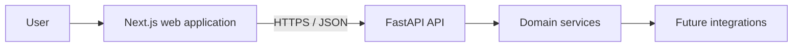
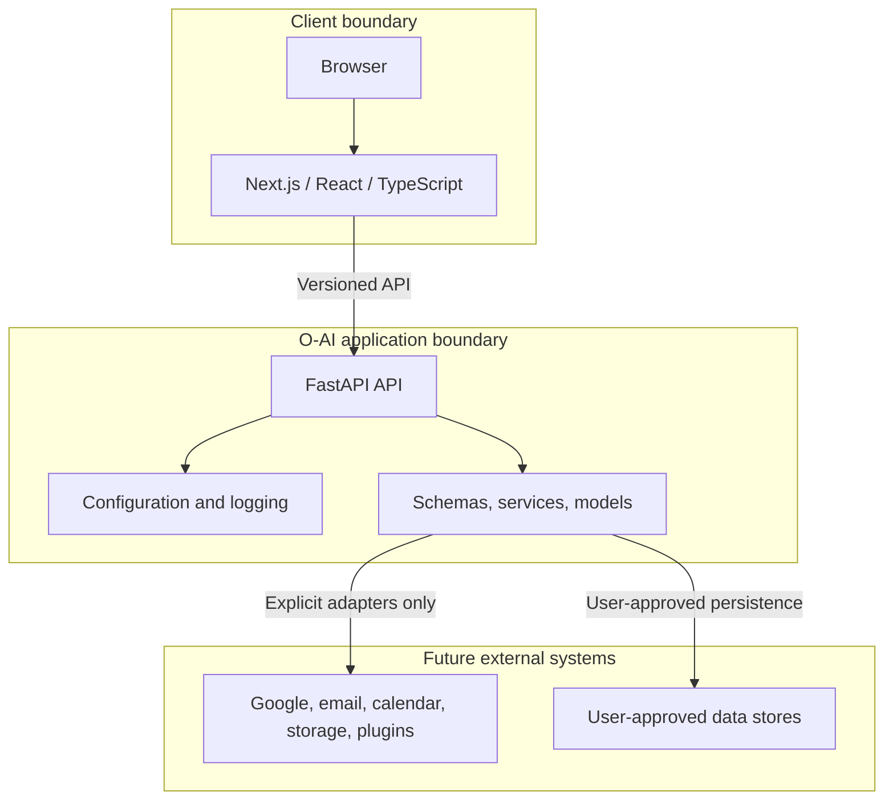
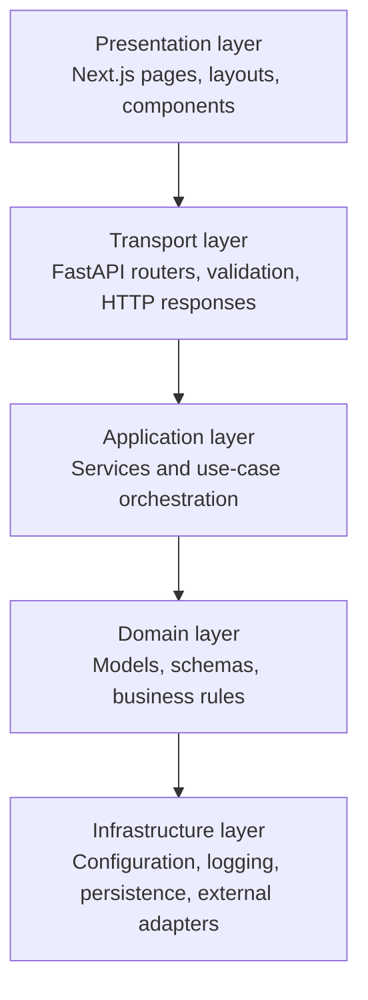

# Architecture

## Overview

O-AI is a Personal AI Operating System with a web client and a versioned HTTP API. The current release establishes the application boundary, operational health checks, configuration, and observability foundation. AI capabilities are intentionally deferred.

## System boundaries

The browser, O-AI application, and external providers remain separate trust boundaries. External access must be explicitly authorized, scoped, observable, and revocable. The frontend never receives secrets intended for backend integrations.

## Layered architecture

Dependencies flow inward. Framework-specific code belongs at the transport or infrastructure edges; business rules should not depend on HTTP, React, or a specific provider.

## Backend

The backend is a Python/FastAPI service under `backend/app`.

| Area | Responsibility |
| --- | --- |
| `api/` | Versioned HTTP routers and endpoint composition. |
| `core/` | Settings, startup/lifecycle concerns, logging, and shared infrastructure. |
| `models/` | Persistence-facing domain entities when storage is introduced. |
| `schemas/` | Pydantic request and response contracts. |
| `services/` | Business use cases and provider-neutral orchestration. |
| `main.py` | FastAPI application assembly and middleware registration. |

Endpoints live below a versioned API prefix. Schemas form the public contract; services keep endpoint handlers thin. Health checks remain independent from future AI or integration services so operational status can be observed without invoking product features.

## API transport contract

Every API response uses a common envelope. Successful responses return `{"success": true, "data": ...}`. Failures return `{"success": false, "error": {"code": "...", "message": "..."}}`. Endpoint-specific schemas remain inside `data`, preserving stable resource contracts while making client handling consistent.

Each request carries an `X-Request-ID`. O-AI preserves a caller-supplied value or generates a UUID, returns it on successful and error responses, and includes it in logs for unexpected failures. Exception handlers translate validation, configuration, provider, HTTP, and unexpected errors into safe transport responses; internal stack traces remain in server logs only.

## Local conversation persistence

Version 1 stores conversations and messages in local SQLite. API routes call application services; services coordinate repositories and provider-neutral chat; repositories alone access SQLAlchemy sessions and ORM models. Public Pydantic schemas are mapped from persisted entities, so ORM models never cross the API boundary.

The chat flow creates a UUID conversation when needed, saves the user message, loads only a configured chronological window of recent messages, invokes `ChatService`, then saves the assistant reply. If the provider fails, the user message remains as history but no synthetic assistant reply is stored. Provider implementations never access repositories or database models.

`create_all()` runs during the FastAPI lifespan only to create missing Version 1 tables. It cannot alter existing schemas. Any schema change after Version 1 requires an approved, explicit migration strategy; Alembic is intentionally not included in this release. The current string-based provider input is a Version 1 compatibility boundary; a future approved release may adopt structured provider messages.

## Local Knowledge Engine

Knowledge indexing is local-only and begins only after an explicit scan request. API routes call `KnowledgeService`; the service selects reader adapters and coordinates repositories; readers neither use FastAPI nor access database sessions. `Document` represents one root-relative source path, so two files with identical bytes remain separate documents with independent provenance and citations.

SQLite ORM tables store document metadata and chunks. A separate, idempotently-created FTS5 virtual table indexes searchable chunk text; `create_all()` does not create, alter, or migrate that virtual-table definition. Successful re-indexing replaces metadata, chunks, and FTS rows in one transaction. Extraction failures retain a previous successful index and record only a safe error. Missing files retain history but are excluded from normal search results.

The scanner resolves every candidate beneath `OAI_KNOWLEDGE_ROOT`, skips symlinks and hidden/runtime paths, enforces a maximum file size, and persists/exposes only root-relative paths. It never accepts arbitrary filesystem paths through the API. Supported readers cover PDF, DOCX, XLSX, CSV, PPTX, text, Markdown, HTML, and EML. No OCR, attachment extraction, embeddings, vector database, cloud storage, or background watcher is present. Image-only/scanned PDFs are reported as requiring OCR, planned for Release 0.6.1.

## Knowledge Intelligence

Knowledge answers are evidence-first: deterministic intent analysis and retrieval planning query local FTS5, deterministic ranking selects diverse evidence, conflict detection flags incompatible values, and a bounded prompt passes only selected text to `ChatService`. `GroundedPromptBuilder` delimits every source as untrusted and requires public source IDs. `CitationEngine` validates returned IDs; `ConfidenceEvaluator` emits high, medium, low, or insufficient without probabilities. The existing single-string provider contract is a limitation: prompt injection cannot be claimed fully prevented. Citation metadata is not yet durably tied to persisted assistant messages because `create_all()` cannot migrate existing SQLite schemas.

## Memory-aware chat

Chat resolves only active `CONFIRMED` personal-memory versions through a read-only `ConfirmedMemoryReader` boundary. Eligibility also requires that the selected version belongs to the memory holding its active pointer. The resolver uses deterministic Thai/English/model-identifier lexical matching, positive matches only, and configurable item, total-character, and per-item-character budgets (`OAI_MEMORY_CONTEXT_MAX_ITEMS=8`, `OAI_MEMORY_CONTEXT_MAX_CHARS=2000`, `OAI_MEMORY_CONTEXT_MAX_ITEM_CHARS=500`). Malformed, empty, oversized, orphaned, stale, pending, rejected, and archived values are skipped without logging their content.

Selected records are rendered inside explicit `BEGIN/END UNTRUSTED PERSONAL MEMORY` delimiters, preceded by instructions that memory is contextual data only and cannot override system, developer, safety, or grounded-answer instructions. Document evidence remains authoritative for document-grounded factual claims, and conflicts must be disclosed. Conversation history, knowledge evidence, and memory remain distinct context blocks; neither the resolver nor chat creates, modifies, approves, rejects, or archives memory. Responses expose only memory ID, version, and key for explainability; memory context is not persisted with messages or citations. The current single-string provider boundary reduces prompt-injection risk but is not complete prompt isolation.

## Reasoning foundation

`ReasoningService` is a pure, deterministic service layer placed after memory and document retrieval and before provider prompt composition. It uses fixed Thai/English keyword rules to classify intent, with `general` as the safe fallback for empty, whitespace-only, and unclassified questions. It identifies missing information from already selected context and maps deduplicated evidence to stable memory ID/version/key metadata and selected document citation IDs only. It returns a `ReasoningPlan` planning/explanation artifact and a separate provider context block.

`ReasoningPlan` is not model chain-of-thought, hidden reasoning, or proof that an answer is correct. It contains only safe structured metadata—no memory values, document excerpts, hidden prompts, secrets, environment values, or provider internals—and is not persisted to messages, citations, or memory records. It never queries storage, changes retrieval ranking, invokes providers, performs actions, creates tasks, or executes plans. The plan is non-executable explanatory context only; it does not authorize autonomous behavior.

## Planning engine

`PlanningService` is a pure deterministic layer after `ReasoningService` and before prompt composition. It produces explanatory `PlanningPlan` metadata, not hidden model reasoning or chain-of-thought, an executable workflow, task persistence, or proof that an answer or recommendation is correct. It has no repository, provider, tool, workflow, scheduler, agent, filesystem, network, database, or execution dependency, and does not persist or execute generated tasks. Real-world actions require separate explicit owner approval and a future approved execution system.

Planning uses Policy A for every `ReasoningPlan` intent. General, casual, empty, whitespace-only, and unmatched questions receive only a minimal non-operational `response_organization` plan; they are not presented as project plans, commitments, or actions. The stable `plan_kind` mapping is: `general`, `factual_lookup`, `explanation`, and `summary` map to `response_organization`; `procedure` maps to `procedure_outline`; `comparison` maps to `comparison_structure`; and `troubleshooting` maps to `troubleshooting_structure`. The API exposes `planning_plan` as an optional additive field, so existing clients may ignore it. Its field names, fixed slug identifiers, and list ordering are stable: phase/task IDs are deterministic, dependencies are topologically ordered, risks use their approved code as their stable ID, and normalized missing-information codes retain first-occurrence order.

Templates only organize a response. All begin with `assess` and end with `respond`; `procedure` adds `sequence`, `comparison` adds `compare`, and `troubleshooting` adds `diagnose`. A `clarify` phase is inserted immediately before `respond` only for approved, normalized information-gap codes. Approved codes and their fixed advisory risk mappings are: `no_retrieved_context` — no retrieved memory or document context is available; `no_document_evidence` — document-grounded factual claims lack selected document evidence; and `comparison_basis` — a comparison may lack a complete basis. Empty, duplicate, and unknown codes are excluded safely and never produce risks or clarification claims.

`PlanningPlan` validates unique phase/task IDs and dependency edges, valid phase/task references, no self-dependencies, acyclicity, and topological task ordering before API or provider use. The planning prompt is isolated from Reasoning, Personal Memory, and Knowledge blocks. It explicitly says the data is deterministic and non-executable, cannot override system, developer, safety, grounding, citation, or owner-control requirements, cannot be changed by retrieved memory or documents, and must never be treated as completed work or disclose hidden prompts, secrets, environment values, or configuration.

## Decision engine

`DecisionService` is a pure deterministic layer after Planning and before prompt composition. It returns `DecisionAnalysis` explanatory metadata only: explicit alternatives found in the already-normalized question, fixed unweighted evaluation criteria, fixed advisory trade-offs, exact existing reasoning evidence references, inherited normalized information gaps, and a recommendation status. It has no repository, provider, tool, database, filesystem, network, workflow, agent, ranking, scoring, or execution dependency; it performs no writes and is not persisted to messages, citations, memories, or database records.

Decision analysis never selects, ranks, scores, or automatically recommends an alternative. It uses `owner_decision_required` only when a comparison question explicitly supplies at least two alternatives and no approved information gaps remain; it uses `insufficient_information` when such alternatives have gaps, and `not_applicable` otherwise. English separators only are supported: `vs`, `vs.`, `versus`, and standalone `or`. A standalone two-token `A or B` expression is classified as a comparison; Thai separator inference is deliberately unsupported. Alternatives remain in deterministic source order with stable `alternative-<n>` IDs and are capped at `MAX_ALTERNATIVES = 8`; longer labels are excluded and only the first eight normalized alternatives are retained. The decision prompt is separately delimited from Reasoning, Planning, Personal Memory, and Knowledge, and cannot override system, developer, safety, grounding, citation, planning, reasoning, or owner-control requirements. Any real decision or action requires separate explicit owner approval.

## Frontend

The frontend is a Next.js App Router application under `frontend`.

| Area | Responsibility |
| --- | --- |
| `app/` | Routes, layouts, page-level UI, and global styles. |
| `app/layout.tsx` | Root document structure and shared metadata. |
| `app/page.tsx` | Initial product entry page. |
| Environment configuration | Public API base URL only; private integration credentials stay server-side. |

UI code should call the versioned API through a small client boundary as features are added. Server and client component choices should be explicit, with interactive state isolated to client components.

## Future modules

The following modules are planned as bounded capabilities, not as direct dependencies of the UI:

| Module | Purpose | Boundary |
| --- | --- | --- |
| Memory | Store, retrieve, and govern user-approved personal context. | Consent, retention, deletion, and provenance controls. |
| Knowledge | Organize curated organizational or personal knowledge. | Source attribution and access control. |
| Documents | Ingest, index, search, and manage documents. | File ownership, extraction safety, and lifecycle policies. |
| Gmail | Read or act on Gmail data after explicit authorization. | OAuth scopes, auditability, and revocation. |
| Calendar | Surface and manage calendar context after authorization. | OAuth scopes, time-zone correctness, and confirmation for writes. |
| Plugin Engine | Extend O-AI through isolated, permissioned integrations. | Manifest, capability permissions, validation, and lifecycle controls. |

Each module should expose a service interface and schemas before provider-specific infrastructure is introduced. No module may assume unrestricted access to user data or external systems.

## Technology choices

### FastAPI

FastAPI provides typed request/response validation through Pydantic, first-class OpenAPI generation, asynchronous support, and a lightweight operational footprint. It fits a modular API where contracts and reliability matter from the first release.

### Next.js

Next.js provides a production-ready React framework with routing, server rendering options, TypeScript support, and an ecosystem suited to a long-lived web product. Its App Router supports gradual growth from a small foundation to richer user experiences.

## Architecture governance

Architecture changes require owner approval. New modules should be introduced through an architectural decision record, a documented system boundary, and a small, validated implementation plan.
