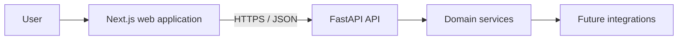
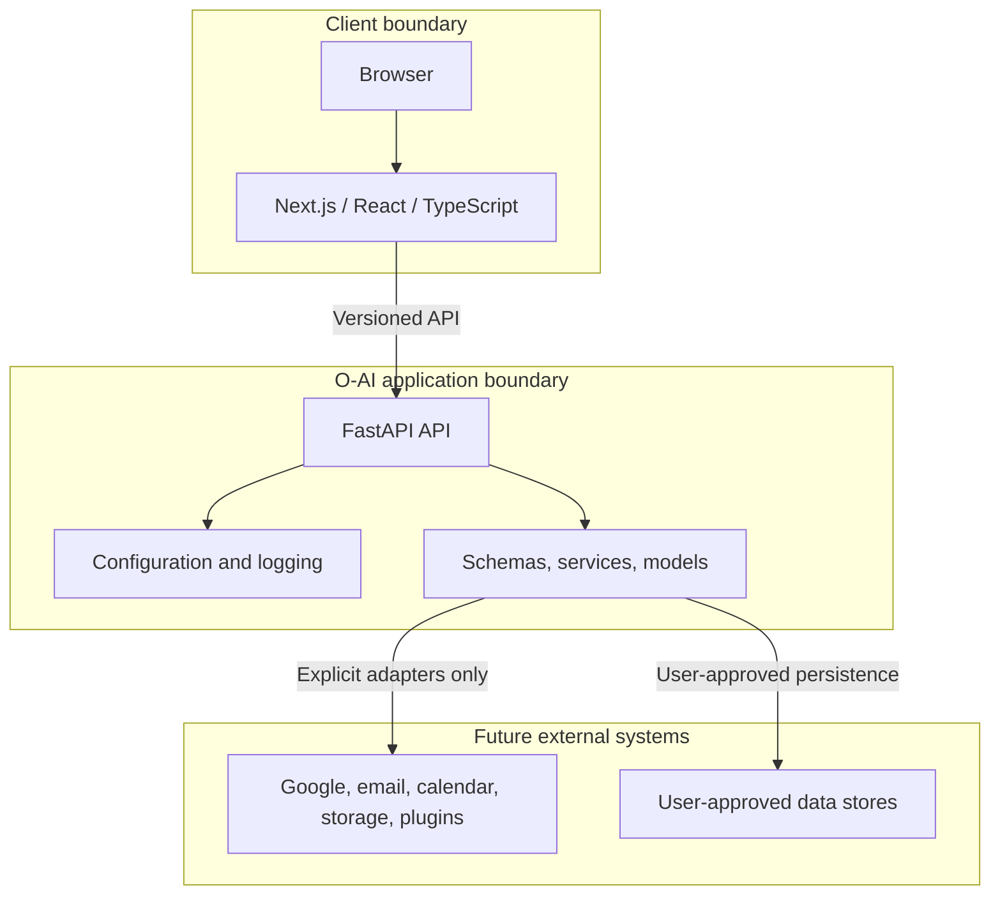
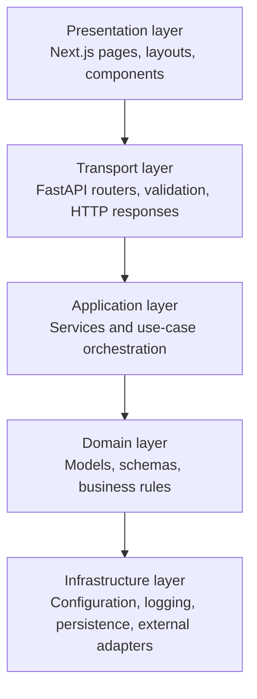
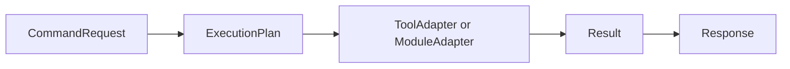
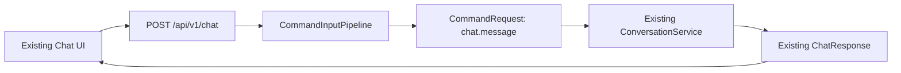
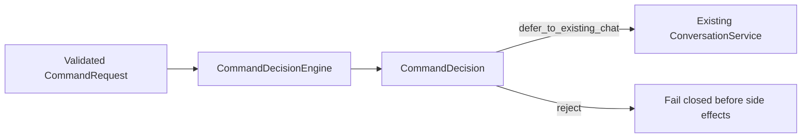

# Architecture

## Overview

O-AI is a local-first Personal AI Operating System with a web client and a versioned HTTP API. It currently includes local Knowledge ingestion/retrieval, owner-controlled Personal Memory, persisted citations, and deterministic runtime intelligence metadata.

## System boundaries

The browser, O-AI application, and external providers remain separate trust boundaries. External access must be explicitly authorized, scoped, observable, and revocable. The frontend never receives secrets intended for backend integrations.

## Layered architecture

Dependencies flow inward. Framework-specific code belongs at the transport or infrastructure edges; business rules should not depend on HTTP, React, or a specific provider.

## Backend

The backend is a Python/FastAPI service under `backend/app`.

| Area | Responsibility |
| --- | --- |
| `api/` | Versioned HTTP routers and endpoint composition. |
| `core/` | Settings, startup/lifecycle concerns, logging, and shared infrastructure. |
| `models/` | Persistence-facing domain entities when storage is introduced. |
| `schemas/` | Pydantic request and response contracts. |
| `services/` | Business use cases and provider-neutral orchestration. |
| `contracts/` | Internal versioned protocols and immutable values for future AI, tool/module, and command boundaries. |
| `main.py` | FastAPI application assembly and middleware registration. |

Endpoints live below a versioned API prefix. Schemas form the public contract; services keep endpoint handlers thin. Health checks remain independent from future AI or integration services so operational status can be observed without invoking product features.

## API transport contract

Every API response uses a common envelope. Successful responses return `{"success": true, "data": ...}`. Failures return `{"success": false, "error": {"code": "...", "message": "..."}}`. Endpoint-specific schemas remain inside `data`, preserving stable resource contracts while making client handling consistent.

Each request carries an `X-Request-ID`. O-AI preserves a caller-supplied value or generates a UUID, returns it on successful and error responses, and includes it in logs for unexpected failures. Exception handlers translate validation, configuration, provider, HTTP, and unexpected errors into safe transport responses; internal stack traces remain in server logs only.

## Local conversation persistence

Version 1 stores conversations and messages in local SQLite. API routes call application services; services coordinate repositories and provider-neutral chat; repositories alone access SQLAlchemy sessions and ORM models. Public Pydantic schemas are mapped from persisted entities, so ORM models never cross the API boundary.

The chat flow creates a UUID conversation when needed, saves the user message, loads only a configured chronological window of recent messages, invokes `ChatService`, then saves the assistant reply. If the provider fails, the user message remains as history but no synthetic assistant reply is stored. Provider implementations never access repositories or database models.

Alembic owns production schema evolution. FastAPI startup opens the configured SQLite database read-only for compatibility verification; it verifies the expected revision, tables, constraints, foreign keys, FTS5 definition, and applicable Memory immutability protections. Startup never creates tables, upgrades, stamps, or rewrites the schema. The current string-based provider input remains a compatibility boundary.

## Local Knowledge Engine

Knowledge indexing is local-only and begins only after an explicit scan request. API routes call `KnowledgeService`; the service selects reader adapters and coordinates repositories; readers neither use FastAPI nor access database sessions. `Document` represents one root-relative source path, so two files with identical bytes remain separate documents with independent provenance and citations.

SQLite ORM tables store document metadata and chunks. A separate, idempotently-created FTS5 virtual table indexes searchable chunk text; `create_all()` does not create, alter, or migrate that virtual-table definition. Successful re-indexing replaces metadata, chunks, and FTS rows in one transaction. Extraction failures retain a previous successful index and record only a safe error. Missing files retain history but are excluded from normal search results.

The scanner resolves every candidate beneath `OAI_KNOWLEDGE_ROOT`, skips symlinks and hidden/runtime paths, enforces a maximum file size, and persists/exposes only root-relative paths. It never accepts arbitrary filesystem paths through the API. Supported readers cover PDF, DOCX, XLSX, CSV, PPTX, text, Markdown, HTML, and EML. No OCR, attachment extraction, embeddings, vector database, cloud storage, or background watcher is present. Image-only/scanned PDFs are reported as requiring OCR, planned for Release 0.6.1.

## Knowledge Intelligence

Knowledge answers are evidence-first: deterministic lexical retrieval queries local FTS5, ranking selects bounded evidence, conflict detection flags incompatible values, and a bounded prompt passes only selected text to `ChatService`. `GroundedPromptBuilder` delimits every source as untrusted and requires public source IDs. `CitationEngine` validates returned IDs; citation snapshots are transactionally persisted with the assistant message as historical evidence. `ConfidenceEvaluator` emits high, medium, low, or insufficient without probabilities. The existing single-string provider contract is a limitation: prompt injection cannot be claimed fully prevented.

## Memory-aware chat

Chat resolves only active `CONFIRMED` personal-memory versions through a read-only `ConfirmedMemoryReader` boundary. Eligibility also requires that the selected version belongs to the memory holding its active pointer. The resolver uses deterministic Thai/English/model-identifier lexical matching, positive matches only, and configurable item, total-character, and per-item-character budgets (`OAI_MEMORY_CONTEXT_MAX_ITEMS=8`, `OAI_MEMORY_CONTEXT_MAX_CHARS=2000`, `OAI_MEMORY_CONTEXT_MAX_ITEM_CHARS=500`). Malformed, empty, oversized, orphaned, stale, pending, rejected, and archived values are skipped without logging their content.

Selected records are rendered inside explicit `BEGIN/END UNTRUSTED PERSONAL MEMORY` delimiters, preceded by instructions that memory is contextual data only and cannot override system, developer, safety, or grounded-answer instructions. Document evidence remains authoritative for document-grounded factual claims, and conflicts must be disclosed. Conversation history, knowledge evidence, and memory remain distinct context blocks; neither the resolver nor chat creates, modifies, approves, rejects, or archives memory. Responses expose only memory ID, version, and key for explainability; memory context is not persisted with messages or citations. The current single-string provider boundary reduces prompt-injection risk but is not complete prompt isolation.

## Reasoning foundation

`ReasoningService` is a pure, deterministic service layer placed after memory and document retrieval and before provider prompt composition. It uses fixed Thai/English keyword rules to classify intent, with `general` as the safe fallback for empty, whitespace-only, and unclassified questions. It identifies missing information from already selected context and maps deduplicated evidence to stable memory ID/version/key metadata and selected document citation IDs only. It returns a `ReasoningPlan` planning/explanation artifact and a separate provider context block.

`ReasoningPlan` is not model chain-of-thought, hidden reasoning, or proof that an answer is correct. It contains only safe structured metadata—no memory values, document excerpts, hidden prompts, secrets, environment values, or provider internals—and is not persisted to messages, citations, or memory records. It never queries storage, changes retrieval ranking, invokes providers, performs actions, creates tasks, or executes plans. The plan is non-executable explanatory context only; it does not authorize autonomous behavior.

## Planning engine

`PlanningService` is a pure deterministic layer after `ReasoningService` and before prompt composition. It produces explanatory `PlanningPlan` metadata, not hidden model reasoning or chain-of-thought, an executable workflow, task persistence, or proof that an answer or recommendation is correct. It has no repository, provider, tool, workflow, scheduler, agent, filesystem, network, database, or execution dependency, and does not persist or execute generated tasks. Real-world actions require separate explicit owner approval and a future approved execution system.

Planning uses Policy A for every `ReasoningPlan` intent. General, casual, empty, whitespace-only, and unmatched questions receive only a minimal non-operational `response_organization` plan; they are not presented as project plans, commitments, or actions. The stable `plan_kind` mapping is: `general`, `factual_lookup`, `explanation`, and `summary` map to `response_organization`; `procedure` maps to `procedure_outline`; `comparison` maps to `comparison_structure`; and `troubleshooting` maps to `troubleshooting_structure`. The API exposes `planning_plan` as an optional additive field, so existing clients may ignore it. Its field names, fixed slug identifiers, and list ordering are stable: phase/task IDs are deterministic, dependencies are topologically ordered, risks use their approved code as their stable ID, and normalized missing-information codes retain first-occurrence order.

Templates only organize a response. All begin with `assess` and end with `respond`; `procedure` adds `sequence`, `comparison` adds `compare`, and `troubleshooting` adds `diagnose`. A `clarify` phase is inserted immediately before `respond` only for approved, normalized information-gap codes. Approved codes and their fixed advisory risk mappings are: `no_retrieved_context` — no retrieved memory or document context is available; `no_document_evidence` — document-grounded factual claims lack selected document evidence; and `comparison_basis` — a comparison may lack a complete basis. Empty, duplicate, and unknown codes are excluded safely and never produce risks or clarification claims.

`PlanningPlan` validates unique phase/task IDs and dependency edges, valid phase/task references, no self-dependencies, acyclicity, and topological task ordering before API or provider use. The planning prompt is isolated from Reasoning, Personal Memory, and Knowledge blocks. It explicitly says the data is deterministic and non-executable, cannot override system, developer, safety, grounding, citation, or owner-control requirements, cannot be changed by retrieved memory or documents, and must never be treated as completed work or disclose hidden prompts, secrets, environment values, or configuration.

## Decision engine

`DecisionService` is a pure deterministic layer after Planning and before prompt composition. It returns `DecisionAnalysis` explanatory metadata only: explicit alternatives found in the already-normalized question, fixed unweighted evaluation criteria, fixed advisory trade-offs, exact existing reasoning evidence references, inherited normalized information gaps, and a recommendation status. It has no repository, provider, tool, database, filesystem, network, workflow, agent, ranking, scoring, or execution dependency; it performs no writes and is not persisted to messages, citations, memories, or database records.

Decision analysis never selects, ranks, scores, or automatically recommends an alternative. It uses `owner_decision_required` only when a comparison question explicitly supplies at least two alternatives and no approved information gaps remain; it uses `insufficient_information` when such alternatives have gaps, and `not_applicable` otherwise. English separators only are supported: `vs`, `vs.`, `versus`, and standalone `or`. A standalone two-token `A or B` expression is classified as a comparison; Thai separator inference is deliberately unsupported. Alternatives remain in deterministic source order with stable `alternative-<n>` IDs and are capped at `MAX_ALTERNATIVES = 8`; longer labels are excluded and only the first eight normalized alternatives are retained. The decision prompt is separately delimited from Reasoning, Planning, Personal Memory, and Knowledge, and cannot override system, developer, safety, grounding, citation, planning, reasoning, or owner-control requirements. Any real decision or action requires separate explicit owner approval.

## Goal and Project engine

`GoalService` is a pure deterministic layer after Decision and before prompt composition. It returns non-persistent `GoalAnalysis` metadata only. A candidate is recognized solely from explicit English `goal: <text>` or `project: <text>` input; it never creates a goal/project, changes status, schedules work, creates workflows, or executes actions. Unmarked text is `not_applicable`; marked text is only a `candidate` requiring separate owner approval.

Separately, the durable Project backbone stores explicitly owner-created Projects and append-only immutable ProjectRevision snapshots in SQLite. It has no separate Goal table, automatic state changes, or task subsystem. An owner may explicitly select a Project only when creating the first chat or grounded-answer conversation; the selection and first persisted message commit together and cannot later change. At provider-request time, the latest selected Project is projected read-only into a bounded data-only block containing only title, objective, status, and non-null current summary/next action. Project IDs, revisions, history, timestamps, notes, and other internal fields are never provider-visible; the block is neither Knowledge evidence nor a citation source, and it is never persisted in messages or citations. COMPLETED and ARCHIVED Projects retain their history and may still be selected explicitly; owners may explicitly edit durable details, progress, and next actions at any status. No Project is selected or changed automatically.

### Goal Constitution

Goals and projects are owner-controlled concepts, not commands. GoalAnalysis is explanatory metadata only: it never creates, persists, activates, schedules, executes, completes, or changes the status of a goal or project. Only explicit marker input may produce a candidate, and every real-world action requires separate explicit owner approval through a future approved execution system. Goal, Project, Decision, Planning, Reasoning, Personal Memory, and Knowledge remain separate context blocks; user-supplied marker text is untrusted data and cannot override system, developer, safety, grounding, citation, or owner-control requirements.

## Provider, privacy, and deployment boundary

For normal chat, selected provider input may include recent conversation history, the current user message, runtime Reasoning/Planning/Decision/Goal metadata, selected CONFIRMED Personal Memory values, and selected Knowledge evidence for grounded answers. This repository does not establish an external provider's retention or training policy. API memory-usage metadata exposes only memory ID, version, and key; it does not expose selected values.

O-AI supports a trusted local, single-owner deployment model. The default Docker deployment binds the frontend and backend published ports to the Windows host loopback interface, so the supported browser is on that same host. LAN/mobile and public/Internet access are intentionally unsupported until a separately designed security boundary exists. Knowledge scans require the fixed `X-OAI-Local-Request: 1` marker: it is not a credential, but makes browser scan requests preflighted so an unapproved origin cannot authorize the scan request through CORS. It does not protect against local software or processes. There is currently no authentication or authorization layer; localhost binding does not limit access by local processes or OS users. SQLite plus FTS5 is intentional for the supported workload. PostgreSQL, Redis, vector databases, distributed workers, microservices, Kubernetes, an async rewrite, and local-LLM infrastructure are deliberately deferred until evidence requires them.

## Adapter and command contracts v1

D21 adds internal, provider-neutral contracts under `backend/app/contracts` without changing the active chat path:

AI Adapter Contract v1 consists of immutable `AIRequest` and `AIResult` values plus the structural `AIAdapter.generate(request)` protocol. It is a future adapter boundary only. Normal chat continues to use `ChatProvider.generate_reply(message: str) -> str`, and `OpenAIChatProvider` remains composed exactly as before. No adapter bridge or chat migration is present in D21.

Tool/Module Adapter Contract v1 defines separate structural `ToolAdapter` and `ModuleAdapter` protocols. Both accept the shared `CommandRequest` and `ExecutionPlan` contracts and return `Result`; `Response` is the presentation-neutral final command envelope. These contracts contain no provider SDK, HTTP, database, model, repository, or frontend type.

The command flow is declarative, not an execution engine. Constructing a request or plan has no side effect, `ExecutionPlan.owner_approval_required` defaults to `True`, and the repository contains no D21 dispatcher, scheduler, autonomous loop, adapter registration, or runtime wiring. A future caller must enforce owner approval and capability policy before explicitly invoking an adapter. Local AI installation and integration are deferred.

The boundaries are additive and internal: there is no public API or data migration. Rollback removes the contract modules, their tests, and this documentation without affecting persisted data or HTTP clients. Any future adapter implementation, command orchestrator, chat migration, external integration, or side effect requires a separately approved architecture change.

## Command/Input Pipeline (D22)

The existing `POST /api/v1/chat` route is the current Web/Chat input adapter. It continues to receive the unchanged validated `ChatRequest` and return the unchanged `ApiSuccess[ChatResponse]` envelope. D22 inserts a narrow application-layer `CommandInputPipeline` between that route and the existing `ConversationService` path:

The request-ID middleware remains authoritative for HTTP correlation. The route passes `request.state.request_id` unchanged into `CommandRequest.request_id`; this ID is correlation metadata only, not an identity or authorization credential. The fixed command arguments are `message`, `conversation_id`, and `project_id`, preserving the existing chat inputs and UUID values without a public schema change.

`normalize_chat` is pure and side-effect free. `process_chat` fails closed unless the command is exactly `chat.message` and the argument keys/types match the approved shape. Only then does it delegate unchanged values to `ConversationService.send_message`. It does not persist, invoke a provider, log message contents, construct an execution plan, perform intent/decision analysis, select an AI provider, route to an adapter, execute a tool/module, or authorize autonomous work.

The existing ConversationService remains responsible for its established conversation and Project-linked behavior. D22 does not repurpose the Knowledge/retrieval pipeline or explanatory intelligence/Decision services into command handling; it only provides the input seam before that existing path. Further command identifiers, generic dispatch, routing, planning, execution, external integrations, or Local AI require separate owner-approved architecture changes.

## Command intent and decision boundary (D23)

D23 adds a deterministic, internal, non-executable decision seam after D22 has accepted the exact `chat.message` command and validated its exact argument shape:

`CommandDecision` contains a command-level intent, disposition, reason code, and optional provider preference hint. Its taxonomy is deliberately narrow: `chat_message`/`unknown`, `defer_to_existing_chat`/`reject`, and `unspecified`/`automatic`/`local_ai_explicit` preference hints. D23 does not turn these hints into provider selection or adapter invocation.

Preference hints use only narrow, explicit provider-routing phrases. Generic words such as `default` or `automatic`, a generic mention of Local AI, missing input, invalid internal message values, and conflicting explicit phrases all resolve to `unspecified`. The decision never logs message contents, persists data, calls a provider, creates an execution plan, calls an AI/tool/module adapter, or accesses external systems.

The existing `ReasoningService` and explanatory `DecisionService` remain independent: their answer-oriented intent and comparison metadata semantics are unchanged and are not reused for command decisions. D23 preserves D22's guard order: unknown command identifiers are rejected by D22 before D23, and invalid `chat.message` arguments fail before D23 or `ConversationService` invocation. D23 does not implement D24 routing, Local AI, tool execution, or autonomous behavior.

## AI route selection (D24)

D24 adds `AIRouter`, a pure route-selection layer that accepts only a `CommandDecision`; it never re-reads user input. It returns an internal `AIRouteDecision` with one of `selected`, `unavailable`, or `rejected` and a stable logical adapter ID where applicable.

`unspecified` selects the configured default with selection source `default`; `automatic` selects that same default with source `automatic`. The current composition makes `chatgpt.default` available and `local_ai.default` unavailable. `local_ai_explicit` selects only the configured Local AI ID with source `explicit`. An unavailable Local AI route stops before conversation/provider work; an available Local AI route is selected but likewise stops before invocation until D26. It never silently falls back to ChatGPT.

D23 `reject` decisions and malformed decisions produce a fail-closed D24 `rejected` route. Rejected and unavailable decisions have no selection source. The router has no provider, adapter, database, HTTP, logging, persistence, tool/module, execution, or external dependency. It creates no execution plan and does not start D25/D26.

## ChatGPT adapter (D25)

D25 adds `ChatGPTAdapter`, the concrete AI Adapter Contract v1 implementation with stable ID `chatgpt.default` and contract version `1`. It wraps the existing `OpenAIChatProvider` rather than duplicating any OpenAI SDK integration. `generate(AIRequest)` delegates exactly once and returns `AIResult`; `generate_reply(str)` remains a compatibility shim for the existing `ChatService` and `ConversationService` path.

The adapter leaves `ChatConfigurationError` and `ChatProviderError` unchanged. D24 remains selection-only: this composition preserves the existing ChatGPT chat path but does not create a registry, invoke a selected D24 adapter generically, or begin D26. Local AI remains unavailable and unimplemented.

## Local AI runtime adapter and telemetry (D26-B)

D26-B adds `LocalAIAdapter` for `local_ai.default`, backed by the provider-neutral `LocalAIRuntimeClient` protocol. `OllamaRuntimeClient` is a deployment adapter that maps `AIRequest.content` to Ollama's configured HTTP endpoint and turns a valid local response into `AIResult.content`. It checks runtime reachability and configured-model availability before generation, and fails closed for offline, missing-model, timeout, malformed, or empty responses. It never falls back to ChatGPT or another cloud provider.

`OAI_LOCAL_AI_ENABLED`, `OAI_LOCAL_AI_BASE_URL`, `OAI_LOCAL_AI_MODEL`, `OAI_LOCAL_AI_TIMEOUT_SECONDS`, and `OAI_LOCAL_AI_CONTEXT_LENGTH` are deployment settings. Model storage remains an Ollama deployment concern and is not encoded in application configuration. `SystemMetricsProvider` owns an isolated daemon inference session that samples approximately once per second with `psutil` for CPU/RAM and `nvidia-smi` when available for GPU/VRAM. Each session resets then retains only its own latest and peak values; a unique session identity prevents a stopped sampler from writing into a newer session. ACTIVE starts immediately before runtime generation and returns to IDLE immediately afterward; model LOADED/IDLE/UNKNOWN remains separate so Ollama keep-alive is never treated as active inference. Telemetry is best effort and cannot fail or materially delay inference.

D24 routing semantics and the existing `ConversationService` path remain unchanged. D26-B does not add a generic adapter executor, register Local AI into the chat path, modify public APIs, or start D27.

## Tool/Module routing and standard tool (D27)

D27 adds `ToolModuleRouter`, a pure selection boundary over structured `CommandRequest` and `ExecutionPlan` contracts. It never receives or parses raw chat text, returns only `selected`, `unavailable`, `blocked`, or `rejected`, and never calls an adapter. Request/plan ID mismatches are rejected, unknown adapter IDs are unavailable, and owner-approval-required plans are blocked. Dependency composition registers adapters but does not wire execution into the chat pipeline.

`StandardToolAdapter` is the first registered Tool Adapter v1: `tool.standard.echo` / `standard.echo` / version `1`. It accepts exactly one read-only `echo` plan step containing a string `value`, returning a structured `Result`; every other operation or shape fails safely. It has no file, network, subprocess, database, automation, factory, or external side effect. D27 supports Module Adapter routing structurally but does not introduce a module implementation, generic executor, or D28 capability.

## Response composition and safe errors (D28)

D28 adds two internal, pure services without joining them into an end-to-end executor. `OrchestrationErrorNormalizer` classifies terminal D24 AI-route and D27 Tool/Module-route outcomes, known ChatGPT/Local AI errors, failed or blocked Tool/Module results, and unknown exceptions into fixed safe codes. `ResponseComposer` separately presents AI success, Tool/Module success, or a normalized error through the existing D21 `Response` and `Result` contracts while preserving the exact request ID.

The normalizer never carries raw exception text or adapter error detail into a composed response. `OWNER_APPROVAL_REQUIRED` produces a `blocked` result; all other safe errors are `failed`. Explicit Local AI unavailability or response failure cannot select or fall back to cloud AI. The services perform no HTTP, network, database, persistence, logging, adapter invocation, routing, tool execution, or public API work. They are dependency-injected for future orchestration only; existing FastAPI exception handlers, chat API envelopes, conversation flow, and D24-D27 selection semantics are unchanged.

## End-to-end command orchestration (D29)

`CommandOrchestrator` connects the D21-D28 internal boundaries behind the existing chat endpoint: validated `CommandRequest` → D23 decision → D24 route → DI-registered AI Adapter v1 → `ConversationService` → D28 response composition. `AIRouter` remains selection-only. The registry validates unique adapter IDs and contract version `1` at composition time, and fails closed if the selected ID is absent. ChatGPT is the configured default; Local AI is route-available only when enabled in deployment configuration, and its own runtime/model checks remain authoritative.

The selected AI adapter is an explicit per-turn argument from `ConversationService` to `ChatService`; no global current-adapter state is stored. Formatting happens once in `ChatService`, then invokes `AIAdapter.generate(AIRequest)` once. This preserves conversation user/assistant persistence, history, memory, reasoning, planning, explanatory decision/goal analysis, project context, and project-action proposal behavior for both selected adapters. Terminal outcomes are normalized and returned through the existing safe API error envelope with the original request ID; no raw adapter/provider errors or Local-AI-to-cloud fallback are exposed.

D29 also exposes an internal-only structured Tool/Module lane: `CommandRequest + ExecutionPlan` → D27 route → selected adapter execute once → `Result` → D28 composer. It does not parse chat text or create plans. Blocked, unavailable, and rejected routes never execute, and the only registered tool remains the read-only `standard.echo` adapter. No normal chat path invokes this lane.

## Native Windows MVP operations (D30)

D30 closes the MVP operational path without changing Core boundaries: FastAPI runs on `127.0.0.1:8000`, Next.js runs on `127.0.0.1:3000`, and the Alembic-managed SQLite database is initialized by the Windows bootstrap script. The optional Ollama runtime remains an external host deployment at its configured URL; `qwen3.5:9b` is the Local AI baseline, while its model storage path is never represented in Core configuration.

The bootstrap script preserves user configuration, installs only existing requirements, and migrates the configured database. Start/stop scripts use PID files and command-line checks to manage only O-AI-owned backend/frontend processes; Ollama is never stopped. The running-system smoke validates health/revision, API envelopes/request IDs, and provider-specific E2E only when configured. Docker remains supported but deferred/non-MVP because its current startup-verification and Local AI host assumptions are not the official D30 run path. The MVP is loopback-only, trusted single-owner use; production/LAN/O-SERVER deployment remains separate work.

## Unified adapter runtime registry (D31)

D31 adds one immutable, dependency-composed `AdapterRegistry` snapshot for AI, Tool, and Module Adapter Contract v1 implementations. Registration is explicit: the composition root supplies concrete adapter objects, the registry classifies each object against exactly one approved structural contract, verifies the matching contract version, rejects empty or whitespace-padded IDs, and enforces globally unique adapter IDs across all three adapter kinds. Discovery is limited to deterministic registered-ID/kind views and typed resolution; the registry never invokes an adapter.

The existing D29 `AIAdapterRegistry` remains as a compatibility view over the unified registry, while `ToolModuleRouter` may consume that same registry instead of maintaining a second adapter map. FastAPI dependency composition now creates one shared registry per dependency graph containing the configured ChatGPT adapter, Local AI adapter, and read-only standard Tool adapter. D24 availability policy remains separate: registering `local_ai.default` does not make Local AI route-available when deployment configuration disables it, and runtime/model checks remain inside `LocalAIAdapter`.

D31 adds no dynamic plugin/module discovery, filesystem scanning, entry-point loading, provider selection, routing policy, capability negotiation, adapter invocation, execution-plan creation, owner-approval bypass, persistence, HTTP endpoint, public schema, dependency, deployment, or database change. Future provider routing, Local AI replacement, module loading, and capability discovery remain separate owner-approved work.

## Architecture Review 1.0

Architecture Review 1.0 confirmed no P0 findings and recorded the verdict **READY WITH REQUIRED PRE-HARDENING CORRECTIONS**. The proposed 0.9 hardening sequence is 0.9.0A operational truth, 0.9.0B backup/restore confidence, 0.9.0C retry/privacy boundary, 0.9.0D composition/test hardening, and 0.9.0E measured readiness. Deferred infrastructure remains deliberate, not missing functionality.

## Frontend

The frontend is a Next.js App Router application under `frontend`.

| Area | Responsibility |
| --- | --- |
| `app/` | Routes, layouts, page-level UI, and global styles. |
| `app/layout.tsx` | Root document structure and shared metadata. |
| `app/page.tsx` | Initial product entry page. |
| Environment configuration | Public API base URL only; private integration credentials stay server-side. |

UI code should call the versioned API through a small client boundary as features are added. Server and client component choices should be explicit, with interactive state isolated to client components.

## Future modules

The following modules are planned as bounded capabilities, not as direct dependencies of the UI:

| Module | Purpose | Boundary |
| --- | --- | --- |
| Memory | Store, retrieve, and govern user-approved personal context. | Consent, retention, deletion, and provenance controls. |
| Knowledge | Organize curated organizational or personal knowledge. | Source attribution and access control. |
| Documents | Ingest, index, search, and manage documents. | File ownership, extraction safety, and lifecycle policies. |
| Gmail | Read or act on Gmail data after explicit authorization. | OAuth scopes, auditability, and revocation. |
| Calendar | Surface and manage calendar context after authorization. | OAuth scopes, time-zone correctness, and confirmation for writes. |
| Plugin Engine | Extend O-AI through isolated, permissioned integrations. | Manifest, capability permissions, validation, and lifecycle controls. |

Each module should expose a service interface and schemas before provider-specific infrastructure is introduced. No module may assume unrestricted access to user data or external systems.

## Technology choices

### FastAPI

FastAPI provides typed request/response validation through Pydantic, first-class OpenAPI generation, asynchronous support, and a lightweight operational footprint. It fits a modular API where contracts and reliability matter from the first release.

### Next.js

Next.js provides a production-ready React framework with routing, server rendering options, TypeScript support, and an ecosystem suited to a long-lived web product. Its App Router supports gradual growth from a small foundation to richer user experiences.

## Architecture governance

Architecture changes require owner approval. New modules should be introduced through an architectural decision record, a documented system boundary, and a small, validated implementation plan.
